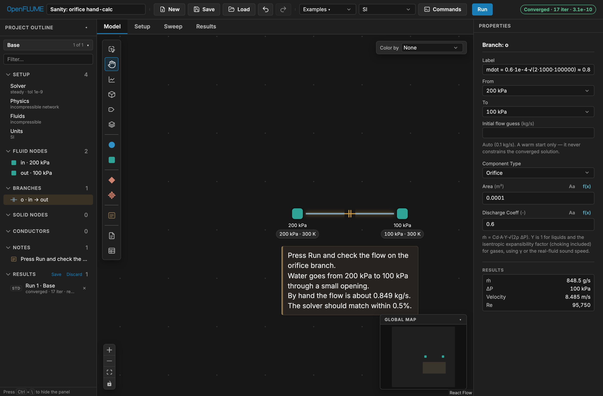
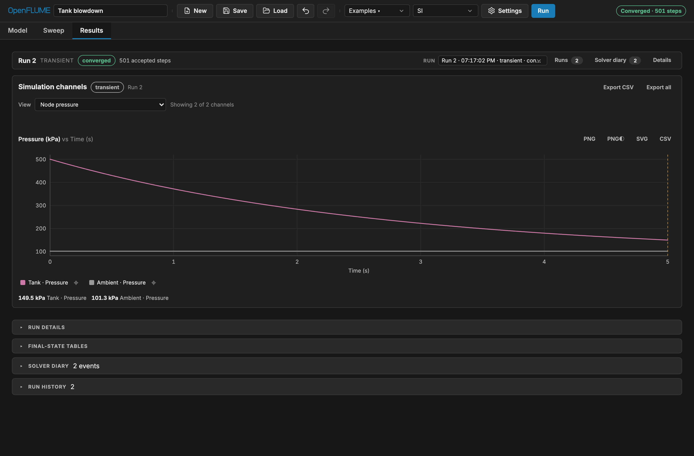
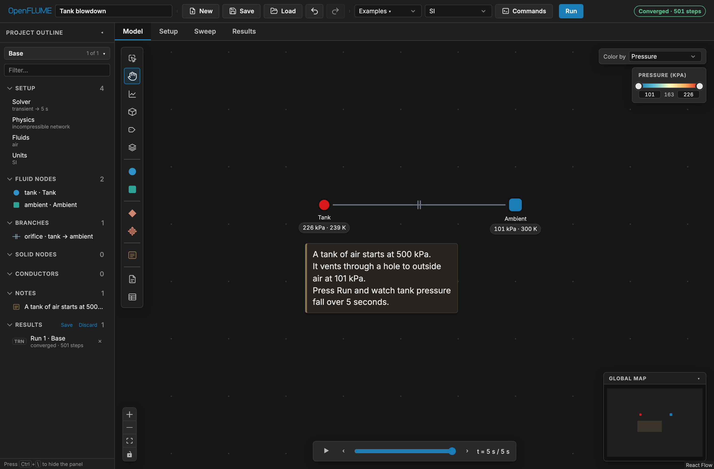
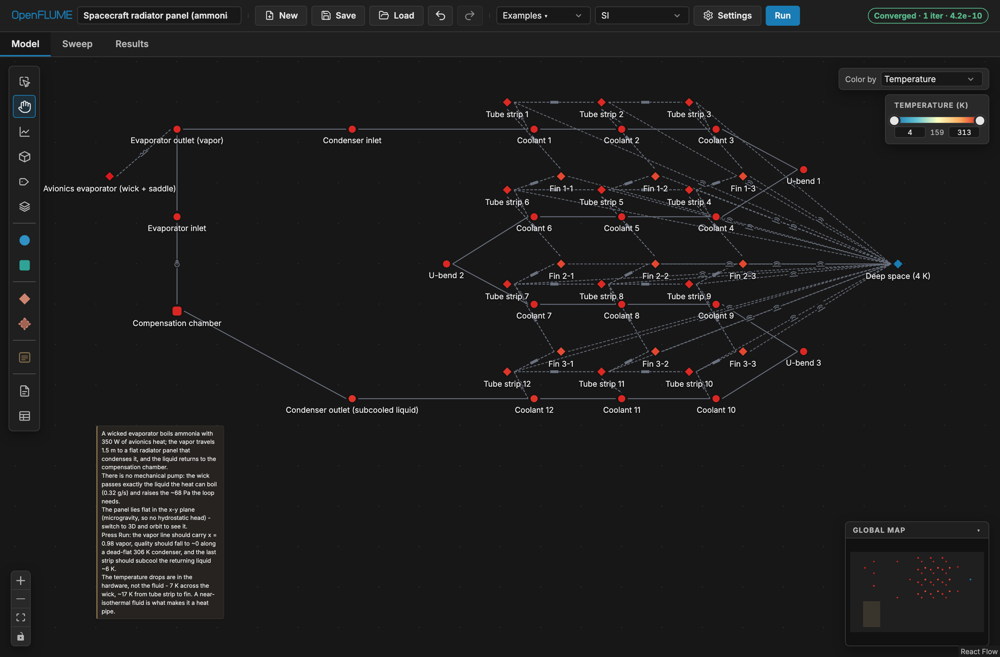
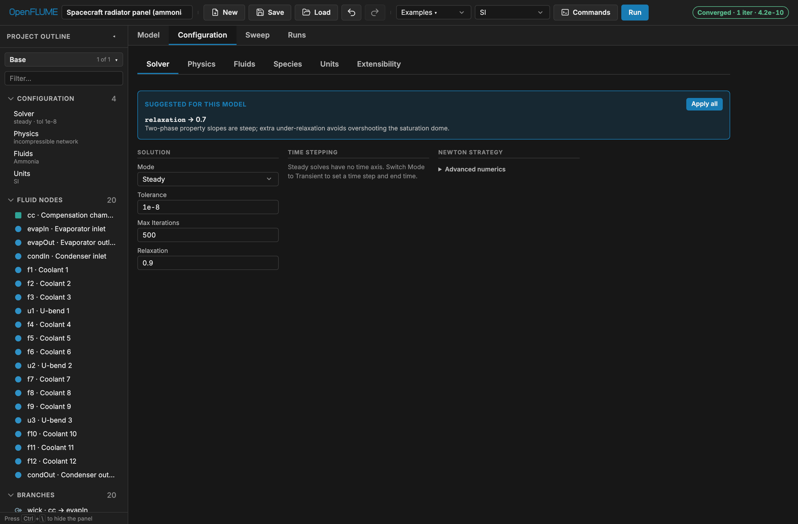
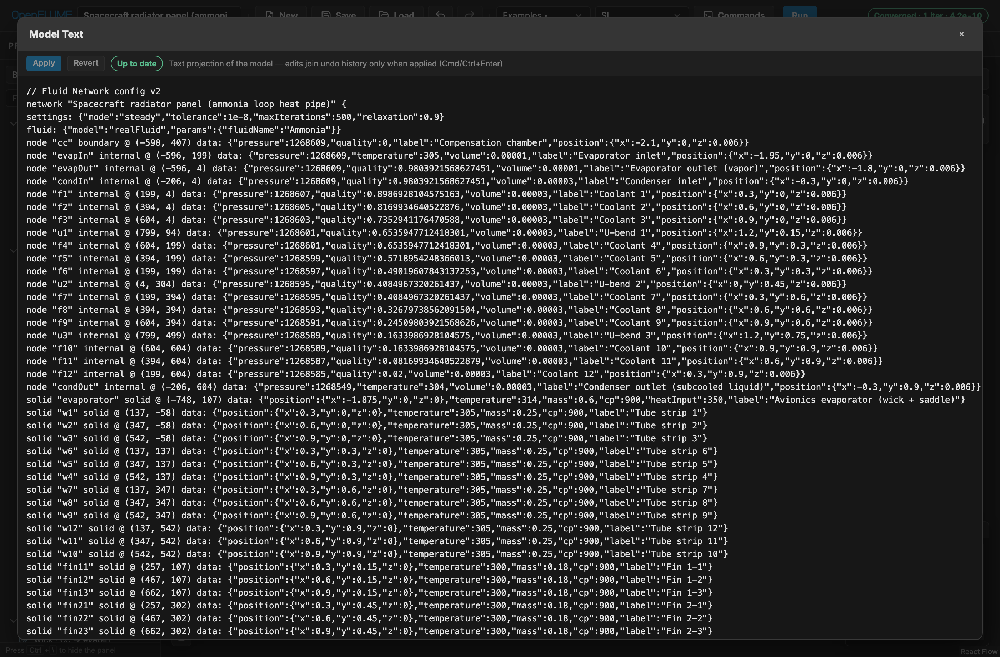
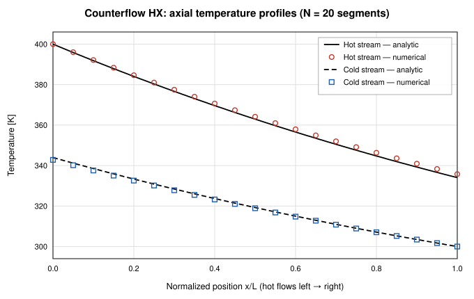
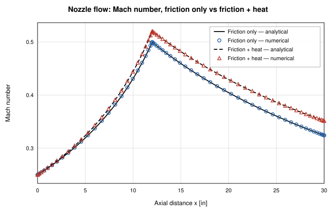

<p align="center">
  
</p>

# OpenFLUME, Version 0.2.1

_Open FLUid Model Environment_

## User's Manual

John Rising

---

**Document status:** This manual covers OpenFLUME v0.2.1 and is maintained within the repository. In the event of a conflict between this documentation and the source code, [`src/core/schema.ts`](../src/core/schema.ts) and [`src/core/validate.ts`](../src/core/validate.ts) serve as the authoritative source of truth.

**How to cite.** See [CITATION.cff](../CITATION.cff), or:

> Rising, J. (2026). _OpenFLUME: Open FLUid Model Environment_ (v0.2.1).
> [https://github.com/OpenFLUME/OpenFLUME](https://github.com/OpenFLUME/OpenFLUME)

---

## Preface

The aerospace industry has long needed an accessible, open-source tool for thermal-fluid network analysis. While legacy codes like NASA's GFSSP and C&R Technologies' SINDA/FLUINT are highly capable and validated, they can be difficult to extend, challenging to automate, and largely inaccessible to students, researchers, and engineers without institutional licenses. As a result, many organizations build their own proprietary network solvers—duplicating effort, repeating common mistakes, and re-running the same validation benchmarks without contributing to a shared foundation.

OpenFLUME aims to break this cycle. It solves this same class of problems using a proven finite-volume network formulation, provided entirely open-source.

Although a browser interface is provided, the solver core is a plain library with no user-interface dependency so it can be integrated into a research pipeline. The tool is designed to be easily understood and clear, so simulations can be created programmatically or, especially in the case of very large networks, AI-assisted.

This manual is organized so that a new user can stop after section 2 and still
run a useful model. Section 1 introduces the method and limitations. Section 2 installs the program and walks through a first simulation.
Sections 3 and 4 describe the data structure and the mathematical formulation. Section 5 covers program
structure and scripting. Section 6 describes the interface. Section 7 describes example problems, and section 8 records verification and validation.

An engineer with an undergraduate background in fluid mechanics and heat transfer
should be able to build a defensible model from this manual.

---

## Executive Summary

OpenFLUME (Open FLUid Model Environment) is a finite-volume, general-purpose program for
simulating arbitrary thermo-fluid networks, in both steady state and transient
operation. The system under analysis is discretized into **fluid nodes**,
**branches**, **solid nodes**, and **conductors**. Scalar properties like pressure,
temperature, density, enthalpy, quality, and species composition are computed at
nodes; mass flow rates are computed in branches and heat transfer rates in
conductors.

The program runs entirely in a web browser. A visual network editor
is backed by a solver that executes in a dedicated worker thread so that long
runs do not block the interface. Models are saved as `.fn` text files and autosaved to browser storage. Everything runs locally, and nothing is transmitted to a server.

Four equation-of-state classes are supported: constant-density incompressible
liquid, ideal gas with user-settable gas constants, thermal-expansion liquids (for
buoyancy-driven circulation), and real fluid through a CoolProp WebAssembly
sidecar.
Seventeen branch component
types model momentum sources and sinks: pipe, orifice, cavitating venturi,
generic resistance, valve, check valve, dynamic check valve, relief valve, pump,
bend, area change, flow source, pressure regulator, heated pipe, tabulated
pressure drop, Reynolds-dependent custom resistance, and user-authored components.
Conjugate heat transfer is available through solid lumped
masses and ambient reservoirs linked by conduction, convection, and radiation
conductors, with a temperature-dependent material catalogue and five
convection heat-transfer models including two cryogenic chilldown correlations.
CEA-coupled reacting junctions (steady or transient) support LOX/RP-1 and
LOX/methane combustors, while the separate species-transport path supports
transient ideal-gas chemistry.

The steady-state solver uses a coupled Newton–Raphson method to simultaneously resolve mass and momentum residuals. In challenging convergence scenarios, it leverages an analytic Jacobian (computed via forward-mode automatic differentiation), trust-region dogleg globalization, and pseudo-transient continuation. Transient simulations use a fully implicit backward-Euler scheme, supporting both fixed and variable time steps. Advanced optional capabilities include lumped fluid inertia, trapped-gas cushions, multi-species advection with stiff Arrhenius kinetics, declarative logic registers, transient PID control, and built-in parameter sweeps.

Thirteen example problems ship with the program, spanning hand-checkable sanity
cases, engineering applications, and published benchmarks.

---

## Nomenclature

| Symbol        | Quantity                                                                                    | Unit              |
| ------------- | ------------------------------------------------------------------------------------------- | ----------------- |
| $A$           | flow or heat transfer area                                                                  | m²                |
| $a$           | speed of sound                                                                              | m/s               |
| $C$           | quadratic loss coefficient, $1/(2\rho C_d^2 A^2)$                                           | 1/(kg·m)          |
| $C_d$         | discharge coefficient                                                                       | —                 |
| $d$           | orifice or pipe bore (diameter ratio $\beta = d/D$)                                         | m                 |
| $c$           | damping coefficient (dynamic check valve)                                                   | N·s/m             |
| $c_p$         | specific heat at constant pressure                                                          | J/(kg·K)          |
| $c_v$         | specific heat at constant volume                                                            | J/(kg·K)          |
| $D$           | diameter (hydraulic)                                                                        | m                 |
| $F$           | radiation view factor; also force ($F_\text{preload}$)                                      | —; N              |
| $f$           | Darcy friction factor                                                                       | —                 |
| $G$           | mass flux                                                                                   | kg/(m²·s)         |
| $g$           | gravitational acceleration, 9.80665                                                         | m/s²              |
| $h$           | specific enthalpy; also liquid height (hydrostatic-column check)                            | J/kg; m           |
| $h_0$         | stagnation enthalpy, $h + \tfrac12 v^2$                                                     | J/kg              |
| $h_c$         | convection heat transfer coefficient (property panel: Specified h)                          | W/(m²·K)          |
| $\mathbf{J}$  | Jacobian of the residual                                                                    | —                 |
| $K$           | loss coefficient, including $K_{90}$, $K_\text{bend}$, $K_\text{exp}$, $K_\text{con}$       | —                 |
| $k$           | thermal conductivity; also spring stiffness                                                 | W/(m·K); N/m      |
| $L$           | length                                                                                      | m                 |
| $M$           | Mach number, $v/a$                                                                          | —                 |
| $\dot m$      | mass flow rate                                                                              | kg/s              |
| $m$           | mass                                                                                        | kg                |
| $\mathrm{Nu}$ | Nusselt number                                                                              | —                 |
| $n$           | polytropic index                                                                            | —                 |
| $O/F$         | oxidizer-to-fuel mass ratio                                                                 | —                 |
| $P$           | pressure                                                                                    | Pa                |
| $P_v$         | saturation (vapor) pressure                                                                 | Pa                |
| $\mathrm{Pr}$ | Prandtl number                                                                              | —                 |
| $p$           | valve or poppet fractional opening                                                          | —                 |
| $Q$           | volumetric flow rate                                                                        | m³/s              |
| $\dot Q$      | heat transfer rate                                                                          | W                 |
| $R$           | specific gas constant; also reverse-flow resistance $R(\dot m)$                             | J/(kg·K); Pa·s/kg |
| $\mathbf{R}$  | residual vector                                                                             | —                 |
| $\mathrm{Re}$ | Reynolds number                                                                             | —                 |
| $r$           | pressure ratio $P_\text{down}/P_\text{up}$; also venturi recovery factor                    | —                 |
| $r_*$         | critical (choke) pressure ratio, $(2/(\kappa+1))^{\kappa/(\kappa-1)}$                       | —                 |
| $T$           | temperature                                                                                 | K                 |
| $T_0$         | stagnation temperature; also EOS reference temperature                                      | K                 |
| $t$           | time                                                                                        | s                 |
| $UA$          | overall conductance                                                                         | W/K               |
| $u$           | specific internal energy                                                                    | J/kg              |
| $V$           | volume                                                                                      | m³                |
| $v$           | velocity                                                                                    | m/s               |
| $\mathbf{x}$  | Newton unknown vector                                                                       | —                 |
| $x$           | vapor quality; also poppet travel                                                           | —; m              |
| $Y$           | ISO/AGA expansibility factor; also Miropolskii two-phase factor; also species mass fraction | —                 |
| $z$           | elevation (positive up)                                                                     | m                 |
| $\beta$       | volumetric thermal expansion coefficient; also orifice diameter ratio ($d/D$)               | 1/K; —            |
| $\gamma$      | ratio of specific heats                                                                     | —                 |
| $\Delta P$    | pressure drop, $P_\text{from} - P_\text{to}$                                                | Pa                |
| $\Delta T$    | temperature difference                                                                      | K                 |
| $\Delta t$    | time step                                                                                   | s                 |
| $\Delta z$    | elevation change, $z_\text{to} - z_\text{from}$                                             | m                 |
| $\varepsilon$ | pipe roughness; also effectiveness; also emissivity                                         | m; —; —           |
| $\epsilon$    | smoothing scale in $\tanh$ switches                                                         | kg/s              |
| $\eta$        | energy-release efficiency (reacting junction)                                               | —                 |
| $\kappa$      | isentropic exponent ($\gamma$ for an ideal gas; $a^2\rho/P$ for a real fluid)               | —                 |
| $\mu$         | dynamic viscosity                                                                           | Pa·s              |
| $\rho$        | density                                                                                     | kg/m³             |
| $\rho_0$      | reference density (expandable-liquid EOS)                                                   | kg/m³             |
| $\sigma$      | Stefan–Boltzmann constant, 5.670374×10⁻⁸                                                    | W/(m²·K⁴)         |
| $\tau$        | time constant                                                                               | s                 |
| $\theta$      | bend angle                                                                                  | deg               |
| $\omega$      | under-relaxation factor                                                                     | —                 |

**Subscripts.** `from`, `to` — branch or conductor endpoints in declared
orientation. `up`, `down`/`dn` — upstream, downstream by sign of $\dot m$.
`f`, `g` — saturated liquid, saturated vapor; `g` is also the cushion gas
volume $V_g$. `w` — wall; also the incompressible liquid volume $V_w$ in a
cushion. `sat` — saturation. `0` — stagnation or EOS reference.
`src` — source. `c` — component drop $\Delta P_c$, or chamber ($P_c$).
`disc`, `stroke`, `preload`, `crack`, `full` — dynamic / relief-valve geometry
and set-points. `in`, `out` — area-change ports. `set` — regulator set pressure.
`top` — free surface of a hydrostatic column. `arc` — bend centreline arc.

**Superscripts.** $n$, $n+1$ — time level. $\|\mathbf{R}\|_\infty$ — infinity
norm of the residual.

**Abbreviations.**

| Abbreviation | Meaning                                      |
| :----------- | :------------------------------------------- |
| **AD**       | Automatic differentiation                    |
| **BDF1**     | First-order backward differentiation formula |
| **CEA**      | Chemical Equilibrium with Applications       |
| **CFD**      | Computational fluid dynamics                 |
| **DAE**      | Differential-algebraic equation              |
| **EOS**      | Equation of state                            |
| **FD**       | Finite difference                            |
| **HEM**      | Homogeneous equilibrium model                |
| **HEOS**     | Helmholtz Energy Equation of State           |
| **HEX**      | Heat exchanger                               |
| **LHP**      | Loop heat pipe                               |
| **NTU**      | Number of transfer units                     |
| **ODE**      | Ordinary differential equation               |
| **P&ID**     | Piping and instrumentation diagram           |
| **PID**      | Proportional–integral–derivative             |
| **PTC**      | Pseudo-transient continuation                |
| **TVS**      | Thermodynamic vent system                    |

---

## Contents

1. [Introduction](#1-introduction)
2. [Installation and First Run](#2-installation-and-first-run)
3. [Data Structure](#3-data-structure)
4. [Mathematical Formulation](#4-mathematical-formulation)
5. [Program Structure](#5-program-structure)
6. [Graphical User Interface](#6-graphical-user-interface)
7. [Example Problems](#7-example-problems)
8. [Verification and Validation](#8-verification-and-validation)
9. [Appendix A — Branch Component Quick Reference](#appendix-a--branch-component-quick-reference)
10. [Appendix B — Conductor Quick Reference](#appendix-b--conductor-quick-reference)
11. [Appendix C — The `.fn` File Format](#appendix-c--the-fn-file-format)
12. [Appendix D — Glossary](#appendix-d--glossary)
13. [Appendix E — References](#appendix-e--references)

---

# 1. Introduction

## 1.1 Purpose and Scope

This program computes the distribution of pressure, temperature, density, and
mass flow rate in a network of pipes and components, together with the
temperature distribution in solid structure thermally coupled to that fluid. It
addresses the class of problem in which the _system_ behavior is the question —
how much flow each leg of a manifold takes, how fast a tank blows down, how hot a
cooling channel wall runs, when a cryogenic line finishes chilling — as distinct
from problems in which the local flow field inside a single component is the
question, which require computational fluid dynamics.

Typical applications include propellant feed and pressurization systems, vent and
relief circuits, regenerative cooling jackets, water and process distribution
networks, cryogenic transfer lines, passive-circulation loops, and spacecraft
thermal control loops.

## 1.2 Network Flow Analysis

The system is represented as a directed graph. Control volumes are placed at
**nodes**, where the extensive fluid state is stored and conservation of mass and
energy is enforced. **Branches** connect pairs of nodes, and each branch carries
one scalar unknown, its mass flow rate, governed by a momentum relation between
the pressures at its two endpoint nodes.

You might wonder why the program separates nodes (volume) and branches (flow) instead of just offering a single "pipe" component that has both. This staggered approach is standard in thermal-fluid network solvers because it handles complex junctions naturally: a single node can connect to any number of branches without needing to define which pipe "owns" the junction's volume. It also avoids numerical instabilities that often occur when mass and momentum are computed at the exact same location.


_Figure 1-1. A representative network: two pressure boundaries, six internal
nodes, and twelve branches forming interconnected loops. This topology is the
multi-loop verification case of
[`docs/validation/incompressible-hydraulics-report.md`](validation/incompressible-hydraulics-report.md)._

Two consequences of this arrangement dictate how you will build and scope your models:

First, **spatial resolution is entirely up to you**. A 100 m pipe represented by a single branch has only one flow rate and no interior temperature profile. If you represent that same pipe with twenty branches and nineteen interior nodes, you can capture an axial temperature profile and a distributed friction gradient. Wherever a gradient matters to your result you must subdivide the line into enough segments to resolve it. (The shipped chilldown example uses twenty axial segments for a 61 m line for exactly this reason; the Repeat and Split commands of section 3.13 build such discretizations.)

Second, **a node's volume determines its ability to store mass and energy**. In a steady-state run, volume is irrelevant and you can safely ignore it. In a transient run, however, an interior node accumulates mass and energy in proportion to its volume. This means you must assign a positive volume to every interior node in a transient model, because how you distribute that volume directly sets your system's behavior.

### 1.2.1 Network Definitions

**Fluid node.** A control volume holding fluid state. An **internal** (interior)
node has unknown pressure and temperature solved by the program. A **boundary**
node has its pressure and temperature imposed, either as constants or from a
time schedule; it acts as an infinite reservoir. Every network must contain at
least one boundary node, which anchors the pressure level of the whole system.

**Branch.** A directed connection between two fluid nodes carrying a mass flow
rate. Its **component** assigns the momentum relation — pipe friction, an orifice
closure, a pump curve, and so on. Both endpoints must be fluid nodes resolving to
the same named fluid, and a branch may not connect a node to itself.

**Solid node.** A lumped thermal mass with a temperature, a mass, and a specific
heat. It holds no fluid and passes no flow.

**Ambient node.** A fixed-temperature thermal reservoir of effectively infinite
capacity, optionally driven by a temperature schedule. It plays the same role in
the thermal network that a boundary node plays in the fluid network.

**Conductor.** A directed thermal link carrying a heat transfer rate by
conduction, convection, or radiation. Conduction and radiation conductors join
two thermal (solid or ambient) nodes. A convection conductor is the fluid-solid
coupling: exactly one endpoint must be a fluid node and the other a solid or
ambient node.

**Group (subnetwork).** A purely visual container for organizing a large diagram.
The solver ignores groups; a grouped network produces identical numbers to an
ungrouped one.

**Note.** A free-floating text annotation. Notes are inert — the solver never
reads them and they are excluded from the provenance hash, so documenting a model
never invalidates its results.

## 1.3 Units

**All quantities in a model are SI.** The solver, the saved `.fn` file, and the
scripting interface use SI exclusively and carry no unit metadata.

| Quantity                    | Unit            | Quantity                  | Unit     |
| --------------------------- | --------------- | ------------------------- | -------- |
| Pressure                    | Pa              | Volume                    | m³       |
| Temperature                 | K               | Mass                      | kg       |
| Mass flow rate              | kg/s            | Heat rate, power          | W        |
| Density                     | kg/m³           | Specific heat             | J/(kg·K) |
| Dynamic viscosity           | Pa·s            | Thermal conductivity      | W/(m·K)  |
| Length, diameter, roughness | m               | Heat transfer coefficient | W/(m²·K) |
| Area                        | m²              | Overall conductance $UA$  | W/K      |
| Time                        | s               | Activation energy         | J/mol    |
| Elevation                   | m (positive up) | Molecular weight          | kg/mol   |

The interface can _display and accept_ other units. The **Units ▾** menu offers
three presets — **SI**, **Metric engineering**, and **US customary** — which
convert values in property fields for display and entry only, including degrees
Rankine, °F, and psi. Conversion happens at the input and output; the stored model
is always SI. Values typed into the parameter sweep workspace and into the model
text editor are SI regardless of the display preset.

## 1.4 Sign Conventions

Sign errors are the most common cause of a physically wrong but numerically
converged model. The four conventions below are enforced consistently throughout.

**Mass flow.** A branch is declared `from` one node `to` another. **Positive mass
flow is in the declared** `from` **→** `to` **direction.** A negative reported $\dot m$
means the fluid runs backward through that branch relative to how you drew it,
which is normal and correct for legs whose direction you did not know in advance.

**Pressure drop.** $\Delta P \equiv P_\text{from} - P_\text{to}$. A component's
pressure-drop relation returns a positive value for a loss. A pump therefore
returns a _negative_ pressure drop, being a pressure rise in the `from` → `to`
direction.

**Elevation.** `elevationChange` on a pipe is $z_\text{to} - z_\text{from}$, in
metres, positive when the `to` end is higher. The hydrostatic contribution is
$\Delta P_\text{elev} = \rho g\Delta z$ with $g = 9.80665$ m/s², so lifting
fluid costs pressure. Elevation may instead be derived from physical node
coordinates (section 3.10). Note that `settings.gravity` exists in the schema as
a vector but hydrostatics currently use the fixed scalar $g$ above.

**Heat.** A conductor's heat rate is positive when heat flows from its `from`
endpoint toward its `to` endpoint. A `heatInput` on any node, fluid or solid, is
positive when heat is _added to_ that node. In a fluid node's energy balance,
convective heat arriving from a wall is positive.

## 1.5 Capability Summary

| Category                | Available                                                                                                               |
| ----------------------- | ----------------------------------------------------------------------------------------------------------------------- |
| Solution modes          | Steady state; transient with fixed or adaptive time step                                                                |
| Equations of state      | Incompressible liquid, ideal gas, thermal-expansion liquid, real fluid (CoolProp, 124-fluid catalogue)                  |
| Two-phase               | Transient homogeneous-equilibrium model for real fluids                                                                 |
| Compressible duct flow  | Opt-in quasi-1-D (`momentumFlux` + `kineticEnergy`, any fluid model): Fanno/Rayleigh choking, seeded supersonic nozzles |
| Branch components       | 17 types (Appendix A)                                                                                                   |
| Conjugate heat transfer | Solid and ambient nodes; conduction, convection, radiation conductors                                                   |
| Convection models       | Specified $h$ or expression, Dittus–Boelter, Miropolskii, Darr–Hartwig, TT-WF                                           |
| Solid properties        | Constant, sourced material catalogue, table, equation, time table                                                       |
| Transient momentum      | Optional lumped fluid inertia; trapped-gas cushions                                                                     |
| Species                 | Multi-species advective transport with Arrhenius chemistry (transient, ideal gas)                                       |
| Combustion              | CEA-coupled reacting junctions (steady or transient + `kineticEnergy`; LOX/RP-1 and LOX/CH₄)                            |
| Control and logic       | Registers, declarative logic rules, stop rules, transient PID controllers                                               |
| Multi-fluid             | Named isolated fluid continua, mixed EOS classes allowed (wall-coupled only)                                            |
| Extensibility           | Tabulated $\Delta P$, $K(\mathrm{Re})$ resistances, user-authored JavaScript components                                 |
| Exploration             | Session-only single-parameter sweeps up to 25 variants                                                                  |
| Persistence             | `.fn` text save/load, browser autosave, 13 shipped examples                                                             |

## 1.6 Program Structure

The program has four parts. The **core** (`src/core`) is a platform-agnostic
TypeScript library containing the schema, validation, equations of state,
component relations, and both solvers; it has no browser dependency and runs
unchanged in Node.js. The **substrate** (`src/substrate`) implements the `.fn`
text projection. The **interface** (`src/ui`) is a React application that owns the
canvas, panels, run history, and a solver **worker** that keeps long solves off
the main thread. An optional companion server (`scripts/serve.ts`) serves the
built application and discovers user-authored component files on disk. Real-fluid
properties come from a lazily loaded CoolProp WebAssembly module. Section 5
develops this in detail.

## 1.7 Scope Boundaries

The following limitations are structural. They follow from the lumped-parameter
formulation and cannot be worked
around by refining the mesh or tightening tolerances. Read this list before
using a result to support a decision.

**No shocks.** With `settings.momentumFlux` and `settings.kineticEnergy` both
enabled, the solver handles quasi-1-D compressible duct flow, specficially
Fanno friction choking, Rayleigh thermal choking, and converging–diverging
nozzles built from tapered pipe. Smoothly expanding
supersonic branches are reachable, like converging-diverging nozzles.
Under the default limited-upwind momentum faces
(`settings.momentumFluxScheme: "upwind"`, section 4.1.2) the transonic solve
is seed-robust: entropy-violating roots such as a station dipping onto
the supersonic branch mid-convergent do not satisfy the discrete equations
at all, so even a flat cold start converges to the physical branch. The
legacy `"central"` scheme is a couple of percent more accurate at the choke
but must be seeded onto the physical branch (`initialMdot` near the choked
value and a monotonically falling nodal $P$/$T$ guess); its converged root
is certified by the second-law audit (`settings.transonicAdmissibility`).

What remains structurally out of scope is **shock capture**. There is no
Rankine–Hugoniot jump condition and no mechanism for locating a normal shock, so
over-expanded and separated nozzle operation, shock position, and any case where
the flow must pass supersonic → subsonic cannot be modeled. Thrust is likewise
not computed; the solver returns the internal flow field, not a momentum balance
on the vehicle. Point choking at restrictions is separately available through
`orifice` (expansibility $Y(r,\kappa)$, any gas-capable fluid) and
`cavitatingVenturi` (choked liquid). With the flags off (the default), branch momentum is the incompressible
algebraic relation $\Delta P(\dot m)$ with no Mach number in the formulation, and
a long gas line driven toward sonic velocity returns unphysical answers rather
than friction-choking.

**Kinetic energy transport is opt-in and steady-oriented.** By default static
enthalpy is fluxed; the $\tfrac12 v^2$ term is not carried, so there is no
stagnation/static distinction and recovery temperature and diffuser heating are
not modeled. `settings.kineticEnergy` switches the energy equation to
stagnation-enthalpy transport for any fluid model — the solver couples
pressure, mass flow, and enthalpy in one Newton system (`[P, ṁ, h]`), which is
what lets it hold near-sonic states, and enthalpy is a complete state
coordinate for every EOS including CoolProp real fluids. The coupled system is
not steady-only: transient solves take it too, for real fluids and for every
analytic `kineticEnergy` network. Only species-transport networks keep the
segregated stagnation-enthalpy update, composition not being a coupled
unknown, and that path is not designed to track choking fronts.

**No acoustic wave propagation.** Optional lumped fluid inertia $(L/A)d\dot
m/dt$ captures bulk surge, but there is no distributed wave equation or
method-of-characteristics solution. Classical water hammer — wave timing,
reflection, anything limited by the speed of sound — cannot be simulated.

**Cavitation only at the venturi closure.** There is no general
cavitation-inception check on pumps, valves, or low-pressure liquid nodes.

**Turbomachinery is a pump curve.** Pressure rise versus volumetric flow only. No
compressor or turbine maps, and no shaft-work term in the energy equation, so
pump heating of the fluid is not captured.

**No general junction mixing.** Outside an explicitly declared reacting
junction, unlike fluids may not meet at a node; couple them thermally through a
solid wall instead. A reacting junction is the narrow exception: declared
oxidizer and fuel inlet branches terminate at a chamber node and produce one
named ideal-gas stream under the CEA closure. Different EOS classes may
otherwise coexist in one network (e.g. an ideal-gas hot side with a real-fluid
coolant) precisely because the wall is the only coupling — property access
dispatches per node.

**Two-phase flow is homogeneous-equilibrium.** The HEM assumption suits
dispersed, high-mixing, or low-quality flows. At high void fraction it
under-predicts pressure drop relative to separated-flow correlations such as
Lockhart–Martinelli, which are not implemented.

**Reacting-flow support is split between two models.** Species transport with
Arrhenius chemistry is transient-only and ideal-gas-only. CEA-coupled reacting
junctions are steady-only, require `kineticEnergy`, freeze product composition
downstream, and support only the committed LOX/RP-1 and LOX/CH₄ tables though more can be generated by the user; see
[`combustion.md`](combustion.md).

**User code is trusted, not sandboxed.** Embedded and local components execute
JavaScript through `new Function`. This is not a security boundary; treat
component files like source code.

**Steady closed ideal-gas loops need a pressure anchor.** In a steady-state simulation, the solver finds a balance of flows. If a section of your network is completely sealed off (like a closed loop or a trapped section behind a closed valve), there is no fixed pressure boundary to tell the solver what the overall pressure inside that isolated section should be. For an ideal gas, this missing information makes the math unsolvable (a singular Jacobian). To fix this, connect a boundary node to the isolated section or run the model in transient mode (where the known initial pressure anchors the system over time).

## 1.8 How to Read This Manual

As a new user, you should first read section 1.4 (sign conventions), work through section 2, and then jump straight to the example in section 7 that most closely matches your problem so you can start modifying it. Sections 3 and 4 provide deep reference material—they are best read after you've built your first model and want to understand exactly what is happening under the hood. If you are preparing to publish a paper or certify an engineering result, you must read section 1.7 (limitations) and section 8 (verification) in full to ensure you are operating within the solver's validated bounds.

---

# 2. Installation and First Run

## 2.1 Prerequisites

Node.js 22 (the pinned version is in `.nvmrc`) and npm 10.8 or newer. A current
Chromium-, Firefox-, or WebKit-based browser. No other services, licenses, or
network access are required; real-fluid support is bundled, not fetched at run
time.

## 2.2 Installation

```bash
git clone https://github.com/OpenFLUME/OpenFLUME.git
cd OpenFLUME
npm install
npm run dev
```

Open `http://localhost:5173`. The application loads with an empty canvas, or with
your most recent network restored from browser storage.

## 2.3 First Simulation

The fastest way to confirm a working installation is to run a case whose answer
is known in closed form.

1. Open **Examples ▾** in the toolbar and choose, under _Verify-by-inspection_,
   **Sanity: orifice hand-calc**. Two boundary nodes appear, joined by a single
   orifice branch, with the expected answer written on the canvas as a note.
2. Click **Run**. The status pill reports **Converged** with an iteration count
   and final residual.
3. Select the orifice branch. The **Results** block at the bottom of the property
   panel shows the solved mass flow rate. It should agree with
   $C_d A\sqrt{2\rho\Delta P} \approx 0.8485$ kg/s to within 0.5 %.



_Figure 2-1. The orifice sanity check after a converged run. The status pill
(top right) reports the iteration count and final residual; the property
panel's **Results** block reports the solved mass flow of 848.5 g/s against
the hand-calculated 0.849 kg/s._

Then run a transient:

1. Choose **Tank blowdown** from _Applications_ — a 0.1 m³ air tank at 500 kPa,
   300 K venting through an orifice to atmosphere over 5 s.
2. Click **Run**. The status pill reports **Converged** with the accepted step
   count. Open the **Results** tab. A new plot starts empty — from **or plot a
   whole set…** choose **Node pressure** to chart tank and ambient pressure
   versus time. Tank pressure should decay monotonically toward 101 325 Pa.
   The **Node & solid temperature** preset shows tank temperature falling well
   below its initial 300 K: the expansion is adiabatic, not isothermal.
3. Return to the **Model** tab. A time scrubber has appeared below the canvas;
   drag it and, with **Color by** set to **Pressure**, watch the network recolor
   through the blowdown.



_Figure 2-2. The **Results** tab after the tank-blowdown transient, with the
**Node pressure** preset: tank pressure decays from 500 kPa toward atmosphere
over the 5 s run, 501 accepted steps._



_Figure 2-3. Back on the **Model** tab with **Color by** set to **Pressure**:
the colormap legend appears at the top right and the time scrubber below the
canvas replays the run._

If both cases converge, the installation is sound.

## 2.4 Companion Server (Optional)

The companion server is needed only for user-authored component files
(section 5.6). It serves the built application and exposes the component library
on the same origin:

```bash
npm run serve        # build, then serve on http://localhost:4174
npm run serve:dist   # serve an existing dist/ without rebuilding
```

Relevant environment variables are `PORT`, `HOST`, `DIST_DIR`, `LIBRARY_DIR`
(default `library/components`), and `ALLOW_REMOTE_WRITES`. Component creation
over HTTP is restricted to localhost and refuses to overwrite existing files.

## 2.5 Files Read and Written

| Artifact                            | Direction                  | Notes                                                                               |
| ----------------------------------- | -------------------------- | ----------------------------------------------------------------------------------- |
| `.fn` model file                    | Save / Load                | Line-oriented lossless text projection (Appendix C)                                 |
| Browser `localStorage`              | Autosave                   | Last network plus unit preferences; restored on reload                              |
| `library/components/*.component.js` | Read (and optional create) | User components; requires companion server                                          |
| CSV exports                         | Write                      | Channel data, result tables, transient time series, sweep variants, run comparisons |
| Solver diary JSON / text            | Write                      | Convergence record with config-hash provenance                                      |

## 2.6 Running the Test Suites

```bash
npm test          # fast pull-request tier
npm run check     # production build plus fast tier
npm run test:all  # every Vitest file
npm run test:slow # adds opt-in slow scientific validation blocks
npm run test:e2e  # builds and runs the Playwright end-to-end suite
```

Tiers are described in [`docs/testing-slow.md`](testing-slow.md) and section 8.5.

---

# 3. Data Structure

A complete model is a single `NetworkConfig` object. This section describes each
element and its properties. Exact TypeScript declarations live in
[`src/core/schema.ts`](../src/core/schema.ts); the constraints quoted here are
enforced by [`src/core/validate.ts`](../src/core/validate.ts) before any solve.

## 3.0 A Complete Model

Before the field-by-field reference, it is worth seeing the whole object at
once. The listing below is the shipped **Three-pipe junction** example
(section 7.2) in full — a steady incompressible case with one inlet boundary,
one junction node, one outlet boundary, and two pipe branches. Every structure
the rest of section 3 documents appears here in its concrete form: `meta`,
`settings`, `fluid`, `nodes`, and `branches`.

```json
{
  "meta": {
    "name": "Three-pipe junction",
    "version": 2
  },
  "settings": {
    "mode": "steady",
    "tolerance": 1e-9,
    "maxIterations": 500,
    "relaxation": 0.9
  },
  "fluid": {
    "model": "incompressible",
    "preset": "water"
  },
  "nodes": [
    {
      "id": "in",
      "type": "boundary",
      "x": 0,
      "y": 0,
      "pressure": 300000,
      "temperature": 300,
      "label": "Inlet"
    },
    {
      "id": "j",
      "type": "internal",
      "x": 200,
      "y": 0,
      "pressure": 250000,
      "temperature": 300,
      "label": "Junction",
      "volume": 0.001
    },
    {
      "id": "out1",
      "type": "boundary",
      "x": 400,
      "y": 100,
      "pressure": 200000,
      "temperature": 300,
      "label": "Out 1"
    }
  ],
  "branches": [
    {
      "id": "b1",
      "from": "in",
      "to": "j",
      "label": "Pipe 1",
      "component": {
        "type": "pipe",
        "length": 2,
        "diameter": 0.03,
        "roughness": 1e-5,
        "elevationChange": 0
      }
    },
    {
      "id": "b2",
      "from": "j",
      "to": "out1",
      "label": "Pipe 2",
      "component": {
        "type": "pipe",
        "length": 3,
        "diameter": 0.02,
        "roughness": 1e-5
      }
    }
  ]
}
```

Note what is _absent_. `x` and `y` are diagram pixels and never reach the
solver. `volume` on the junction node is carried even though this is a steady
case, where it is ignored — it costs nothing and makes the model runnable as a
transient. `elevationChange` is stated explicitly on the first pipe and omitted
on the second, which is the same thing: an omitted optional field takes its
default rather than being an error. `solidNodes`, `conductors`, `groups`, and
`notes` are all optional and simply do not appear.

The `.fn` file format is a line-oriented projection of exactly this object, not
a different model; see Appendix C.

## 3.1 Top-Level Structure

| Key                | Required | Contents                                                        |
| ------------------ | -------- | --------------------------------------------------------------- |
| `meta`             | yes      | `name` and `version` (must be `2`)                              |
| `settings`         | yes      | Mode, tolerances, time stepping, solver strategy (section 3.11) |
| `fluid`            | yes      | Default equation of state for the network                       |
| `fluids`           | no       | Named additional fluids as isolated continua                    |
| `nodes`            | yes      | Fluid nodes, at least one, at least one of them a boundary      |
| `branches`         | yes      | Fluid branches, at least one                                    |
| `solidNodes`       | no       | Solid lumped masses and ambient reservoirs                      |
| `conductors`       | no       | Thermal links                                                   |
| `species`          | no       | Species list and Arrhenius reactions (ideal gas, transient)     |
| `junctions`        | no       | CEA-coupled reacting junctions (steady or transient)            |
| `registers`        | no       | Named numeric state for logic and expressions                   |
| `logic`            | no       | Declarative event rules and stop rules                          |
| `controllers`      | no       | Transient PID controllers                                       |
| `componentLibrary` | no       | Embedded user-component source                                  |
| `closureParams`    | no       | Overrides for correlation constants                             |
| `groups`           | no       | Visual subnetwork containers                                    |
| `notes`            | no       | Text annotations (inert)                                        |

Only schema version `2` is accepted. Decoding rejects unknown structure before
validation runs, and validation runs before every solve.

## 3.2 Fluid Node Properties

| Field                 | Type                    | Unit  | Required                     | Meaning                                                |
| --------------------- | ----------------------- | ----- | ---------------------------- | ------------------------------------------------------ |
| `id`                  | string                  | —     | yes                          | Unique; shares one namespace with solid nodes          |
| `label`               | string                  | —     | no                           | Display name                                           |
| `type`                | `internal` / `boundary` | —     | yes                          | Interior control volume or reservoir                   |
| `x`, `y`              | number                  | px    | yes                          | Diagram position; never a solver input                 |
| `position`            | `{x,y,z}`               | m     | no                           | Physical coordinates, $z$ up; formula-bindable         |
| `group`               | string                  | —     | no                           | Subnetwork membership                                  |
| `fluid`               | string                  | —     | no                           | Names an entry in `fluids`; omit for the default       |
| `pressure`            | number                  | Pa    | see below                    | Boundary value, or transient initial value             |
| `temperature`         | number                  | K     | see below                    | Boundary value, or transient initial value             |
| `quality`             | number                  | —     | alternative to `temperature` | Real fluid only; mutually exclusive with `temperature` |
| `volume`              | number or expression    | m³    | internal, transient          | Storage volume; must be positive                       |
| `heatInput`           | number                  | W     | no                           | Heat added to the node                                 |
| `pressureSchedule`    | `[[t,P],…]`             | s, Pa | no                           | Boundary only                                          |
| `temperatureSchedule` | `[[t,T],…]`             | s, K  | no                           | Boundary only                                          |
| `gasCushion`          | object                  | m³, — | no                           | Trapped gas; transient liquid networks only            |
| `massFractions`       | map                     | —     | no                           | Species composition                                    |
| `fluidFrontInlet`     | number on [0,1]         | —     | no                           | Boundary only; cryogenic front inlet                   |

**A boundary node requires** `pressure`, and either `temperature` or `quality`
but not both. `quality` is accepted only when that node's fluid model is
`realFluid`.

**An internal node in a transient requires** a positive `volume`, plus
`pressure` and either `temperature` or `quality` as the initial condition. In
steady state, an internal node needs neither: its pressure and temperature are
unknowns, and any values supplied serve only as the starting iterate. Supplying a
good initial guess is nevertheless the single most effective way to help a
difficult steady case converge.

Note the distinction between `x`, `y` — pixel coordinates that place the symbol
on the diagram — and `position` — physical coordinates in metres that can feed
physics, notably derived pipe elevation change and derived convection axial
stations.

## 3.3 Branch Properties

Every branch carries `id`, an optional `label`, `from`, `to`, and a `component`
object whose `type` selects the momentum relation. Both endpoints must be fluid
nodes, must resolve to the same named fluid, and must differ from each other.

The seventeen component types are `pipe`, `orifice`,
`cavitatingVenturi`, `resistance`, `valve`, `checkValve`, `dynamicCheckValve`,
`reliefValve`, `pump`, `bend`, `areaChange`, `flowSource`, `regulator`,
`heatedPipe`, `dpTable`, `customResistance`, and `userComponent`. Their
parameters, constraints, interface labels, and governing equations are
tabulated in Appendix A and derived in section 4.3.

## 3.4 Solid Node Properties

| Field                 | Type                | Unit     | Required         | Meaning                                        |
| --------------------- | ------------------- | -------- | ---------------- | ---------------------------------------------- |
| `id`                  | string              | —        | yes              | Unique across fluid and solid nodes            |
| `label`               | string              | —        | no               | Display name                                   |
| `type`                | `solid` / `ambient` | —        | yes              | Lumped mass or fixed reservoir                 |
| `x`, `y`              | number              | px       | yes              | Diagram position                               |
| `position`            | `{x,y,z}`           | m        | no               | Physical coordinates                           |
| `temperature`         | number              | K        | yes              | Fixed value (ambient) or initial value (solid) |
| `mass`                | number              | kg       | solid, transient | Lumped mass; must be positive                  |
| `cp`                  | number or spec      | J/(kg·K) | solid, transient | Specific heat; see below                       |
| `heatInput`           | number              | W        | no               | Heat added to the node                         |
| `temperatureSchedule` | `[[t,T],…]`         | s, K     | no               | Ambient only                                   |

A **solid** node has finite thermal capacity $m c_p$ and therefore a thermal time
constant; in steady state its temperature floats to satisfy its heat balance and
neither `mass` nor `cp` is required. An **ambient** node is a fixed-temperature
reservoir of unbounded capacity, appropriate for a room, deep space, or a
temperature-controlled bath.

`cp` accepts five forms: a constant; `{ material }` naming an entry in the
sourced catalogue (OFHC copper, GRCop-84, Aluminum 6061-T6, stainless 304 and
316, Inconel 718, PTFE, anisotropic G-10 CR — each with a documented validity
range and end-value clamping); `{ table }` of temperature–value pairs;
`{ expression, tRange }`; or `{ timeTable }`, which is transient-only. Catalogue
sources and validity ranges are recorded in
[`docs/solid-properties-results.md`](solid-properties-results.md).

## 3.5 Conductor Properties

Every conductor carries `id`, an optional `label`, `from`, `to`, and a `type`
object discriminated by `kind`.

| `kind`       | Endpoints                       | Parameters                                                                     |
| ------------ | ------------------------------- | ------------------------------------------------------------------------------ |
| `conduction` | both thermal (solid or ambient) | `k` (W/(m·K), constant, spec object, or expression), `area` (m²), `length` (m) |
| `convection` | exactly one fluid, one thermal  | `area` (m²), and either `h` (W/(m²·K)) or a `correlation` block                |
| `radiation`  | both thermal                    | `emissivity`, `area` (m²), `viewFactor`                                        |

The convection conductor is the only fluid-to-solid coupling in the program, and
it is coupled implicitly: the fluid node's energy residual and the solid node's
energy residual both carry the same conductor heat rate with opposite signs.

A `correlation` block replaces a constant $h$ with one computed from the local
flow state. Its `model` is `dittusBoelter`, `miropolskii`, `darrHartwig` (which
also needs `axialPosition`), `ttWf` (which also needs `axialPosition` and
`segmentLength`, and is transient-only), or `custom` (which needs an
`expression`). `diameter` must be positive; `flowArea` defaults to $\pi D^2/4$.
All named models require the `realFluid` fluid model; `custom` does not. When a
correlation is present, `h` becomes optional and a floor of 5 W/(m²·K) prevents
zero conductance. Correlation forms are given in section 4.4.

A worked conjugate fragment: a heated wall lump tied to a fluid node by
convection and to deep-space-like surroundings by radiation. Added to a network
that already declares a fluid node `fluid1`, these two arrays are the whole
thermal side of the model.

```json
{
  "solidNodes": [
    {
      "id": "wall",
      "type": "solid",
      "x": 200,
      "y": 150,
      "temperature": 350,
      "mass": 1,
      "cp": 500,
      "heatInput": 5000
    },
    { "id": "amb", "type": "ambient", "x": 300, "y": 0, "temperature": 300 }
  ],
  "conductors": [
    {
      "id": "c1",
      "from": "wall",
      "to": "fluid1",
      "type": { "kind": "convection", "h": 1000, "area": 0.1 }
    },
    {
      "id": "c2",
      "from": "wall",
      "to": "amb",
      "type": {
        "kind": "radiation",
        "emissivity": 0.8,
        "area": 0.5,
        "viewFactor": 1
      }
    }
  ]
}
```

The `wall` node carries `mass` and `cp` because it is a lumped capacity; `amb`
carries neither, being a reservoir. Conductor `c1` has exactly one fluid
endpoint, which is what makes it legal as a convection tie, and its heat rate
appears with opposite signs in the `wall` and `fluid1` energy residuals.

## 3.6 Ambient Nodes and Boundary Thermal Conditions

To impose a wall temperature, connect the wall solid node to an ambient node
through a conductor sized for the physics you intend: a large-conductance
conduction or convection tie clamps the wall near the ambient temperature, while
a radiation tie to a 4 K ambient represents deep space. The same trick makes a
gas tank near-isothermal — attach a convection conductor with
$hA \gg 10^4$ W/K between the tank fluid node and an ambient node, and the tank
will track the set point within about 1 K, which is a useful control case against
the adiabatic default.

## 3.7 Schedules

A schedule is an array of `[time, value]` pairs with time in seconds and the
value in SI units for its quantity. Interpolation between knots is piecewise
linear, and values outside the range clamp to the first or last entry. Available
schedules are boundary node `pressureSchedule` and `temperatureSchedule`, ambient
node `temperatureSchedule`, valve `positionSchedule`, and flow source
`massFlowSchedule`.

Under adaptive time stepping, the step size is truncated so that every accepted
step lands exactly on schedule breakpoints, which prevents a discontinuity from
being straddled and smeared.

## 3.8 Registers, Logic, and Controllers

`registers` are named numbers that persist across a transient and are returned
with the results. `logic` rules fire on lifecycle events, evaluate a guarded
condition, atomically assign registers, and can stop the run with a stated
reason — enough to build hysteresis bands, latches, event counters, and
termination criteria without writing code. `controllers` are PID controllers that
run on accepted transient steps and actuate valves, flow sources, boundary
conditions, or heat inputs on the following step.

Controllers are transient-only, have no anti-windup, and take effect on the step
_after_ the one that measured the error unless `initialOutput` seeds the first
step. Logic can write registers and stop a solve but cannot mutate component
settings directly. The full contract is in
[`docs/usercode.md`](usercode.md).

## 3.9 Multiple Fluids and Species

A network has one required default `fluid` and may declare named extras in
`fluids`. A node owns its fluid; a branch inherits from its endpoints and is
rejected unless both resolve to the same named fluid. Unlike fluids therefore
never mix at a junction — the only permitted coupling between them is heat
through a solid wall, using convection conductors on opposite faces. EOS
_classes_ may differ between continua (an `idealGas` hot side with a
`realFluid` coolant is the canonical regenerative-cooling case): since unlike
fluids never share an equation, the solver dispatches property access per node.

`species` enables multi-species advective transport with optional Arrhenius
chemistry. It requires the `idealGas` model and transient mode, and is rejected
when named fluids are present. Chemistry is integrated node-locally with a
first-order backward-difference method and adaptive sub-stepping; see section
4.1.6.

### 3.9.1 Species Configuration

| Field                        | Type               | Unit     | Required | Meaning                                                 |
| ---------------------------- | ------------------ | -------- | -------- | ------------------------------------------------------- |
| `names`                      | `string[]`         | —        | yes      | Ordered species identifiers; sets the index order below |
| `molecularWeights`           | `number[]`         | kg/mol   | yes      | Aligned with `names`                                    |
| `cp`                         | `number[]`         | J/(kg·K) | no       | Constant-pressure specific heats, aligned with `names`  |
| `formationEnthalpy`          | `number[]`         | J/kg     | no       | Formation enthalpies, aligned with `names`              |
| `viscosity`                  | `number[]`         | Pa·s     | no       | Dynamic viscosities, aligned with `names`               |
| `reactions`                  | `Reaction[]`       | —        | no       | Arrhenius reactions; omit for inert transport           |
| `reactions[].reactants`      | map species→number | —        | yes      | Reactant stoichiometric coefficients                    |
| `reactions[].products`       | map species→number | —        | yes      | Product stoichiometric coefficients                     |
| `reactions[].A`              | number             | —        | yes      | Arrhenius pre-exponential factor                        |
| `reactions[].b`              | number             | —        | yes      | Arrhenius temperature exponent                          |
| `reactions[].Ea`             | number             | J/mol    | yes      | Activation energy                                       |
| `reactions[].heatOfReaction` | number             | J/kg     | no       | Enthalpy change per kilogram of mixture                 |

The array-valued fields are positional: `molecularWeights[k]`, `cp[k]`,
`formationEnthalpy[k]`, and `viscosity[k]` all describe `names[k]`, so each
supplied array must have the same length as `names`. Composition itself is not
declared here but per node, as `nodes[].massFractions` (section 3.2), for both
boundary values and internal-node initial conditions.

A reaction rate follows the modified Arrhenius form
$k = A\,T^{b}\exp\left(-E_a/(R_u T)\right)$ with $R_u$ the universal gas
constant, which is why `Ea` is per mole while `heatOfReaction` is per kilogram
of mixture. Omitting `reactions` leaves species purely advective.

### 3.9.2 Reacting Junctions

`junctions` declares combustion at an internal chamber node, in steady or
transient mode. Each entry names the chamber `node`, one or more inlet
branches with roles `oxidizer` or `fuel`, a `model` of type `ceaTable`, and a
named `productFluid`. The committed tables support `propellants: "lox-rp1"`
and `"lox-ch4"` over chamber pressure 0.2–30 MPa and O/F 1–5; out-of-range
requests clamp to the table edge. `model.efficiency` must lie in (0, 1].

The product fluid and chamber node must use the same named `idealGas` entry.
Every inlet branch must end at the chamber, and at least one non-inlet branch
must carry products away. Junctions require `settings.kineticEnergy` and
cannot be combined with `species`. In transient mode the chamber node must
additionally carry a positive `volume`: the mass balance then integrates a
genuine `d(ρV)/dt` storage term, so `Pc(t)` responds to a feed-pressure
transient with real fill/drain dynamics, while the energy closure stays
quasi-steady (combustion/residence time is far below any ramp rate a
network's boundary schedules would author). The chamber closure is solved
inside the coupled Newton system (steady or transient); product-gas
properties are updated between outer iterations. Composition is frozen
downstream and the CEA tables assume standard-state reactant injection. See
[`combustion.md`](combustion.md) for the complete contract.

## 3.10 Formula-Bound Fields

Geometry-like fields accept a formula instead of a number: node volume, pressure,
temperature, and heat input; solid mass, temperature, and heat input; every
physical-coordinate axis; pipe and heated-pipe length, diameter, roughness,
elevation, and $UA$; bend diameter and $r/D$; branch areas, discharge
coefficients, and the mechanical parameters of `dynamicCheckValve` (`mass`,
`springRate`, `preload`, `damping`, `stroke`, `initialPosition`, `discArea`);
conductor area, length, emissivity, and view factor; and convection-correlation
geometry. A formula references other parts of the _static_ model — for example
`pipe('seg1').surfaceArea` — and is resolved once against the model immediately
before each solve, so it expresses geometric consistency, not feedback on the
solution.

In the property panel, the **f(x)** button lists the valid
references and helpers for the field, and an inline preview shows the resolved
value in the current display unit. Two derived quantities are especially useful:
an unset pipe `elevationChange` and unset convection `axialPosition` /
`segmentLength` can be derived automatically from resolved physical `position`
coordinates along a unique pipe path. Scope, allowlist, and semantics are
specified in [`docs/parameter-bindings.md`](parameter-bindings.md).

## 3.11 Solver Settings

| Field                     | Type                         | Required        | Default                     | Meaning                                                                                                                                                      |
| ------------------------- | ---------------------------- | --------------- | --------------------------- | ------------------------------------------------------------------------------------------------------------------------------------------------------------ |
| `mode`                    | `steady` / `transient`       | yes             | —                           | Solution mode                                                                                                                                                |
| `tolerance`               | number                       | yes             | 1×10⁻⁶ (new network)        | Residual convergence threshold                                                                                                                               |
| `maxIterations`           | number                       | yes             | 200 (new network)           | Newton iteration limit                                                                                                                                       |
| `relaxation`              | number on (0,1]              | no              | 1.0 (0.9 for a new network) | Under-relaxation factor                                                                                                                                      |
| `dt`                      | number                       | fixed transient | —                           | Time step, s                                                                                                                                                 |
| `endTime`                 | number                       | transient       | —                           | Final time, s                                                                                                                                                |
| `timeStepping`            | `fixed` / `adaptive`         | no              | `fixed`                     | Time-step control                                                                                                                                            |
| `adaptive.dtMin`, `dtMax` | number                       | adaptive        | —                           | Step bounds, s; `dtMin` < `dtMax`                                                                                                                            |
| `adaptive.relTol`         | number                       | adaptive        | —                           | Relative error tolerance                                                                                                                                     |
| `adaptive.absTolP`        | number                       | no              | 100                         | Absolute pressure tolerance, Pa                                                                                                                              |
| `adaptive.absTolT`        | number                       | no              | 0.01                        | Absolute temperature tolerance, K                                                                                                                            |
| `adaptive.safety`         | number                       | no              | 0.9                         | Step-size safety factor                                                                                                                                      |
| `adaptive.dtInitial`      | number                       | no              | derived                     | First step size, s                                                                                                                                           |
| `steadySolver`            | `ptc` / `direct`             | no              | `ptc`                       | Real-fluid steady strategy                                                                                                                                   |
| `globalization`           | `trustRegion` / `lineSearch` | no              | `trustRegion` (real fluid)  | Inner-loop globalization                                                                                                                                     |
| `jacobian`                | `hybrid` / `fd`              | no              | `hybrid`                    | Analytic/FD or pure finite difference                                                                                                                        |
| `momentumFlux`            | boolean                      | no              | `false`                     | Include convective acceleration term                                                                                                                         |
| `kineticEnergy`           | boolean                      | no              | `false`                     | Stagnation-enthalpy transport (any fluid model; see section 4.1.4)                                                                                           |
| `momentumFluxScheme`      | `upwind` / `central`         | no              | `upwind`                    | Momentum-flux face scheme for compressible branches: limited-upwind (seed-robust transonic) or exact endpoint form (section 4.1.2)                           |
| `transonicAdmissibility`  | boolean                      | no              | `true`                      | Second-law audit + re-seed for central-scheme transonic roots, ideal-gas branches only (section 4.1.2; no effect unless `momentumFlux` is on with `central`) |
| `gravity`                 | `{x,y,z}`                    | no              | `{0,0,−9.80665}`            | Gravity vector (see section 1.4)                                                                                                                             |
| `certifyAfterCoupling`    | boolean                      | no              | `false`                     | Experimental: certify transient real-fluid steps on the post-coupling residual ([`solver-convergence.md`](solver-convergence.md) §1)                         |

## 3.12 Presentation and Variant Records

Three top-level arrays exist for the benefit of the reader rather than the
solver: `groups`, `notes`, and `variants`. None of them changes a number.

**Groups** are visual subnetwork containers.

| Field    | Type   | Unit | Required | Meaning                      |
| -------- | ------ | ---- | -------- | ---------------------------- |
| `id`     | string | —    | yes      | Unique subnetwork identifier |
| `label`  | string | —    | yes      | Display name                 |
| `x`, `y` | number | px   | yes      | Container position on canvas |

Membership is declared from the other side: a node or solid node joins a group
by carrying that group's id in its own `group` field (sections 3.2 and 3.4).

**Notes** are free-floating text annotations.

| Field             | Type   | Unit | Required | Meaning                                       |
| ----------------- | ------ | ---- | -------- | --------------------------------------------- |
| `id`              | string | —    | yes      | Unique note identifier                        |
| `text`            | string | —    | yes      | Annotation body; may contain newlines         |
| `x`, `y`          | number | px   | yes      | Card top-left position on canvas              |
| `width`, `height` | number | px   | no       | Explicit card size; absent means fit the text |
| `group`           | string | —    | no       | Subnetwork the note is pinned inside          |

Note ids live in **their own namespace** and can never collide with node ids —
unlike fluid and solid nodes, which share one namespace (section 3.4). A note
without a `group` sits on the main canvas. `width` and `height` are written only
once the card has been resized; clearing them returns the card to fitting its
text. Notes are excluded from the provenance hash, so annotating a model never
stales its results.

**Variants** are named alternatives to the network in the file (section 6.12).

| Field   | Type   | Unit | Required | Meaning                                   |
| ------- | ------ | ---- | -------- | ----------------------------------------- |
| `id`    | string | —    | yes      | Unique variant identifier (own namespace) |
| `name`  | string | —    | yes      | Display name, e.g. `"Cold day"`           |
| `patch` | object | —    | no       | Sparse overrides on the base network      |

A `patch` is not a copy of the network; it records only the differences, so
edits to the base keep flowing into every variant that does not override them.
Its shape is:

- `settings` — field overrides on `settings`;
- `fluid` — field overrides on the default fluid spec;
- `nodes`, `branches`, `solidNodes`, `conductors` — each a map from entity `id`
  to a field map for that entity;
- `added` — entities the variant introduces;
- `removed` — ids the variant deletes.

An absent `patch` means the variant matches the base exactly. The solver never
sees a variant: the active one is resolved against the base first
(`src/core/variants.ts`), and variants are excluded from the provenance hash,
so adding one cannot stale another variant's results.

## 3.13 Repeating and Discretizing

Section 1.2 leaves spatial resolution to you: wherever a gradient matters, a
line must be subdivided into enough segments to resolve it. Many models are
therefore one pattern repeated — a cryogenic transfer line resolved as N
identical segments of pipe, node volume, wall mass, and convection conductor
(the shipped chilldown example of section 7.11 is exactly that: twenty
segments over 61 m). The **Repeat** and **Split** commands do the mechanical
part of building such a model. Both are ordinary edits — one undo step each —
and neither changes the `.fn` file format.

**The unit and the seam.** A repeat _unit_ is a selection of fluid and solid
nodes, taken together with the branches and conductors whose endpoints both
lie inside the selection. The _seam_ is the single branch that enters the
unit from outside, and it must be unambiguous: when exactly one branch enters
the selection it is the seam; when several do, the menu action stays disabled
(with the reason as its tooltip) until the intended entry branch is included
in the selection — a shift-click or marquee selection may carry one branch
alongside the nodes.

**Repeat.** With the unit selected, **Repeat…** in the canvas
selection-actions menu asks for the _total_ instance count — the original plus
the copies, so 20 builds the chilldown line from one segment. The seam branch
is cloned once per added instance, chaining the previous instance's exit node
to the new one, and every branch that left the unit _from the unit's exit
node_ is rewired to leave from the last instance: the result is a series
chain. A branch leaving from any other member — a side tap on the first
segment, say — describes instance 1 specifically and stays attached to it. A
conductor crossing the unit boundary is cloned per instance with only its
member endpoint remapped, so every instance's wall ties to the _same_
external ambient node. The unit must be chainable: it cannot contain a
boundary node (a copied pressure boundary would re-impose itself on every
instance — Duplicate is the way to copy those), and every member must be
reachable from the seam's target along the unit's own branches so no copy is
left without inflow. The dialog's canvas spacing defaults to the pitch that
keeps the chain drawn as one continuous run, and its physical spacing
defaults to the seam pipe's resolved length along +x, so the repeated line
also lands end-to-end in hydrostatics and the 3D view. Copied ids bump a
trailing integer (`n1` → `n2`) and labels that mention member ids are
remapped to match, following the naming the shipped multi-segment models
already use.

**Parameter linking.** Two rules decide what a copied parameter means. The
first always applies: a formula on a copied entity is rewritten to reference
the copy's _own_ members, so `pipe('seg1').volume` on the template arrives as
`pipe('seg2').volume` on instance 2. The second is the dialog's **Link
parameters to the first instance** checkbox, on by default: each copied
literal number on a formula-capable field is replaced by a binding to
instance 1 — the copied pipe's length becomes
`{ "expr": "pipe('seg1').length" }` — so retuning the first segment retunes
the whole line. Turn linking off when the copies are meant to differ: a
tapered line, a degraded segment, a per-segment variation edited by hand.
Canvas and physical positions are never linked; they are offset per instance.
The expression syntax and the bindable-field allowlist are specified in
[`docs/parameter-bindings.md`](parameter-bindings.md) (see section 3.10).

Linking interacts with two other features worth knowing about:

- **Sweeps.** A formula-bound field cannot be a sweep target (a sweep writes
  literal numbers, and overwriting a binding would silently lose the
  formula), so the linked copies' parameters are not sweepable directly.
  Instance 1 keeps the literal and stays sweepable — sweeping it propagates
  through the links to every copy, which is usually exactly what you want
  from a uniform line.
- **Actuator set points are linked too.** Valve positions, dynamic
  check-valve initial positions and regulator set pressures are bindable
  fields like any other, so with linking on they follow instance 1 as well.
  That is consistent with the checkbox contract, but if your copies are
  meant to be actuated or tuned _differently_, link parameters off (or
  re-point those fields by hand afterwards).

**Split pipe.** For the common case — one pipe that needs more resolution and
nothing else — select the pipe and choose **Split…** from the canvas
selection-actions menu (the same menu as **Duplicate** and **Repeat…**). The
dialog asks for the segment count and splits a selected pipe or heated pipe
into N equal series segments in place: N−1 internal nodes
and N−1 new pipes are inserted, and the original branch keeps its id as the
last segment. The extensive quantities are _divided_, not duplicated — total
length, elevation change, and a heated pipe's $UA$ come out of the split
exactly as they went in (copying $UA$ verbatim would multiply the wall heat
leak by N) — while the intensive quantities (diameter, roughness, wall
temperature) are copied to every segment. Each inserted node inherits its
initial pressure and temperature from the internal endpoint and binds its
volume to its own upstream pipe, so a split line stays transient-ready.

**Known limitations.**

- **Series chaining only.** Repeat builds an end-to-end chain; there is no
  parallel repeat (N identical tubes sharing an inlet and outlet header) in
  this release.
- **Controllers, logic rules, and reacting junctions are not cloned or
  retargeted.** They are top-level records keyed by id (sections 3.8 and
  3.9.2), and Repeat touches only nodes, solid nodes, branches, and
  conductors — a copied valve arrives uncontrolled, and a copy of a combustor
  node is a plain internal node. The Repeat dialog and the Split dialog warn
  when the unit you are about to copy is actually referenced by one of these
  records; the copies themselves are always left out of them.
- **Discretize on Base.** Repeating or splitting while a named variant is
  active records the whole structural change in that variant's patch (the
  copies become variant-only additions, and switching back to Base hides the
  chain). That round-trips correctly, but a discretization is structural —
  run it on Base unless the segment count itself is what the variant varies.
- **The count is not stored.** A repeat has no memory of how it was made; to
  change N, undo (Ctrl/Cmd+Z — the whole repeat is one undo step) and run it
  again.

Copied nodes and solid nodes keep the template's subnetwork membership (the
`group` field is cloned with the node), so a repeated unit lands inside the
same subnetwork tab, tiled by the canvas spacing exactly as on the main
canvas.

---

# 4. Mathematical Formulation

## 4.1 Governing Equations

### 4.1.1 Mass Conservation

For every internal fluid node $i$, with inflows counted positive:

$$\sum_\text{in} \dot m - \sum_\text{out} \dot m = 0 \qquad \text{(steady)}$$

$$\sum_\text{in} \dot m - \sum_\text{out} \dot m + \frac{d}{dt}\left(\rho_i V_i\right) = 0 \qquad \text{(transient)}$$

Boundary nodes enforce no mass residual; they absorb or supply whatever flow the
network demands. This is why at least one boundary node is mandatory — without
one, mass conservation alone leaves the pressure level undetermined.

### 4.1.2 Branch Momentum

Each branch supplies one algebraic momentum relation between its endpoint
pressures and its mass flow rate. With the component pressure-drop function
$\Delta P_c(\dot m, \rho, \mu, t)$:

$$P_\text{from} - P_\text{to} - \Delta P_c(\dot m) - \Delta P_\text{accel} = 0$$

The acceleration (momentum-flux) term is included only when
`settings.momentumFlux` is enabled:

$$\Delta P_\text{accel} = \left(\frac{\dot m}{A}\right)^{2}\left(\frac{1}{\rho_\text{to}} - \frac{1}{\rho_\text{from}}\right)$$

evaluated at the endpoint states with the component's flow area; a tapered pipe
(`diameterOut`) contributes each endpoint's own area, so velocity-head change
from area taper is represented. The term vanishes identically for
constant-density flow and captures the pressure paid to accelerate a fluid that
expands along a branch through heating, decompression, or area change. It is
off by default so that published-benchmark baselines are unchanged, and
branches whose component carries no flow area contribute no term.

The endpoint (central) form above is an exact integral balance, so it also
admits nonphysical discrete roots near a sonic transition — "expansion
shocks" (a subsonic upstream state jumping to a supersonic downstream state
away from an area minimum), forbidden by the second law but algebraically
valid — and on some throat-clustered transonic grids it has no admissible
root at all. `settings.momentumFluxScheme` selects how compressible
branches (ideal gas always; real fluid when `kineticEnergy` is on, which is
when its density carries the Mach coupling) evaluate the term:

- `"upwind"` (default) — **limited-upwind faces** (GFSSP-style donor-cell
  momentum advection with a MUSCL/van Albada limited face density). Each
  compressible branch carries one exit-face velocity built from its
  _upstream_ node's density plus a slope-limited correction, and its
  momentum row advects the feeding branches' face velocities. A momentum
  row's sensitivity to its downwind density is bounded by grid-smooth
  increments, so the expansion-shock roots cease to exist and transonic
  solves converge from cold starts. Accuracy is second-order on smooth
  profiles and first-order at the sonic cell: choked mass flow lands within
  2–6% of the analytic value on the validation grids. Liquids, real fluids
  without `kineticEnergy`, species mixtures, junction-inlet branches, and
  chain entrances keep the central form bit-identically (with no Mach
  coupling there is no expansion-shock pathology, and for them the central
  form is exact).
- `"central"` — the endpoint form everywhere. Sub-1% choked-flow accuracy
  when it converges to the physical root, which requires a warm start on
  the physical branch; the second-law audit
  (`settings.transonicAdmissibility`, on by default) checks every converged
  ideal-gas branch against the entropy condition, re-seeds and re-solves on
  a violation, and reports unresolved violations in `SteadyResult.warnings`.

See [combustion.md](combustion.md) and the derivations in
`core/solver/kernel.ts` and `core/solver/admissibility.ts`.

> **Validity.** Without `kineticEnergy` these relations assume low-Mach flow;
> with it they extend to compressible duct flow up to and through choking,
> including seeded supersonic bells (section 4.1.4). See section 1.7.

### 4.1.3 Fluid Energy

Steady state fluxes upwinded enthalpy with no storage:

$$\sum_\text{in} \dot mh_\text{upwind} - \sum_\text{out} \dot mh_\text{node} + \dot Q_\text{in} = 0$$

The transient form stores internal energy:

$$\frac{d}{dt}(m u) = \sum_\text{in} \dot mh_\text{upwind} - \sum_\text{out} \dot mh_\text{node} + \dot Q_\text{in}$$

with $m = \rho V$, $u$ the specific internal energy, and $h$ the specific
enthalpy. $\dot Q_\text{in}$ collects the node `heatInput`, convective heat from
attached conductors, and any branch heat delivered by a `heatedPipe`.

Using $u$ for storage and $h$ for flux is what makes flow work come out right.
For an ideal gas, $c_p - c_v = R$, which yields adiabatic blowdown cooling
($T \propto m^{\gamma-1}$) and adiabatic fill heating approaching
$\gamma T_\text{supply}$. For liquids $c_v = c_p$ and $dm/dt \approx 0$, so
behavior is unchanged from a $c_p$ formulation. For real fluids $h(P,T)$ and
$u(P,T)$ come directly from CoolProp, giving genuine non-ideal cooling — a
nitrogen blowdown from 10 MPa drops more than 20 K.

By default both forms flux _static_ enthalpy (section 1.7); the optional
stagnation-enthalpy form is described in section 4.1.4.

### 4.1.4 Compressible Duct Flow (`kineticEnergy`)

`settings.kineticEnergy: true` (any fluid model, steady or transient; species
networks keep the segregated update) switches the energy equation to transport
_stagnation_ enthalpy,

$$h_0 = h + \tfrac12 v^2, \qquad v = \frac{\dot m}{\rho A},$$

so the kinetic-energy content of the stream is carried and static temperature
falls as the flow accelerates, conserving $T_0$ along an adiabatic duct. The
momentum equation's friction and acceleration terms are then evaluated at the
resulting static states; friction uses the harmonic mean of the endpoint static
densities, the correct integral weighting for a flow that accelerates along the
segment.

Together with `settings.momentumFlux`, this closes the quasi-1-D compressible
duct equations. A chain of `pipe` branches — with a constant `frictionFactor`
and, for nozzles, linear taper via `diameterOut` — then reproduces:

- **Fanno flow** — friction-driven acceleration in an adiabatic constant-area
  duct, choking at $M = 1$ at the critical length;
- **Rayleigh flow** — thermal choking in a frictionless heated duct (node
  `heatInput` supplies the wall heat);
- **combined friction and heat**, and **converging–diverging nozzles** with
  friction and heat transfer — subsonic venturis through fully choked
  transonic operation with a supersonic bell (sections 1.7 and 7.7).

The solver detects this configuration and couples node enthalpies into the
Newton system alongside pressures and mass flows (the coupled `[P, ṁ, h]`
system), which is what lets it hold near-sonic exit states that a segregated
energy update cannot. This applies in **both** modes: steady solves always take
the coupled row, and transient solves take it too — for real fluids, and, via
`useCoupledHMode`, for every analytic (non-real-fluid) `kineticEnergy` network,
whether or not it declares a reacting junction (see
[`combustion.md`](combustion.md)). Species-transport networks are the exception
and keep the segregated update. Solved branches report a Mach number in the
results. Near-choked cases benefit from grids clustered near the choke point.
Under the default `momentumFluxScheme: "upwind"` they converge from cold
starts; the `"central"` scheme requires reasonable initial guesses —
`branches[].initialMdot` plus node pressure/temperature seeds on the physical
branch — as GFSSP itself does (section 4.1.2).

The capability is validated against the NASA GFSSP compressible-flow
verification paper (Bandyopadhyay & Majumdar, TFAWS 2007, NTRS 20070036728) in
`src/core/__tests__/compressibleDuctFlow.test.ts`: all five cases (Fanno,
Rayleigh, combined, adiabatic nozzle, heated nozzle) match an RK4 integration
of the generalized 1-D compressible-flow ODE within the paper's own 5 %
agreement band. Real-fluid transonic flow is validated in
`src/core/__tests__/realFluidTransonic.test.ts`: a CoolProp nitrogen choked
CD nozzle matches an analytic ideal-gas twin (same grid, same scheme, N₂'s
R and γ) on mass flow to 0.17 %, chokes within the upwind scheme's
documented margin, and reaches the same root from a flat cold start.

### 4.1.5 Solid Energy and Conjugate Coupling

For each solid node, summing over attached conductors:

$$\sum \dot Q + \dot Q_\text{src} = 0 \qquad \text{(steady)}$$

$$\sum \dot Q + \dot Q_\text{src} + m c_p \frac{dT}{dt} = 0 \qquad \text{(transient)}$$

Conductor laws:

- **Conduction** — $\dot Q = \dfrac{kA}{L}\left(T_\text{from} - T_\text{to}\right)$
- **Convection** — $\dot Q = h_c A\left(T_\text{solid} - T_\text{fluid}\right)$
- **Radiation** — $\dot Q = \varepsilon \sigma A F\left(T_\text{from}^4 - T_\text{to}^4\right)$

The thermal subsystem is solved by Newton–Raphson. Radiation contributes its
exact derivative $\partial \dot Q/\partial T = 4\varepsilon\sigma A F T^3$, which
matters for convergence because the fourth-power law is stiff. Fluid-solid
convection is coupled implicitly, as noted in section 3.5.

### 4.1.6 Species Transport and Reacting Flow

Species are handled by operator splitting rather than monolithic Newton coupling.
Advective transport is upwinded in the outer successive-substitution loop,
mirroring the enthalpy update. Once per converged time step, a node-local stiff
chemistry sub-step integrates the Arrhenius source terms with a first-order
backward-difference method, dense Newton, and adaptive sub-stepping, updating
each internal node's composition and temperature.

This species-transport reacting-flow path is transient-only and ideal-gas-only;
`realFluid` and `incompressible` combinations with species are rejected by
validation. It is distinct from the CEA-coupled reacting-junction model
described in section 3.9.2 and [`combustion.md`](combustion.md). The first-order
integrator is robust for small reaction sets but requires many small sub-steps
at tight tolerances; large detailed mechanisms would want a higher-order stiff
method.

## 4.2 Equations of State

| Model              | Density                                            | Enthalpy                    | Notes                                                                                                            |
| ------------------ | -------------------------------------------------- | --------------------------- | ---------------------------------------------------------------------------------------------------------------- |
| `incompressible`   | $\rho = \text{const}$                              | $h = c_p T$                 | $\mu$ constant; `water` preset                                                                                   |
| `idealGas`         | $\rho = P/(RT)$                                    | $h = c_p T$                 | Custom `R`, `gamma`, `mu`, `cp` for He, CO₂, …; `air` preset                                                     |
| `expandableLiquid` | $\rho(T) = \rho_0\left[1 - \beta (T - T_0)\right]$ | $h = c_p T$                 | Enables buoyancy loops; `waterExpandable` preset uses $\rho_0 = 998$, $\beta = 2.07\times10^{-4}$, $T_0 = 293$ K |
| `realFluid`        | CoolProp $\rho(P,T)$                               | CoolProp $h(P,T)$, $u(P,T)$ | NIST-grade $\mu$, $c_p$, $c_v$; two-phase by HEM                                                                 |

A fluid spec is `{ model, preset?, params? }`. `preset` is a quick-select for
the analytic models — `water`, `air`, or `waterExpandable` — and is not used by
`realFluid`. `params` supplies the constants of the chosen model; every key is
optional, keys not recognized by a model are ignored, and a matching `preset`
short-circuits `params` entirely.

| Model              | `params` keys                    | Meaning                                                                                                                            |
| ------------------ | -------------------------------- | ---------------------------------------------------------------------------------------------------------------------------------- |
| `incompressible`   | `rho`, `mu`, `cp`                | Density kg/m³, dynamic viscosity Pa·s, specific heat J/(kg·K)                                                                      |
| `idealGas`         | `R`, `gamma`, `mu`, `cp`         | Specific gas constant J/(kg·K), ratio of specific heats, viscosity Pa·s, specific heat J/(kg·K) — this is how helium or CO₂ is set |
| `expandableLiquid` | `rho0`, `beta`, `T0`, `mu`, `cp` | Reference density kg/m³ at reference temperature `T0` K, volumetric expansion coefficient 1/K, viscosity, specific heat            |
| `realFluid`        | `fluidName`                      | Canonical CoolProp HEOS name or unambiguous alias; everything else comes from the equation of state                                |

`fluidName` is the only way a real fluid is selected — there is no `realFluid`
preset — and it is resolved through the alias canonicalization described in
[`docs/fluid-catalogue.md`](fluid-catalogue.md).

The real-fluid path evaluates properties through a CoolProp WebAssembly sidecar
of roughly 6.5 MB (4.3 MB compressed), lazily loaded when a real fluid is first
selected so that the base application stays small. A generated 124-fluid HEOS
catalogue with alias canonicalization is documented in
[`docs/fluid-catalogue.md`](fluid-catalogue.md); backend rationale, derivative
semantics, and performance guidance are in
[`docs/real-fluid-performance.md`](real-fluid-performance.md).

**Two-phase (HEM).** Transient two-phase flow is supported for real fluids
through a homogeneous-equilibrium model, in which the liquid and vapour phases
are assumed to travel at the same velocity and to be in thermodynamic
equilibrium at the local pressure. Its three parts are:

- **Properties** — mixture state is evaluated from pressure and enthalpy
  (`statePH`) rather than pressure and temperature, because inside the dome
  $T$ is no longer an independent coordinate. Enthalpy fixes the quality
  $x$, and mixture density follows from the saturated-phase values.
- **Solution** — the network is solved with the extended `[P, ṁ, h]`
  system, so nodal enthalpy is a coupled unknown rather than a lagged update.
  This is what allows a node to sit on the saturation line for many steps
  without oscillating across it.
- **Momentum** — the `pipe`, `orifice`, and `valve` pressure-drop relations are
  evaluated with the **HEM mixture density** and a **McAdams** mixture
  viscosity, $1/\mu = x/\mu_g + (1-x)/\mu_f$, so friction factor and Reynolds
  number stay defined and continuous through the dome.

Conjugate heat transfer in two-phase flow uses the Miropolskii film-boiling
correlation (section 4.4). The HEM assumption is most accurate for dispersed,
high-mixing, or low-quality flows; its limits are stated in section 1.7 and its
verification record in sections 8.2 and 8.4.

For branches with elevation change the solver averages upstream and downstream
density when forming the elevation head, which is essential for
natural-circulation loops driven by thermal expansion.

## 4.3 Branch Component Relations

Unless noted, $v = \dot m/(\rho A)$ and the $\dot m|\dot m|$ form is used so that
the relation is smooth, correctly signed, and differentiable through zero flow.

### 4.3.1 Pipe

Darcy–Weisbach friction plus hydrostatic head:

$$\Delta P = f\frac{L}{D}\frac{\rho v |v|}{2} + \rho g\Delta z$$

with the friction factor $f = 64/\mathrm{Re}$ for $\mathrm{Re} < 2300$, the
Swamee–Jain explicit approximation for turbulent flow,

$$f = 0.25 \Big/ \left[\log_{10}\left(\frac{\varepsilon}{3.7 D} + \frac{5.74}{\mathrm{Re}^{0.9}}\right)\right]^{2},$$

and a linear blend between the laminar and turbulent values for
$2000 \le \mathrm{Re} < 4000$. Optional lumped inertia is described in
section 4.5.1.

An optional constant `frictionFactor` overrides the correlations with a
prescribed Darcy $f$ (0 gives a frictionless pipe), as textbook Fanno/Rayleigh
problems and code-to-code comparisons require. An optional `diameterOut` makes
the segment linearly tapered from `diameter` to `diameterOut`: friction uses
the mean flow area, and with `momentumFlux` each endpoint contributes its own
area to the acceleration term. A chain of tapered pipes models a
converging–diverging nozzle (section 4.1.4).

### 4.3.2 Orifice

One restriction, one mass-flow law, for every fluid:

$$\dot m = C_d A\, Y(r,\kappa)\,\sqrt{2\rho_\text{up}\Delta P}$$

$Y$ is the ISO/AGA expansibility factor for a simple restriction ($\beta\to 0$):

$$Y(r,\kappa)=\sqrt{\frac{\kappa}{\kappa-1}\frac{r^{2/\kappa}-r^{(\kappa+1)/\kappa}}{1-r}},\qquad r=\frac{P_\text{down}}{P_\text{up}}$$

The isentropic exponent $\kappa$ comes from the branch fluid: the constant
$\gamma$ for an ideal gas, $a^2\rho/P$ from the equation of state for a real
fluid, and omitted ($Y=1$) for an incompressible liquid. $Y\to 1$ as
$\Delta P/P\to 0$, so the incompressible Bernoulli inversion

$$\Delta P = \frac{\dot m |\dot m|}{2\rho\left(C_d A\right)^2}$$

is recovered automatically. When $r$ falls below the critical ratio
$r_*=(2/(\kappa+1))^{\kappa/(\kappa-1)}$ the same formula is evaluated at
$r_*$ and mass flow no longer depends on further back-pressure drop
(choked). Legacy models authored as `orificeCompressible` load as this
component.

### 4.3.3 Cavitating Venturi

An analytical choked-flow closure for real fluids, blending two regimes. When
throat pressure reaches the saturation pressure $P_v(T_\text{up})$ the flow
chokes and becomes independent of downstream pressure:

$$\dot m_\text{choked} = C_d A\sqrt{2\rho\left(P_\text{up} - P_v\right)}$$

At small overall $\Delta P$ the throat never reaches $P_v$ and the component
behaves as an incompressible orifice on $P_\text{up} - P_\text{down}$. The
recovery factor $r$ sets the critical downstream pressure
$P_\text{crit} = r P_\text{up} + (1-r) P_v$ at which cavitation onset occurs, and
the transition is smoothed by

$$\text{blend} = \tfrac12\left[1 + \tanh\left(\frac{100\left(P_\text{crit} - P_\text{down}\right)}{P_\text{up} - P_v}\right)\right].$$

Note that $r$ has two different starting values depending on how the branch is
created: omitting `recoveryFactor` gives the solver default 0.0, meaning no
diffuser recovery and legacy simple-orifice onset behavior, whereas placing the
component from the interface seeds it at 0.5. Set it explicitly rather than
relying on either.

Requires `realFluid`, since $P_v$ is needed; validation rejects it otherwise.

### 4.3.5 Resistance and Custom Resistance

$$\Delta P = \frac{K\dot m |\dot m|}{2 \rho A^2}$$

`customResistance` accepts either a constant $K$ or a table of
$K(\mathrm{Re})$ pairs, in which case a `diameter` is required to form the
Reynolds number.

### 4.3.6 Valve

Effective discharge area scales with position $p(t)$, optionally driven by a
schedule:

$$\Delta P = \frac{\dot m|\dot m|}{2\rho\left(C_d Ap\right)^2}, \qquad \left(C_d A p\right)_\text{eff} = \max\left(pC_d A, 10^{-9}\right)$$

The floor area at $p = 0$ keeps the Jacobian non-singular; a fully closed valve
therefore leaks negligibly rather than dividing by zero.

### 4.3.7 Check Valve

Forward flow behaves as an orifice; reverse flow meets a smooth, very large
resistance:

$$\Delta P = C\dot m|\dot m| + R(\dot m)\dot m$$

with $C = 1/(2\rho C_d^2 A^2)$, $R(\dot m) = R_0 (1 - s)$,
$s = \tfrac12\left[1 + \tanh(\dot m/\epsilon)\right]$, $R_0 = 10^{11}$, and
$\epsilon = 10^{-3}$. The `tanh` switch is deliberate: a hard discontinuity at
zero flow would stall Newton iteration.

### 4.3.8 Dynamic Check Valve

Where `checkValve` (§4.3.7) treats the poppet position as an instantaneous,
smooth function of flow direction, `dynamicCheckValve` gives the poppet a
genuine mechanical degree of freedom: travel $x \in [0, x_\text{stroke}]$
advanced by a linear spring-mass-damper ODE driven by the pressure force on
the disc,

$$m\ddot x + c\dot x + kx = \Delta P \cdot A_\text{disc} - F_\text{preload}, \qquad \Delta P = P_\text{from} - P_\text{to}$$

with an inelastic hard stop at $x = 0$ and $x = x_\text{stroke}$. The preload
$F_\text{preload}$ is the spring's closing force at $x = 0$, so the cracking
pressure is $\Delta P_\text{crack} \approx F_\text{preload}/A_\text{disc}$.
Fractional opening $p = x/x_\text{stroke}$ then drives the same orifice
relation as `valve`/`checkValve`:

$$\Delta P = \frac{\dot m|\dot m|}{2\rho\left(C_d A p\right)_\text{eff}^2}, \qquad \left(C_d A p\right)_\text{eff} = \max\left(pC_dA, 10^{-9}\right)$$

The ODE is integrated once per **accepted** transient step (semi-implicit
Euler), using the pressure differential of the step just solved — never during
the Newton solve itself, so `position` is a frozen constant at every trial
iterate and finite-difference perturbation, exactly like `valve`'s
`positionOverride`. This is a one-step-lagged coupling between the mechanical
and fluid states, standard for lumped valve-dynamics models; it can
occasionally show one step of reverse-flow leakage right before the valve
slams shut, which is the "water-hammer precursor" real check valves exhibit,
not a modeling artifact. Steady-state solves (and the very first transient
step) never advance the ODE, so `position` simply holds `initialPosition` for
the whole solve — a fixed-position valve. Model a transient to see opening
lag, slam-shut, and chatter.

### 4.3.9 Relief Valve

Closed below the crack pressure, opening smoothly to full-open pressure, with the
same reverse blocking as the check valve:

$$\left(C_d A\right)*\text{eff} = C_d A \cdot \text{smoothstep}\left(P*\text{crack}, P_\text{full}, \Delta P\right), \qquad \Delta P = \frac{\dot m |\dot m|}{2\rho \left(C_d A\right)_\text{eff}^2} + R(\dot m)\dot m$$

### 4.3.10 Pump

Pressure _rise_ is interpolated from a curve of volumetric flow versus rise,
$Q = \dot m/\rho$, and returned as a negative drop:

$$\Delta P_\text{pump} = -\text{interp}(Q)$$

The curve must be monotonically decreasing in rise so that a unique operating
point exists. No shaft work enters the energy equation (section 1.7).

### 4.3.11 Bend

An Idelchik/Crane-style loss coefficient plus arc friction:

$$K_\text{bend} = K_{90}\left(\frac{\theta}{90}\right)^{0.85}, \qquad K_\text{arc} = f\frac{L_\text{arc}}{D}, \qquad \Delta P = \frac{\left(K_\text{bend} + K_\text{arc}\right)\dot m|\dot m|}{2\rho A^2}$$

### 4.3.12 Area Change

Borda–Carnot sudden expansion and an empirical sudden-contraction coefficient,
direction-aware so that reversed flow swaps the inlet and outlet roles:

$$K_\text{exp} = \left(1 - \frac{A_\text{in}}{A_\text{out}}\right)^{2}, \qquad K_\text{con} = 0.5\left(1 - \frac{A_\text{out}}{A_\text{in}}\right)^{0.75}, \qquad \Delta P = \frac{K\dot m|\dot m|}{2\rho A_\text{ref}^2}$$

### 4.3.13 Flow Source

Imposes a mass flow rate regardless of pressure difference,
$\dot m = \dot m_\text{set}(t)$, optionally from a schedule. Useful for
prescribing a demand leg or a metered feed, but note that it will impose that
flow no matter how unreasonable the pressures required.

### 4.3.14 Regulator

Holds downstream pressure at a set point using a smooth minimum between the set
pressure and an orifice-like upstream drop, so the component acts as a regulator
while it has authority and as a restriction when it does not:

$$P_\text{down} - \text{softmin}\left(P_\text{set}, P_\text{up} - \Delta P_\text{orifice}(\dot m)\right) = 0$$

### 4.3.15 Heated Pipe

Identical hydraulics to `pipe`, plus convective heat transfer in
effectiveness-NTU form against a specified wall temperature:

$$\dot Q = \dot m c_p\varepsilon\left(T_\text{wall} - T_\text{in}\right), \qquad \varepsilon = 1 - \exp\left(-\frac{UA}{\dot m c_p}\right)$$

The heat is delivered to the downstream node's energy balance. This is the
lightweight alternative to building an explicit solid node and conductor when the
wall temperature is known rather than solved.

### 4.3.16 Pressure Drop Table

Pressure drop interpolated from tabulated $(\dot m, \Delta P)$ pairs, with at
least two points and strictly increasing mass flow. Outside the table, behavior
is set by `extrapolate`: `clamp` holds the end value, `linear` continues the end
slope. This is the standard way to enter vendor test data.

### 4.3.17 User Component

Executes a user-authored `pressureDrop(args)` and optional `heat(args)` from an
entry in `componentLibrary` or from the local component library on disk.
Callbacks receive scalar flow and state arguments plus a branch-scoped read-only
fluid accessor. There is no global registry, register access, async API,
persistent state, or dual-number derivative support, so these branches always
take finite-difference Jacobian entries. See
[`docs/usercode.md`](usercode.md).

## 4.4 Convection Correlations

The mass flux presented to a correlation follows the GFSSP convention in which
conductors attach to nodes:

$$G = \frac{\dot m_\text{node}}{A_\text{flow}}, \qquad \dot m_\text{node} = \frac12 \sum_\text{attached branches} \left|\dot m\right|$$

**Dittus–Boelter** (single-phase turbulent forced convection):

$$\mathrm{Nu} = 0.023\mathrm{Re}^{0.8}\mathrm{Pr}^{0.4}, \qquad h_c = \frac{\mathrm{Nu}k}{D}$$

The heating exponent 0.4 is used uniformly. Below $\mathrm{Re} = 2300$ the
laminar limit $\mathrm{Nu} = 3.66$ applies, with a smooth blend between
$\mathrm{Re} = 2000$ and $4000$.

**Miropolskii** (dispersed-flow film boiling):

$$\mathrm{Nu} = 0.023\left[\mathrm{Re}_g\left(x + \frac{\rho_g}{\rho_f}(1-x)\right)\right]^{0.8}\mathrm{Pr}_g^{0.4}Y, \qquad Y = 1 - 0.1\left(\frac{\rho_f}{\rho_g} - 1\right)^{0.4}(1-x)^{0.4}$$

with $h_c = \mathrm{Nu}k_g/D$, $\mathrm{Re}_g = GD/\mu_g$, and vapor properties
at saturation. Quality is clamped to $[0.01, 0.99]$ for stability at the dome
edges, and when a node is single-phase the model falls back to Dittus–Boelter on
that state — which is what makes it usable across a chilldown, where nodes pass
through the dome.

**Darr–Hartwig** implements the 2020 cryogenic flow-boiling set with a regime map
over film, nucleate, transition, and single-phase boiling and a rewet latch,
returning a secant effective coefficient. Its fitted envelope is liquid hydrogen
in vertical upward flow at 1 g; outside that envelope it is an extrapolation.

**TT-WF** is a research-status two-temperature / wetted-fraction chilldown
closure that reuses the Darr–Hartwig sub-correlations. It is transient-only and
**not validated**. See [`docs/fluid-front-transport.md`](fluid-front-transport.md).

**Custom** evaluates a user expression over the local flow state and is the only
correlation available on non-real fluids. In the property panel it is not a menu
entry; it is what the **Specified h** box stores when an equation is typed
instead of a number.

The coefficient is recomputed each outer iteration from the current node state
and under-relaxed by a factor of 0.5 across outer loops, because an $h$ that
jumps between iterations destabilizes the coupled solve. The value published as
the `heatTransferCoeff` channel (and the `heatRate` derived from it) is
recomputed after the solve **without** that under-relaxation, so it can sit a
few percent above the coupling the Newton actually converged on. Solid
temperatures, node states, and branch flows remain consistent with the
converged coupling. The reconstructed coefficient is
$\dot Q_\text{series}/(A\Delta T_\text{solved})$ along a conduction path that
shares the same $\Delta T$, not the reported $h$. See
[`docs/solver-convergence.md`](solver-convergence.md) §4.

## 4.5 Transient Momentum and Trapped Gas

### 4.5.1 Fluid Inertia

Pipe branches may carry the unsteady inertia term:

$$\Delta P = \Delta P_\text{friction} + \frac{L}{A}\frac{d\dot m}{dt}$$

Enable it with `inertia: true` on a `pipe` component. Use it whenever mass flow
is expected to change appreciably within one time step — rapid valve closure,
pump trip, entrapped-air compression. For slow thermal transients over minutes or
hours, the quasi-steady default is sufficient and cheaper. This lumped term
captures bulk surge only; there is no distributed wave equation (section 1.7).

### 4.5.2 Trapped-Gas Cushion

An internal node may carry a `gasCushion` obeying

$$P V_g^{n} = \text{const}, \qquad V_g = V_\text{total} - V_w$$

where $V_\text{total}$ is the fixed node volume, $V_w$ the incompressible liquid
volume, and $n$ the polytropic index (typically $1.0 \le n \le 1.4$). The gas
volume is recovered from the solved node pressure each step, and the change in
liquid volume supplies the mass-storage term in the node balance.

Cushions are valid only for incompressible or expandable-liquid networks in
transient mode, which validation enforces. They model entrapped air at the end of
a run, liquid-filled accumulators, and cushion chambers.


_Figure 4-1. Verification of the cushion formulation: quasi-static compression
under constant inflow against the analytical polytropic law. From
[`docs/validation/fluid-transient-report.md`](validation/fluid-transient-report.md)._

## 4.6 Solution Procedure

### 4.6.1 Steady State

1. **Unknowns** — pressure at every internal node and mass flow rate in every
   branch; real-fluid networks add nodal enthalpy.
2. **Residuals** — mass conservation at each internal node and the momentum
   relation for each branch, assembled into one coupled system.
3. **Jacobian** — by default **hybrid**. Where every contributing code path is
   authored in TypeScript — the analytic EOS models and components with dual
   implementations (`pipe`, `orifice`, `resistance`, `valve`, `bend`,
   `areaChange`, `checkValve`, `dynamicCheckValve`) — derivatives are exact,
   computed by forward-mode dual numbers in a single residual evaluation per
   column. Note that `dynamicCheckValve`'s ODE state (`position`) is frozen for
   the whole Newton solve, so its `pressureDropDual` is exact with respect to
   $\dot m$ exactly like `valve`'s fixed-position case. Real-fluid networks
   are also analytic: cached $\partial(\rho,T)/\partial(P,h)$ partials are
   evaluated once per node per Jacobian build and chained through every column,
   so CoolProp calls scale with the number of nodes rather than nodes × columns.
   Finite differences remain only where the residual is genuinely
   non-differentiable — `pump`, `regulator`, `reliefValve`,
   `orifice` (when $Y$ is active), `cavitatingVenturi`, and `heatedPipe` branch heat get
   per-entry patches — and the whole matrix falls back to finite differences for
   unsupported configurations: species transport, and real-fluid networks
   carrying a gas cushion. Setting `jacobian: 'fd'` forces the pure
   finite-difference path.
4. **Linear solve** — dense Gaussian elimination.
5. **Update** — $\mathbf{x}_{n+1} = \mathbf{x}_n + \omega\mathbf{J}^{-1}\mathbf{R}$.
6. **Zero-flow linearization** — for $|\dot m| < 10^{-7}$ the branch relation is
   linearized about the threshold to keep the Jacobian non-singular.
7. **Convergence** — declared when $\mathbf{R}_\infty <$ `tolerance`.
8. **Globalization and PTC** — for real-fluid problems the default inner-loop
   strategy is a **trust-region dogleg** in scaled variable space, computing the
   Newton step, the Cauchy point, and their dogleg intersection, and accepting on
   the actual-to-predicted reduction ratio; the radius grows on good agreement
   and shrinks on poor, with at most two retries per iteration, falling back to
   backtracking line search if dogleg fails. Real-fluid steady solves add
   **pseudo-transient continuation**: the direct Newton step is tried first, and
   only if globalization rejects it does the solver take a strongly regularized
   pseudo-transient step, with switched-evolution relaxation growing the
   pseudo-time step as the residual falls so that exact Newton is recovered at
   convergence. Non-real-fluid problems use the direct step with line-search
   acceptance. `globalization: 'lineSearch'` forces the legacy path everywhere.

### 4.6.2 Transient — Fixed Step

Marching from $t = 0$ to `endTime` in uniform steps of `dt`, each step:

1. Applies boundary, ambient, valve, and flow-source schedules at the new time.
2. Solves a steady-like coupled Newton system with storage added to the mass
   residual,
   $$R_{\text{mass},i} = \sum \dot m + \frac{\left(\rho_i^{n+1} - \rho_i^{n}\right) V_i}{\Delta t},$$
   and internal-energy storage in the energy residual,
   $$\frac{(m^{n+1} c_v T^{n+1} - m^n c_v T^n)}{\Delta t} = \sum_{\text{in}} \dot{m} c_p T_{\text{upwind}} - \sum_{\text{out}} \dot{m} c_p T^{n+1} + \dot{Q}_{\text{in}}$$
   The $c_v$ on the storage side and $c_p$ on the flux side are the correct
   pairing, not an inconsistency: stored energy is internal energy while
   transported energy is enthalpy (section 4.1.3). For networks outside the
   coupled `[P, ṁ, h]` mode this row is resolved implicitly for $T^{n+1}$ by
   successive substitution once the mass-flow field has converged.
3. Runs logic rules and controllers on acceptance, then stores the converged
   state. Every step is appended to the trajectory even if the Newton did not
   converge; those steps are flagged `converged: false` and the per-step
   residual series `stepResiduals` / `stepResidualsScaled` record the raw and
   scaled infinity-norm that was achieved. Unlike adaptive stepping, fixed
   stepping never retries with a smaller $\Delta t$.

### 4.6.3 Transient — Adaptive Step

Adaptive stepping uses step doubling for local error control. Each candidate step
takes one full backward-Euler step of size $\Delta t$ giving $y_1$, and two
half-steps giving $y_2$. The weighted RMS error over all internal fluid and solid
node pressures and temperatures is

$$\text{err} = \sqrt{\frac{1}{N}\sum\left(\frac{y_2 - y_1}{\text{absTol} + \text{relTol}|y_2|}\right)^{2}}$$

The step is accepted when $\text{err} \le 1$, and the next size is

$$\Delta t_\text{new} = \Delta t\cdot\text{clamp}\left(0.9\text{err}^{-1/2},0.2,5\right)$$

clamped to `[dtMin, dtMax]`. A rejected step is retried smaller; if `dtMin` is
reached the step is force-accepted and counted in `stats.dtAtMinCount`, which is
the record that the tolerance was not met. Event alignment truncates the
step so that every accepted step lands exactly on schedule breakpoints and on
`endTime`. Adaptive runs report `stats: { steps, rejectedSteps, minDt, maxDt, dtAtMinCount }`.

### 4.6.4 Convergence Diagnostics

Convergence is reported, never assumed. Each run records a bounded **solver
diary** built only from evidence that crossed the worker boundary — the throttled
progress stream and the final result — and classifies the outcome as converged,
not converged, stopped short, user-terminated, cancelled, or errored. Diaries
account explicitly for what was retained and what was dropped; a diary
synthesized from a bare final result is labeled `finalEvidenceOnly` rather than
inventing progress milestones. Stall warnings are phrased in progress _samples_,
not solver iterations, since that is what the evidence actually contains.

Known convergence behaviors, including coupled-residual certification and dome-edge
limit cycles in real-fluid problems, are catalogued in
[`docs/solver-convergence.md`](solver-convergence.md). Practical measures for a
difficult case, in the order worth trying: supply better initial pressures and
temperatures at internal nodes; reduce `relaxation`; increase `maxIterations`;
subdivide long branches; for a steady real-fluid case seed nodes near the state
you expect, including inside the dome if flashing is thermodynamically required;
and for a closed ideal-gas loop introduce a small leak (section 1.7).

---

# 5. Program Structure

## 5.1 Modules

| Module             | Path                     | Responsibility                                                                            |
| ------------------ | ------------------------ | ----------------------------------------------------------------------------------------- |
| Core               | `src/core`               | Schema, decoding, validation, EOS, components, correlations, steady and transient solvers |
| Substrate          | `src/substrate`          | `.fn` text projection: serialize, parse, line mapping                                     |
| Interface          | `src/ui`                 | Canvas, panels, run history, sweeps, diary, worker client                                 |
| Worker             | `src/ui/solverWorker.ts` | Off-main-thread solve execution                                                           |
| Companion server   | `scripts/serve.ts`       | Serves the built app; discovers and creates component files                               |
| Validation corpora | `src/validation`         | Published benchmark data and digitized traces                                             |

The core has no DOM, React, or worker dependency. Module boundaries, public
versus internal API, configuration lifecycle, and test tiers are described in
[`docs/architecture.md`](architecture.md).

## 5.2 Configuration Lifecycle

Every solve, whether from the interface or a script, passes through the same
pipeline:

```
untrusted input
  → decodeNetworkConfig        structural decode; version 2 only
  → resolveNetworkParameters   formula bindings resolved to numbers
  → validateResolvedNetwork    fluid, nodes, solids, species, settings,
                               branches, conductors, logic, controllers,
                               component library, closure parameters
  → solveSteady / solveTransient
```

There is no path that reaches a solver without decoding and validation.

## 5.3 Solver Worker

The solver runs in a dedicated Web Worker so that a long solve never blocks the
interface. The main thread posts `{type:'run', config, mode}`; the worker replies
with `ready`, `coolpropLoading`, `progress`, `done`, or `error`.

Progress payloads are cheap partial snapshots — arrays sliced to the current
length, so each emission costs on the order of the number of tracked variables
rather than the whole history — and are throttled to at most ten per second to
bound structured-clone overhead. `solveTransient` emits every
$\max(1, \lfloor \text{totalSteps}/200 \rfloor)$ steps by default.

Because the solve loop is synchronous, a posted cancel message cannot be observed
mid-iteration without `SharedArrayBuffer`, which the application avoids since it
would require cross-origin isolation headers. Cancellation therefore terminates
the worker and respawns a fresh one on the next run. Cancelled runs keep whatever
partial trajectory was already delivered, clearly labeled as partial.

## 5.4 Real-Fluid Sidecar

When any fluid spec is `realFluid`, the worker initializes CoolProp itself, once
per worker rather than once per substance. The WebAssembly module is imported
dynamically, so networks that never touch a real fluid never pay for it.
Everything else — validation, all analytic EOS models, both solvers, and the
`.fn` format — is pure TypeScript with no external dependency.

## 5.5 Using the Core as a Library

The supported export surface is [`src/core/index.ts`](../src/core/index.ts). The
package is not yet published to npm, so import from the source tree as the tools
under [`scripts/`](../scripts/) do. The snippets below are written that way and
work as typed from a script beside `src/`; adjust the relative depth to match
where you put the file. Once the package is published the same imports become
`from "openflume/core"`, with nothing else changing.
Run scripts with `npx tsx script.ts` on Node 22.9 or newer. The `DynamicCheckValve`
constructor is currently exported from `src/core/components` rather than the
supported core barrel; construct it through `NetworkConfig` like the other
components.

Steady solve:

```typescript
import { solveSteady, validateNetwork, decodeNetworkConfig } from "../src/core";
import { readFileSync } from "node:fs";

const config = decodeNetworkConfig(
  JSON.parse(readFileSync("network.json", "utf8")),
);

const errors = validateNetwork(config);
if (errors.length > 0) {
  console.error("Invalid network:", errors);
  process.exit(1);
}

const result = solveSteady(config, {
  onProgress: ({ iteration, residual }) =>
    console.log(`Iter ${iteration}: residual = ${residual.toExponential(3)}`),
});

console.log("Converged:", result.converged, "in", result.iterations, "iters");
```

Transient solve:

```typescript
import { solveTransient } from "../src/core";

const result = solveTransient(config, {
  onProgress: ({ time, endTime, dt }) =>
    console.log(`t = ${time.toFixed(3)} / ${endTime} s (dt = ${dt} s)`),
  shouldAbort: () => false,
});

console.log("Recorded steps:", result.times.length);
console.log("Tank pressure trace:", result.nodes["tank"].pressure);
```

Real fluids must be initialized once before solving:

```typescript
import { initRealFluids, solveSteady } from "../src/core";

await initRealFluids();
const result = solveSteady(realFluidConfig);
```

Passing `shouldAbort` lets a caller stop a run early; the returned result carries
the partial trajectory with `aborted: true`. Always check `result.converged`
before using numbers — the solver returns its best state either way, and it is
the caller's job to notice.

## 5.6 User-Authored Components

Two extension routes require no code at all: `dpTable` for tabulated pressure
drop and `customResistance` for a constant or Reynolds-dependent loss
coefficient. Beyond those, a component may be authored in JavaScript.

Local component files live under `library/components/` as `*.component.js`, each
calling `defineComponent({ metadata, pressureDrop, heat })` exactly once, with no
imports or exports. With the companion server running, the application discovers
them, lists them as named palette entries, and lets branches reference them by
name with declared parameter defaults. The **+ Create custom component** entry in
the connection chooser opens an authoring form that validates and previews the
generated source and then asks the server to write the file; the server refuses
to overwrite an existing one. Four worked templates ship in
[`library/`](../library/).

Alternatively, source may be embedded directly in the model under
`componentLibrary`, which keeps a model self-contained at the cost of carrying
executable code inside a data file. Loading a model with embedded code that does
not match a previously approved hash requires explicit consent.

**This is a trust model, not a sandbox.** Component code runs through
`new Function` with full access to the page. Treat `library/components` exactly as
you treat `src/`. The complete contract is in
[`docs/usercode.md`](usercode.md).

---

# 6. Graphical User Interface

## 6.1 Workspace Tabs

Beneath the toolbar, a tab strip selects the workspace:

| Tab                 | Contents                                                                                                    |
| ------------------- | ----------------------------------------------------------------------------------------------------------- |
| **Model**           | The P&ID canvas — the default view                                                                          |
| _(subnetwork tabs)_ | One closable tab per opened group, showing only its members plus ghost ports for cross-boundary connections |
| **Setup**           | Everything global about the model: solver, physics, fluids, species, units, extensibility                   |
| **Sweep**           | Session-only parameter-sweep workspace                                                                      |
| **Results**         | Channels explorer, result tables, run history, solver diary                                                 |

To the left, the **Project outline** lists the whole project — the active
variant's configuration and elements, plus every recorded run — and can be
hidden with `Ctrl`/`Cmd`+`\`. To the right, a docked **Properties** panel appears
whenever something is selected and gives its width back to the canvas
otherwise; drag its left edge to resize it. See §6.11 for the outline and
§6.12 for simulation variants.

## 6.2 Toolbar

The network name field doubles as the save-file name and shows a dot when there
are unsaved changes. **New**, **Save**, and **Load** handle `.fn` files;
**Undo** and **Redo** walk the history. **Examples ▾** lists the thirteen shipped
models in four groups. **Units ▾** selects the display preset — **SI**, **Metric
engineering**, or **US customary** — and shows a disabled **Custom** entry when
preferences match no preset. **Commands** (or `Cmd`/`Ctrl`+`K`) opens the
command palette, which can run the model, place elements, switch views, and
jump to any element by id.

When a simulation variant other than **Base** is active, its name appears as a
pill beside the network name — so the variant you are editing stays visible
even with the project outline hidden.

**Run** starts a solve; while running the button becomes **Running…** with a
**Cancel** beside it, and live progress reads `Iter … · residual …` for steady
or `t = … s / … s · dt = … s` for transient.

A status pill to the right reports the current health of the model and the last
run: **Ready to solve**, **N issue(s) to fix**, **Solving…**, **Converged** or
**Not converged** with iteration count or step count, **Cancelled**, or a
separate **Fluid init failed** if CoolProp could not start. A **stale** suffix
means the model has been edited since the displayed result was computed.

## 6.3 Canvas Tools

The left rail is organized in sections.

**Canvas tools.** **Select** enables marquee multi-selection; **Pan** is the
default drag behavior. **Inspect properties** reads every available result
property off the selection after a converged steady or transient run.
**Schematic view** / **3D view** toggles
between the P&ID layout and placement by physical position; the 3-D view adds
**Iso**, **Front**, **Top**, and **Side** presets, with drag to orbit and
right-drag to pan. **Hide labels** / **Show labels** toggles names and solved
readouts. **View options** filters what is drawn — fluid nodes, thermal nodes,
fluid branches, and conduction, convection, or radiation ties independently —
which is how a large conjugate model becomes legible.

**Fluid nodes.** **Internal node** and **Boundary node**.

**Thermal nodes.** **Solid node** and **Ambient node**.

**Annotations.** **Text note**.

**Model views.** **Text view** and **Table view** open the corresponding dialogs
(section 6.10).

At the top right, **Color by** selects the quantity painted onto the diagram.
The list is generated from the same channel registry that feeds the plots and
result tables, so it offers every quantity a result can carry: **Pressure**,
**Temperature**, **Density**, **Enthalpy**, **Internal energy**, **Entropy**,
**Specific heat**, **Viscosity**, **Thermal conductivity**, **Speed of sound**,
**Gas volume**, **Quality** and **Front fraction** for nodes; **Mass flow**,
**Pressure drop**, **Velocity**, **Volumetric flow**, **Mass flux**, **Dynamic
pressure**, **Reynolds** and **Mach** for branches; **Heat rate**, **Heat
flux**, **Heat transfer coeff** and **Wetted fraction** for conductors — plus
**None**. A shared blue-to-red colormap is used, with a legend directly beneath
the selector showing the quantity, unit, and domain; elements to which the
quantity does not apply are muted. Before a run, or when a result is stale,
colors show initial and boundary conditions; after a steady run they show the
converged field; after a transient run they follow the time scrubber. A
**Global map** overview at the bottom right can be expanded or collapsed.



_Figure 6-1. Color by Temperature after a converged run, with the shared
colormap legend at the top right._

## 6.4 Building a Circuit

**To place a node,** click its rail tool — the element appears at the viewport
center, snapped to the grid — or drag the tool onto the canvas to place it at the
pointer.

**To create a branch or conductor,** there are two gestures, and which one you
use decides when the component type is chosen.

**Drag from a handle.** Drag from one node's connection handle to another. On
release, a **Connect with** chooser lists the available component types grouped
as **common flow**, **advanced flow**, **custom flow**, and **Thermal ties**,
plus **+ Create custom component** and a refresh control for local components.
Choosing an entry creates the connection with that component's default
parameters and selects it for editing. **Cancel** or **Escape** dismisses the
chooser. The chooser appears only when **no** palette tool is armed — arming a
tool has already answered the question it asks.

**Click, then click.** Arm a component in the palette, then click a source node
and click a target node; the connection is created immediately with the armed
component's defaults, and the tool stays armed for the next one. A hint banner
appears at the top of the canvas — first _click a source node, then click a
target node to connect_, then, once a source is taken, _now click the target
node_ — so the pending endpoint is always visible. Clicking the armed source
node a second time releases it.

While a tool is armed, the connection handles on **eligible** nodes only — not
every node — grow from 5 px to 7 px and take a gold outline (`--select`,
`#c99a43`), which is the same colour the interface uses for selection. Before a
source is picked, eligible means "can start this kind of connection"; after
one is picked, it means "is a legal partner for that source". Ineligible nodes
are left alone, so the highlight is a live map of where the connection may go.

**Escape** unwinds one level at a time, in order: an open chooser, then a
member picker, then the pending source node, then the armed tool itself.
Clicking empty canvas also drops a pending source (and clears the selection)
but leaves the tool armed.

Connection rules are enforced on creation, with a red banner explaining any
rejection: fluid branches join only fluid nodes; conduction and radiation
conductors join only thermal nodes; a convection conductor requires exactly one
fluid endpoint and one thermal endpoint. The banner does not auto-dismiss; the
next interaction clears it.

Dropping or clicking a connection onto a group container prompts with **Select
member node** when more than one member qualifies, and connects straight
through when exactly one does.

**To select,** click an element; shift-click adds to the selection, and the
**Select** tool allows marquee selection. A selection-actions menu offers
**Duplicate**, **Repeat…** (chain the selected unit into N series instances —
section 3.13), **Split…** (divide a selected pipe or heated pipe into N equal
series segments — section 3.13), **Create subnetwork**, and **Delete**.

**Groups.** Select two or more nodes and create a subnetwork; a colored container
appears. Double-click the container — or use **Open Tab** in its property panel —
to open its tab and work on members in isolation, with ghost ports standing in
for cross-boundary connections, which are drawn dashed on the main canvas.
**Ungroup** returns members to the main canvas with positions preserved. Groups
never affect results.

**Notes.** Place the note tool and type. Double-click to edit in place — Escape
discards, Cmd/Ctrl+Enter commits. A note grows with its text until the corner
handle is dragged, which pins an explicit box that the text then scrolls inside;
clearing **Width** or **Height** in the panel returns to fitting the text. Notes
inside a subnetwork tab stay pinned there.

## 6.5 Property Panel

With nothing selected the panel reads _Select a node, branch, or group to edit
properties._ Otherwise it is titled for the selection — **Node**, **Solid Node**,
**Branch**, **Conductor**, **Subnetwork**, **Note**, or **N selected**.

**Fluid node.** **Label**, **Type** (Internal / Boundary), **Subnetwork**,
**Fluid** when named fluids exist, **Position (m)** as **X**/**Y**/**Z**, then
conditions: **Pressure**, **Temperature**, **Volume** for internal nodes,
**Trapped gas cushion** with **Initial Gas Volume** and **Polytropic Index
(1.0–1.4)**, and **Heat Input**. Boundary nodes add **Pressure Schedule** and
**Temperature Schedule** tables. Diagram **X**/**Y** are separate from physical
**Position (m)**.

Real-fluid nodes add a **State variable** selector of **Temperature** or
**Vapour quality**. The two are mutually exclusive (section 3.4), so choosing one
replaces the other's field and clears its value; quality is not offered for the
analytic fluid models, which have no saturation dome. When some convection
conductor opts into cryogenic front transport, boundary nodes also gain
**Cryogenic front inlet** on [0,1] — 1 marks a cryogenic inlet, blank or 0 a warm
boundary. When the network declares species, every node gains a **Composition**
group of one mass fraction per species with a running sum and a **Normalize to
1** action; partial entry is allowed, and the sum has to reach 1 to solve.

An internal node also exposes **Reacting junction (combustor)**. Enabling it
selects the CEA propellant pair and efficiency, the named ideal-gas product
fluid, and the oxidizer/fuel role of each inbound branch. Validation enforces
the `kineticEnergy` (and, in transient mode, positive-`volume`) restrictions
described in section 3.9.2.

**Solid node.** **Label**, **Type** (Solid / Ambient), **Subnetwork**,
**Position (m)**, **Temperature**, **Mass** and **cp** for solids, and **Heat
Input**. Ambient nodes add **Temperature Schedule**. The **cp** field exposes all
five specific-heat modes, showing the source and validity range inline for
catalogue materials.

**Branch.** **Label**, **From**, **To**, **Initial flow guess**, and **Component
Type** grouped as **Common**, **Advanced**, and **Custom**, followed by the
parameters for the chosen type (Appendix A). **From** and **To** are dropdowns,
not labels: selecting a different node retargets that endpoint in place, keeping
the branch's id, label, and component parameters. The list is organized by
subnetwork, so an endpoint can be moved **across a group boundary** — into a
group, out of one, or between two — without deleting and redrawing the branch.
Conductors expose the same retargeting on their own **From** and **To**, filtered
to endpoints legal for the conductor kind. **Initial flow guess** is the
Newton warm start `initialMdot`; left blank it reads _Auto (0.1 kg/s)_ and never
constrains the converged solution.

Pipes carry a **Friction** selector of **Correlation (Swamee–Jain)** or
**Constant f**. The constant form is a separate mode rather than a bare number
because absent and zero mean different things: `frictionFactor: 0` is a
frictionless pipe, so an emptied field must not read as one. A **Tapered
outlet** checkbox reveals **Outlet Diameter** (`diameterOut`); friction uses the
mean diameter, and the hint says whether the endpoint areas are currently
feeding the acceleration and kinetic-energy terms. Heated pipes add a **Boiling
model** selector of **UA·ΔT only** or **Miropolskii film boiling**. Splitting a
pipe or heated pipe into segments is an action, not a property: select the
branch and choose **Split…** from the canvas selection-actions menu — length,
elevation change, and $UA$ are divided across the segments rather than
duplicated (section 3.13).

A `customResistance` branch edits its K(Re) curve in place, as a Reynolds/K
point grid beside a readout of the point count, the Reynolds span, and the K the
last solve interpolated. A constant K can be promoted with **Make K depend on
Reynolds** — seeded flat, so promotion changes the shape of the closure without
changing K — and a table collapsed back with **Replace with constant K**. Only
the table form needs **Diameter** (that is what makes Reynolds computable), so a
constant-K branch offers **+ Add diameter** instead.

**Conductor.** **Label**, **From**, **To**, and **Kind**, then kind-specific
parameters. Convection conductors expose a heat-transfer-model editor with
per-model inputs and suitability warnings.

**Subnetwork.** **Label**, position, member count, **Open Tab**, **Ungroup**.

**Note.** **Text**, **X**, **Y**, **Width**, **Height**, **Delete note**.

**Multi-selection** groups the selection by kind and bulk-edits shared numeric
fields, marking differing values **Mixed**. Labels, endpoints, schedules, gas
cushions, property specs, convection models, and physical positions are excluded
from bulk editing.

After a run, a results block reports the solved values for the selection —
every quantity the result carries for that element, as listed in section 6.8 —
tagged **stale** if the model has since changed.

Formula-capable fields carry the **f(x)** button described in
section 3.10.

## 6.6 Setup

The **Setup** tab holds everything global about the model — everything
that is not the network itself — in six sections: **Solver**, **Physics**,
**Fluids**, **Species**, **Units**, **Extensibility**. It always opens on
**Solver**, and leaving the tab returns it there, so the basics are one click
away and the advanced surfaces stay out of the way until you want them. Rows in
the project outline's **Setup** section open this tab directly on the
section they name.

These settings belong to the **active variant** (§6.12): editing them while a
variant is active records the change into that variant, exactly as editing an
element does.

**Solver** sets **Mode** (Steady / Transient), **Tolerance**, **Max
Iterations**, and **Relaxation**; in transient mode it adds the time-stepping
choice of **Fixed dt** or **Adaptive**, with **Time Step** and **End Time** for
fixed stepping and **Min dt**, **Max dt**, **Initial dt**, **Relative
tolerance**, **Safety factor**, and the two absolute floors **Absolute pressure
tolerance** and **Absolute temperature tolerance** for adaptive. An **Advanced
numerics** disclosure holds the Newton strategy: **Steady solver**
(pseudo-transient continuation or direct Newton, steady mode only),
**Globalization** (trust region or line search), **Jacobian** (hybrid
analytic/FD or finite difference), and the experimental **Re-certify after
coupling**. The defaults suit every shipped example; reach for these only when a
solve will not converge.

**Physics** holds the compressible formulation. **Momentum flux** adds the
convective-acceleration term and **Kinetic energy** switches branch transport to
stagnation enthalpy; together they make the network quasi-1-D. A derived summary
line names the formulation the current combination selects, so the interaction
between the flags is visible rather than inferred. **Momentum-flux scheme**
(limited upwind or central) is disabled until momentum flux is on, and the
**Second-law admissibility audit** — on by default — is enabled only for the
steady central-scheme case it applies to. A **Closure calibration** disclosure
exposes the empirical constants of the Dittus–Boelter, Miropolskii, and
Swamee–Jain correlations plus the `solidCpScale` material multiplier; each field
shows its published default as a placeholder, and clearing a field returns the
network to the published value rather than writing it in. Solver numerics are
structurally unreachable from that surface (see `core/closureParams.ts`).

**Fluids** is a single roster: the default fluid is the first card, and **+ Add
fluid** appends named isolated continua. Every card — default and named alike —
offers the same editor: a model of **Incompressible**, **Ideal Gas**,
**Expandable Liquid**, or **Real fluid (CoolProp)**, then either a preset
(**Water**, **Air**, **Water Expandable**, shown read-only) or **Custom**, which
seeds the preset's constants into editable fields (`rho`, `mu`, `cp` and the
model's other parameters, plus arbitrary extra keys). Real fluids replace the
preset with a searchable 124-fluid catalogue (favorites first, then search by
name, alias, or CAS, with warnings for no-transport and unknown names).

**Species** turns multi-species transport on and off. The roster is a table of
species names and molecular weights, with optional whole-column properties for
specific heat, formation enthalpy, and viscosity (whole-column because the
solver rejects a ragged set). Beside it, the reaction list edits Arrhenius
reactions: stoichiometry is entered per declared species, so a reaction can
never name a species the roster does not have, and each card shows its equation
as it is built. Removing the last species removes the block, and node mass
fractions that named a departed species go with it. Species transport requires a
single ideal-gas continuum; the tab says so when the network cannot support it.

**Units** selects the display preset and per-quantity preferences.
**Extensibility** holds the registers, logic-rules, and controllers JSON
editors.



_Figure 6-2. The Setup tab on its Solver section: the section tabs
across the top, solution tolerances on the left, time stepping in the center,
and the Advanced numerics disclosure on the right._

## 6.7 Running a Model

Click **Run**. Validation runs first, and a model with issues will not solve —
the status pill shows the count and opens a list in which each issue selects the
offending element on the canvas. Progress appears in the toolbar. If the
**Results** tab is open with channels plotted, those series update live as
transient steps complete. **Cancel** terminates the run and keeps the partial
trajectory, labeled as partial.

## 6.8 Analysis (Results Tab)

The **Results** tab is where results are read. **The tab's title is the run
selector**: it names the displayed run and switches between **Latest run** and
each historical run, with the outcome badge, the run's evidence (iterations or
accepted steps), and any **partial** or baseline pill beside it. There is no
separate strip above it repeating the same facts. Banners announce a failed
run, a stale result — _Results are from an earlier model state. Rerun before
using these values for a design decision._ — or a cancelled partial.

Everything else about the run — the solve summary, the result tables, the
solver diary and the run history — sits in the collapsible sections below the
plots, each opened from its own header.

### Plots

The Results tab holds **plots**, one per tab. A plot is two things and nothing
else: an **x axis** and a **list of channels**. Add as many plots as you like
with **+ Plot** — pressure along the feed line in one tab, tank pressure over
time in another — rename a tab by double-clicking it, and close it with its
**×**. Plots survive leaving the Results tab and are cleared when a different
model is loaded.

A new plot is **empty**. Nothing is pre-selected, because which of the several
hundred channels a result carries matters to you is not something the tool can
guess.

### Choosing the x axis

| Axis                   | What runs along the bottom                            |
| ---------------------- | ----------------------------------------------------- |
| **Time**               | The transient sample axis (transient results only)    |
| **Station along path** | Distance through the network along a chosen flow path |
| **Position X / Y / Z** | The element's physical coordinate in metres           |
| **Element order**      | Position in the model — the axis that always exists   |

The axis decides what a channel means on the plot, and the difference matters:

- On **Time**, a channel is a _series_. Three node pressures draw three lines,
  each tracing one element through the run.
- On every other axis, a channel is a _point_. Three node pressures draw one
  line across the network, because the thing varying along the axis is the
  element, not the sample. Channels are grouped into a line per quantity, so
  pressure and temperature are two lines on their own scales.

Plotting node pressures against **Station along path** is therefore the
hydraulic grade line: you see not just that pressure was lost but where. A
**Path** selector appears with that axis, offering every route the solved flow
supports — one per outlet of a tee, one per stream of a counterflow pair, or a
closed loop where the network circulates.

Flow direction is not declared in the model: a boundary node is a reservoir and
a branch's drawn `from → to` is only a sign convention. OpenFLUME orients the
network by the solved mass-flow signs and walks it downstream from wherever
mass enters, so reverse flow is drawn the right way round.

Quantities that belong to a _span_ rather than a point — a branch's mass flow
or pressure drop — are drawn as stairs on a spatial axis, because a component's
value does not vary along itself.

The axis degrades honestly. **Station** is a real distance when every component
on the path carries a length (or its endpoints carry physical positions), and a
station index that says so when even one does not. **Element order** is always
an index. An element with no coordinate on the chosen axis is left out and
named, never placed at zero.

### Choosing channels

What the plot currently draws is listed in a **Plotted** block at the top of
the picker, with each channel's value and an **×** to drop it, so the answer to
"what am I looking at" is never somewhere down a scrolling list. **Clear**
empties the plot.

Below it, the picker lists **every** channel the result carries, narrowed by
three controls on one line:

- a **search box**;
- **sort** (the bars glyph) — group the list **by quantity**, the default, or
  **by element**;
- **filter** (the funnel) — restrict it to fluid nodes, branches, solid nodes
  or conductors, each option carrying the glyph the canvas draws for it.

Each row shows its current value in your display units and its element's canvas
glyph; clicking it adds or removes it from the plot and selects that element in
the model. The **or plot a whole set…** control fills the plot with a whole
family in one go — every node pressure, every branch mass flow, and the other
sets listed in §6.8.

### Comparing runs on one plot

The question a design study asks is "which one was better?", and flipping
between two runs a second apart cannot answer it. Above the chart, a **Results**
row names the run the plot is reading — the one chosen in the title dropdown —
and **+ Compare run…** overlays another recorded run on the same axes. The same
channels are resolved against each run, so adding a run doubles the lines
rather than changing what is drawn.

Overlaid runs are dashed and keep the colour of the channel they mirror, so the
eye groups by quantity first and tells the runs apart second; every series is
labelled with the run it came from. Each overlay is resolved against **its own
captured model**, so a variant that moved a node or lengthened a pipe is
plotted on the geometry it actually ran, and its values are interpolated onto
the plot's axis rather than read off by sample index — two runs on different
timesteps still line up. Where an overlay has no data (a coordinate the other
run's axis never reaches, or a steady run on a time axis) the line simply
stops; nothing is extrapolated.

The comparison belongs to the plot, not the tab: one plot can hold a two-design
comparison while the next reads the latest run on its own. Up to four runs can
be overlaid on one plot. Drop one with the **×** on its chip. A pinned baseline
run (§6.12) is overlaid on every plot the same way, without being added by
hand.

### Findings

Under the plot, deterministic readings of the result appear when there is
something to say — the component that dominates the pressure drop, branches
running backwards, near-sonic or sonic flow, mass that does not balance at a
steady junction, and any advisory the solver itself raised. Each states the
numbers behind it and selects the element it is about. Nothing is shown when
there is nothing to report; silence means the result reads cleanly.

### Exports

**Export CSV** writes the current plot's channels with provenance; **Export
all** writes every result channel. A transient export is a plottable table —
time is the first column, each channel is its own column headed by its label
and unit, and a channel with no finite sample at some instant leaves that cell
blank rather than shifting the column. A steady export, having no time axis, is
one row per channel. Every chart also exports itself as PNG, SVG, or CSV with
the run's provenance in the footer.

## 6.9 Parameter Sweeps

The **Sweep** tab explores one scalar parameter at a time and is deliberately
session-only: jobs are never written to the model file or to browser storage.

Under **Define a sweep**, pick a **Sweep target** from the grouped list of
settings, fluid node, solid node, branch, and conductor fields — with a filter
box for large models — then set **Start**, **End**, and **Variants** (1 to 25,
inclusive linear spacing). Values are entered in config-native SI units
regardless of display preset. **Run Sweep** creates and starts the job;
**Create** defines it without running; **New sweep** resets the form.

Variants solve strictly sequentially in the solver worker. A failed variant is
recorded and the sweep continues. Each job solves a frozen, hashed snapshot of
the model, so later edits raise a staleness banner rather than silently changing
what is being compared, and a sweep never touches the model, the text buffer,
undo history, or autosave. Per-job controls include **Start**, **Cancel**,
**Rerun incomplete**, **Rerun all**, **Discard**, and **Export CSV**.

The variant table reports value, status, convergence, solve detail, diary event
count, peak absolute mass flow, pressure and temperature ranges, and duration.
**Promote** on a completed row creates a saved simulation variant named after
the swept value, with the swept field as its patch and the promoted run filed
under it — how a sweep finding becomes something that survives the session.

## 6.10 Model Text and Model Table

**Text view** opens **Model Text**, a full-workspace source editor over the same
lossless text projection used by `.fn` files. Keystrokes stay local until
**Apply** (Cmd/Ctrl+Enter), which commits valid text as exactly one undoable
history entry; invalid text is kept with line-level diagnostics in a **Text
problems** region and never reaches the model. Selection syncs with the diagram
in both directions.



_Figure 6-3. Model Text over the spacecraft radiator panel example: the
same lossless text projection used by `.fn` files, with **Apply** and
**Revert** in the header and an up-to-date status pill._

**Table view** opens **Model Table**, a tabular listing of every element,
including a searchable **Notes** table, with a validation summary pill.

## 6.11 Project Outline

The left panel is a searchable tree over the whole project. `Ctrl`/`Cmd`+`\`
hides and shows it; a filter box narrows every section at once.

At the top sits the **variant picker** (§6.12), which both switches the active
variant and labels everything below it as belonging to that variant. Beneath
it:

- **Setup** — Solver, Physics, Fluids (with one child row per named
  fluid), Species, Units and Extensibility, each annotated with its current
  value. Clicking a row opens the Setup tab on that section.
- **Element sections** — fluid nodes, branches, solid nodes, conductors,
  subnetworks and notes. Each row carries the same symbol the canvas draws:
  a circle for an internal node, a rounded square for a boundary, a diamond
  for a solid (dashed when ambient), and the component's P&ID glyph for
  branches and conductors. Clicking a row selects the element and brings it
  into view on the canvas.
- **Results** — every recorded run, newest first, tagged with the variant that
  produced it (§6.12).

Hovering any element row opens an instant summary card: what the element is,
its endpoints, the two or three parameters that define it, and — when a run is
displayed — its solved values.

A row that needs attention carries an icon at its right edge: an amber
triangle when a readiness check flags it, a red circle when a validation error
names the element. Healthy rows carry nothing — fine is the default state, so
the panel reads as a quiet list with the problems standing out of it. A
collapsed section shows the worst icon among its rows, so a problem is never
hidden by collapsing.

Elements can be **dragged into a different order** within their own section.
Ordering is presentation: it round-trips through the `.fn` file and is
undoable, but it never marks results stale, because listing the same network
in a different order does not change the network. Reordering is disabled while
the filter is active, since the visible rows are then not the full list.

## 6.12 Simulation Variants

A model file can carry named **variants** — alternative versions of the same
network, differing in solver settings, parameters, or topology. The file body
is the implicit **Base** variant; each additional variant is stored as a sparse
patch recording only what it changes, so edits to the base flow through to
every variant that does not override them.

The variant picker at the top of the outline switches between them and offers
**New variant from current**, plus rename, duplicate and delete on each row.
Creating a variant while another is active branches from that one.

While a variant is active, every edit is recorded into its patch and the base
network is left untouched. Rows the variant overrides are marked **M**, with
the base value in their hover card, and the picker shows how many changes the
variant carries. Because the variant name also appears in the toolbar, the
variant you are editing is visible whether or not the outline is open.

Variants are saved inside the `.fn` file, so they travel with the model.

**Runs and comparison.** Each run is filed under the variant that produced it
and shown in the outline's **Results** list with that variant's name. Click a run
to display it; click the star beside another run to pin it as the comparison
baseline, and that star stays gold for as long as the pin holds. The baseline
may come from a _different_ variant, which is how variants are compared: the
delta columns and the dashed chart overlay then show one variant against the
other.

Loading a different model clears the run list — results belong to the model
that produced them.

**Saving results.** Results are not stored in the `.fn` file — that file stays a
model description. They are mirrored into browser storage so an ordinary reload
keeps them, and they are written to a portable `<model>.runs.json` sidecar
beside the model. **Save** in the toolbar writes both files whenever there are
runs to save, so one action captures the whole session; **Save** in the Results
section header writes the sidecar alone. Loading a `.runs.json` through **Load**
reattaches its runs to the open model. Saving always writes the whole file — the
base network and every variant — not only the variant currently on the canvas.

**Discarding results.** Click the **×** beside a run to discard that one, or
**Discard** in the Results section header to drop the whole list. Both ask for
confirmation first, naming what will go, because discarding is permanent: it is
not covered by Undo, and it clears the browser-storage copy too, so a reload
will not bring the runs back. Save the sidecar first if the results matter. The
model itself is never touched.

**Promoting a sweep point.** **Promote** in the Sweep workspace (§6.9) turns an
interesting sweep variant into a saved simulation variant named after the swept
value, with the swept field as its patch, and files the run under it.

## 6.13 Keyboard Shortcuts

| Shortcut           | Scope         | Action                                               |
| ------------------ | ------------- | ---------------------------------------------------- |
| Ctrl/Cmd+Z         | Global        | Undo                                                 |
| Ctrl/Cmd+Shift+Z   | Global        | Redo                                                 |
| Ctrl/Cmd+D         | Global        | Duplicate selection                                  |
| Ctrl/Cmd+K         | Global        | Open the command palette                             |
| Ctrl/Cmd+\         | Global        | Show or hide the project outline                     |
| Ctrl/Cmd+G         | Canvas        | Create subnetwork from selection                     |
| Delete / Backspace | Canvas        | Delete selection                                     |
| Escape             | Canvas        | Cancel connection chooser, picker, or pending action |
| Escape             | Dialogs       | Close dialog                                         |
| Ctrl/Cmd+Enter     | Model Text    | Apply edits                                          |
| Arrow keys         | Focused chart | Step the chart cursor                                |

Within a text field, Ctrl/Cmd+Z applies to that field rather than to model
history.

## 6.14 Validation Messages

Validation runs continuously, debounced, on every model change, and again before
any solve. Issues surface in four places: the toolbar status pill, whose popover
lists each issue and selects the offending element when clicked; the **Model
Table** summary pill; line-level diagnostics in **Model Text**; and transient red
banners on the canvas for rejected connection attempts. CoolProp start-up failure
is reported separately as **Fluid init failed**, since it is an environment
problem rather than a model defect.

---

# 7. Example Problems

Thirteen models ship with the program, reachable from **Examples ▾**. They are
grouped by intent: _Verify-by-inspection_ cases whose answers can be checked by
hand, _Applications_ showing engineering use, _Benchmarks_ reproducing published
results, and _Extensibility_ cases exercising logic, registers, and controllers.

Loading an example replaces the current network, so save any work first. Every
example is a plain `NetworkConfig`, so the productive way to start a model of
your own is to load the nearest example and edit it.

## 7.1 Sanity: Orifice Hand-Calc

_Verify-by-inspection · steady · incompressible_

**Problem.** Water at constant density flows between two fixed-pressure
boundaries through a single orifice.

**Model.** Two boundary nodes, one `orifice` branch. The expected answer is
written on the canvas as a note.

**Check.** The solved mass flow must match $C_d A \sqrt{2\rho\Delta P} \approx
0.8485$ kg/s within 0.5 %. This is the smallest case that exercises the whole
chain — decode, validate, assemble, Newton solve, report — so it is the right
first thing to run after any change to an installation.

## 7.2 Three-Pipe Junction

_Applications · steady · incompressible water_

**Problem.** The classic split-flow problem: one inlet at 300 kPa feeds a
junction that discharges through two pipes to two lower-pressure outlets.

**Model.** Four fluid nodes — one inlet boundary, one internal junction, two
outlet boundaries — joined by three `pipe` branches of differing length and
diameter. Tolerance 1×10⁻⁹, 500 maximum iterations, relaxation 0.9.

**Check.** Inflow must equal the sum of the two outflows to solver tolerance, and
the junction pressure must lie between the inlet and outlet pressures. The
smaller-diameter leg must carry less flow. This is the case to modify first when
learning the program: change a diameter and watch the split move.

## 7.3 Tank Blowdown

_Applications · transient · ideal-gas air_

**Problem.** A 0.1 m³ tank of air, initially at 500 kPa and 300 K, vents to
atmosphere through an orifice over 5 s.

**Model.** One internal node with volume, one ambient boundary node, one orifice
branch. Fixed step of 0.01 s.

**Check.** Tank pressure decays monotonically toward 101 325 Pa. Tank temperature
must fall substantially below 300 K, because the internal-energy storage
formulation captures adiabatic expansion cooling — for an ideal gas,
$T \propto m^{\gamma-1}$. A model that holds the tank at 300 K throughout has
lost the flow-work term. Discharged mass agrees with a Runge–Kutta reference to
0.5 %.


_Figure 7-1 (top) and 7-2 (bottom). The adiabatic choked-blowdown verification
case from
[`docs/validation/tank-transient-report.md`](validation/tank-transient-report.md):
tank pressure and temperature against the Runge–Kutta reference. The
temperature trace is the signature of the internal-energy formulation — an
isothermal model would be a horizontal line._

## 7.4 Water Distribution Network

_Applications · steady · incompressible water_

**Problem.** A pumped distribution tree serves three demand legs at different
elevations.

**Model.** Eleven fluid nodes and twelve branches combining a `pump`, pipes, and
elevation changes.

**Check.** The pump operates at the intersection of its curve and the system
resistance, total delivered flow equals the sum of the legs, and the highest leg
sees the lowest pressure. Raising one leg's elevation must reduce its flow. This
example is the natural place to see how `elevationChange` sign conventions work
in practice.

## 7.5 Heated Pipe with Radiating Wall

_Applications · steady · incompressible water, conjugate_

**Problem.** Water flows through a pipe whose wall is resolved as solid thermal
mass, convecting to the fluid, conducting axially between wall segments, and
radiating to a 300 K ambient.

**Model.** Four fluid nodes, three solid wall nodes, three branches, and five
conductors spanning all three mechanisms.

**Check.** The global energy balance closes: heat radiated to ambient equals heat
convected into the water plus any wall source. Wall temperatures fall
monotonically along the flow direction. This is the smallest model that exercises
conduction, convection, and radiation together, and it is the recommended
template for a first conjugate model.

## 7.6 Spacecraft Radiator Panel (Ammonia Loop Heat Pipe)

_Applications · steady · real-fluid ammonia, conjugate_

**Problem.** An ammonia loop heat pipe rejects 400 W of avionics heat through a
four-pass flat radiator panel to deep space.

**Model.** Twenty fluid nodes, twenty-three solid nodes, twenty branches, and
sixty conductors. Capillary pumping in the wicked evaporator is represented as a
fixed pump curve. The face sheet carries genuine two-dimensional in-plane
conduction, and the panel is laid out in the x–y plane so the 3-D view is
meaningful.

**Check.** Radiated heat matches the 400 W input at steady state. The
two-dimensional conduction network spreads heat between passes, so face-sheet
temperature varies in both directions — visible immediately with **Color by** set
to **Temperature**. This example also demonstrates using **View options** to hide
the sixty conductors while working on the flow path.

## 7.7 LOX/RP-1 Thruster (Combustor)

_Applications · steady · mixed EOS, reacting junction, compressible duct, conjugate_

**Problem.** A small regeneratively cooled LOX/RP-1 thruster: oxidizer and fuel
feeds meet at a chamber, burn, and expand through a choked converging–diverging
nozzle. Chamber pressure, mixture ratio, and product-gas properties are
_solved_, not prescribed.

**Model.** Three circuits couple at a reacting junction (`config.junctions`;
see [`combustion.md`](combustion.md)):

- **LOX feed** — tank → injector orifice → chamber;
- **RP-1 feed** — tank → 42-station counterflow regenerative jacket → injector
  orifice → chamber;
- **hot gas** — chamber → 42-station choked CD nozzle → exhaust, with
  `momentumFlux` and `kineticEnergy` on. The `exhaust` boundary is authored
  at the matched-expansion pressure, not an ambient pressure: a boundary node
  imposes a static pressure, and at a supersonic outlet any other value
  back-propagates into the last interior station.

The chamber energy row is the CEA closure $h = \eta\cdot h(T_0(P_c, O/F))$
with $\eta = 0.9409$. Every gas station carries a three-layer wall stack
(inner liner, fins, outer shell) with film coefficients into its own RP-1
coolant node. Product-gas $R$, $\gamma$, $\mu$, and $c_p$ refresh from the
same CEA lookup between outer Picard iterations.

**Check.** After **Run**, the chamber closes on $T = \eta\cdot T_0$ exactly.
Injector mass flows match the orifice closed form against the solved chamber
pressure. The nozzle chokes and the profile is monotone through the throat
(the default limited-upwind faces, section 4.1.2). The three-layer wall
stack matches the series–parallel resistance network. Full numbers and
figures are in [`docs/validation/combustion-report.md`](validation/combustion-report.md).
The formula-coupled twin (same feed/nozzle/jacket plumbing, but the chamber
is an ordinary node fed by an imposed total mass flow instead of a
reacting junction, and the coupling closes through an outer iteration
instead of the monolithic Newton system) lands within about 1–2% on $P_c$
and the feed flows even when given the identical CEA-matched gas
properties — the residual isolates the coupling architecture and
discretization, not a mismatched gas assumption. See
[`docs/validation/combustion-report.md`](validation/combustion-report.md)
for current numbers.

**Scope.** Requires `kineticEnergy`; frozen composition downstream of
the chamber; standard-state reactant injection. The nozzle is perfectly
expanded by construction — there is no shock capture (section 1.7). This
example runs in steady mode; section 7.8 runs the same reacting junction
transiently.

## 7.8 LOX/RP-1 Thruster (Transient Startup)

_Applications · transient · mixed EOS, reacting junction, compressible duct_

**Problem.** The same thruster as section 7.7, started up: LOX and RP-1 feed
pressure ramps from 100 psi to 1000 psi over the first second and holds there
for a second more (2 s total), while chamber pressure, mixture ratio, and
product-gas properties evolve as the reacting junction fills.

**Model.** Reuses the geometry and thermal model of section 7.7's
`config.junctions` chamber, feed lines, and 42-station regenerative jacket,
with two changes: every fluid node (gas-path and coolant) is given a
`volume` so its mass balance can integrate $d(\rho V)/dt$, and the LOX/RP-1
tank nodes carry a `pressureSchedule` ramp instead of a fixed pressure. The
`exhaust` boundary is fixed at 30 kPa (a plausible high-altitude ambient)
rather than sea-level, because at the low end of the ramp a sea-level
boundary over-expands the nozzle enough to back-propagate an unphysical
recompression kink into the last interior station; 30 kPa keeps the profile
monotone at both ends of the ramp. `settings.tolerance` is relaxed to
`1e-7` from the steady example's `1e-8`, because the extra mass-storage row
raises the raw residual's noise floor enough that the tighter bar is
reachable only by grinding many extra inner-Newton iterations for no
accuracy gain (outer-loop convergence is certified separately). See
[`combustion.md`](combustion.md#transient-reacting-junctions) for the full
rationale.

**Check.** Chamber pressure rises monotonically during the ramp, lagging the
feed-pressure schedule (the mass row's fill dynamic), then settles to a
near-constant value during the hold (spread &lt;0.01%). At every instant the
chamber's temperature-vs-$P_c$ relationship still sits on the same steady CEA
curve the energy closure enforces in section 7.7 — the energy row itself
carries no storage term. The final held state matches a steady solve at the
fully-ramped feed pressure to within 2% on $P_c$, $T_0$, and O/F. Full
numbers and a figure of the pressure ramp are in
[`docs/validation/combustion-report.md`](validation/combustion-report.md).
The property panel's junction summary (Pc, O/F, mass flows, product-gas
state) is indexed by the results timeline for this example, the same way it
is scalar for section 7.7's steady run.

**Scope.** Same as section 7.7, plus: transient reacting junctions require a
positive `volume` on the chamber node; the exhaust boundary is a fixed
pressure chosen for this ramp's range rather than a matched-expansion value.

## 7.9 Water-Water Counterflow Heat Exchanger

_Benchmarks · steady · incompressible water, conjugate_

**Problem.** The counterflow heat exchanger of Example 5 in the GFSSP version 5
manual.

**Model.** Twenty-eight fluid nodes, twelve solid nodes, twenty-six branches, and
twenty-four conductors, discretized at twelve passes.

**Check.** Published outlet temperatures are reproduced to 0.44 K on the hot side
and 0.19 K on the cold side, with duty near 25.6 kW. This is the program's
primary conjugate-heat-transfer benchmark against an independent code.



_Figure 7-3. Axial temperature profiles from the thermal validation suite's
counterflow heat-exchanger case, which mirrors the architecture of this
example: per-segment wall solid nodes convecting to both streams. From
[`docs/validation/thermal-network-report.md`](validation/thermal-network-report.md)._

## 7.10 Entrapped-Air Line

_Benchmarks · transient · incompressible water with gas cushion_

**Problem.** The entrapped-air problem of Lee & Martin, reproduced as Figure 10
of the GFSSP manual: a water line closed by a pocket of trapped air oscillates
after a valve operation.

**Model.** Twelve fluid nodes and eleven branches, with fluid inertia enabled on
every pipe segment and a polytropic gas cushion on the downstream node.

**Check.** The first pressure peak is near 1.90 MPa, the oscillation period falls
between 0.55 and 0.65 s, successive peaks decay, and the late-time mean
approaches the reservoir pressure. The trace agrees with an independent
fourth-order Runge–Kutta rigid-column reference to 8 % at a refined time step.
This case is the joint test of `inertia` and `gasCushion`; disabling either one
destroys the oscillation, which makes it a good demonstration of what those
options actually do.

## 7.11 Cryogenic Line Cooldown

_Benchmarks · transient · real-fluid hydrogen, conjugate_

**Problem.** The C&R Technologies validation case drawn from NBS Report 9264,
Figure 2 (Brennan et al., 1966): saturated liquid hydrogen at 75 psia is admitted
to a 61 m copper line of 15.9 mm inside diameter, initially at 300 K, venting to
0.82 atm.

**Model.** Twenty axial segments — twenty-two fluid nodes, twenty solid nodes,
twenty-one branches, and twenty convection conductors. Each segment carries a
copper wall thermal mass with temperature-dependent NIST OFHC-copper specific
heat and Miropolskii film-boiling convection. Fixed 1 s step.

**Check.** Walls chill sequentially from inlet to outlet — segment 1 well before
segment 20 — and the first segment ends below 50 K. Chilldown time at the
instrumented station is compared with the NBS experiment and with GFSSP
predictions in the validation suite.

This is the most demanding shipped example: real-fluid two-phase flow, a moving
front, temperature-dependent solid properties, and film boiling at once. It is
also the clearest illustration of why axial discretization matters — a coarse
version cannot resolve the front at all.

## 7.12 Extension: Cryo Tank Vent Control

_Extensibility · transient · real-fluid nitrogen_

**Problem.** A pressurized liquid-nitrogen ullage at about 3.2 bar takes a 400 W
parasitic heat leak. A vent valve must hold pressure inside a band.

**Model.** Two fluid nodes and one branch, with logic rules opening and closing
the vent on a 5 psi hysteresis band between `P_high` and `P_low`, while registers
track `ventOpen`, peak pressure, and a vent-event count.

**Check.** Pressure cycles within the band, the valve state toggles at the
thresholds, and the final register values report the peak pressure and number of
vent events. This is the reference example for registers, logic rules, and
hysteresis — the smallest complete demonstration of control without writing
component code.

## 7.13 LH₂ Tank No-Vent Fill

_Extensibility · transient · real-fluid parahydrogen, conjugate_

**Problem.** SINDA/FLUINT Sample Problem F, model `TVS`: a half-full, saturated
42-inch liquid-hydrogen tank is filled from a colder 60 psia source while a
thermodynamic vent system continuously bleeds liquid.

**Model.** Four fluid nodes, thirty-eight solid nodes, three branches, and
sixty-nine conductors. FLUINT's _twinned tanks_ and _moveable ties_ have no
schema equivalent here, so both are **emulated** from registers, logic rules, and
register controllers: the liquid and vapor control volumes are boundary nodes
whose pressure and temperature are integrated in logic and imposed each step,
with densities and enthalpies read back from CoolProp parahydrogen, and nine wall
ties reattach between the twins as the liquid level moves. The ullage is free to
superheat, and a condensing film on each subcooled dry wall segment sets the
condensation rate.

**Check.** At 15 minutes the model reproduces the reference deck within about
1 %: fill fraction 73.4 % against 73.9, pressure 59.63 psia against 59.72, vapor
temperature 47.8 R against 47.4, and thermodynamic-vent flow 0.0518 lbm/hr
against 0.0522.

**Caveat.** The vapor-cooled shield and internal heat exchanger are carried as
solid thermal mass but are not resolved as flow paths — their ducts run at
NTU ≈ 29 per node, beyond what the segregated solid-fluid coupling can solve. The
module header of [`src/ui/lh2StorageTank.ts`](../src/ui/lh2StorageTank.ts) gives
the full accounting. Read that before treating this example as a template.

## 7.14 Additional Configurations

Further networks are exported from the source tree but deliberately kept out of
the menu, because they exist to be asserted on rather than explored: additional
hand-checkable sanity cases (hydrostatic column, 50/50 flow split, equal-temperature
mixing, tank equalization, conduction ladder with lumped cooldown), a pump-startup
transient, a passive gas-cooled reactor loop, further GFSSP benchmark cases,
single-phase and two-phase chilldown builders, and a nitrous-oxide cavitating
venturi in steady and transient form. They are consumed by the validation suites
in section 8 and by the research scripts under [`scripts/`](../scripts/).

---

# 8. Verification and Validation

## 8.1 Approach

Verification here means three distinct things, and the distinction matters when
citing a result. **Analytic verification** compares against a closed-form
solution — the program should reproduce it to near machine precision, and any
error is a code defect. **Code-to-code benchmarking** compares against another
established program's published output; agreement supports the implementation but
inherits the other code's assumptions. **Validation against experiment** compares
against measured data; disagreement may be the model, the closure correlation, the
discretization, or the experiment.

Cases in the following sections are labeled accordingly. Where a correlation is
research-status or unvalidated, this manual says so rather than reporting an
agreement figure.

## 8.2 Analytic Verification

| Case                                  | Reference                                                                                                                                                                                                                                               | Tolerance                                                                                                                                           |
| ------------------------------------- | ------------------------------------------------------------------------------------------------------------------------------------------------------------------------------------------------------------------------------------------------------- | --------------------------------------------------------------------------------------------------------------------------------------------------- |
| Hydrostatic column                    | $P = P_\text{top} + \rho g h$                                                                                                                                                                                                                           | 10 Pa; zero flow                                                                                                                                    |
| 50/50 flow split                      | Half the source rate in each leg                                                                                                                                                                                                                        | 0.001 kg/s                                                                                                                                          |
| Orifice hand-calc                     | $C_d A\sqrt{2\rho\Delta P}$                                                                                                                                                                                                                             | 0.5 %                                                                                                                                               |
| Equal-temperature mixing              | Flow-weighted mean temperature                                                                                                                                                                                                                          | 0.05 K                                                                                                                                              |
| Tank equalization                     | Volume-weighted mean pressure; mass conservation                                                                                                                                                                                                        | 300 Pa; 0.1 % mass                                                                                                                                  |
| Conduction ladder and lumped cooldown | Linear profile; $\exp(-t/\tau)$                                                                                                                                                                                                                         | 0.01 K; $\tau$ within 1 %                                                                                                                           |
| Multi-loop water network              | Independent nodal Newton solution                                                                                                                                                                                                                       | 0.5 % on branch flows                                                                                                                               |
| Pump-valve operating point            | Bisection on the intersection                                                                                                                                                                                                                           | 0.5 %                                                                                                                                               |
| Coupled tank equalization             | Runge–Kutta mass and energy integration                                                                                                                                                                                                                 | 0.5 % pressure; 2 % trajectory                                                                                                                      |
| Heated-pipe temperature rise          | Analytical cumulative heating                                                                                                                                                                                                                           | 0.2 %                                                                                                                                               |
| Tank blowdown                         | Runge–Kutta reference                                                                                                                                                                                                                                   | 2 % final pressure; 0.5 % discharged mass                                                                                                           |
| Isentropic blowdown                   | $T/T_0 = (m/m_0)^{\gamma-1}$                                                                                                                                                                                                                            | 1 %                                                                                                                                                 |
| Choked orifice                        | Analytical choked mass flux                                                                                                                                                                                                                             | 0.5 %                                                                                                                                               |
| Species decay                         | Exponential analytical solution                                                                                                                                                                                                                         | 1 %                                                                                                                                                 |
| Adaptive stepping                     | Runge–Kutta reference on blowdown                                                                                                                                                                                                                       | 2 %                                                                                                                                                 |
| Compressible duct flow, 5 cases       | GFSSP TFAWS-2007 paper (NTRS 20070036728): Runge–Kutta integration of the generalized 1-D ODE; Fanno/Rayleigh closed forms. Full report with the paper's sixteen figures: [`docs/validation/compressible-report.md`](validation/compressible-report.md) | Mass flow within 1 % (`central` scheme) / 2–6 % (default `upwind`); P, T, Mach profiles within 2–6 % (the paper's own 5 % band)                     |
| Real-fluid transonic CD nozzle        | Analytic ideal-gas twin (same grid and scheme, N₂'s R and γ) plus the ideal choking relation; CoolProp nitrogen at 5 bar / 300 K (`src/core/__tests__/realFluidTransonic.test.ts`)                                                                      | Mass flow within 0.17 % of the twin; chokes within the upwind margin; same root from a flat cold start                                              |
| Reacting-junction LOX/RP-1 thruster   | CEA identities; chamber and injector closed forms; quasi-1-D RK4 nozzle ODE; exact wall resistance network. Full report: [`docs/validation/combustion-report.md`](validation/combustion-report.md)                                                      | Chamber closure to machine precision; injector error ≤0.18 %; local nozzle profile error ≤4.87 %; wall temperatures to machine precision            |
| Two-phase HEM path                    | Nitrogen boiling and condensation staircases across the dome, and saturated LN₂ blowdown against a Runge–Kutta reference (`src/core/__tests__/twoPhaseFlow.test.ts`); the experimental leg is the NBS/GFSSP two-phase chilldown benchmark (section 8.4) | $T$ tracks $T_\text{sat}(P(t))$ within 0.5 K; pressure within 3 %; mass conserved to 0.5 %; latent-heat and flow-boiling energy balances within 1 % |



_Figure 8-1. One of the sixteen figures from the compressible-duct validation
report: Mach number along the TFAWS-2007 converging–diverging nozzle,
friction-only and friction-plus-heat cases against the Runge–Kutta reference._

The remaining analytic families have their own generated reports, each
regenerated from a live solve: incompressible hydraulics
([`docs/validation/incompressible-hydraulics-report.md`](validation/incompressible-hydraulics-report.md)),
transient tanks
([`docs/validation/tank-transient-report.md`](validation/tank-transient-report.md)),
conjugate thermal networks
([`docs/validation/thermal-network-report.md`](validation/thermal-network-report.md)),
rigid-column fluid transients
([`docs/validation/fluid-transient-report.md`](validation/fluid-transient-report.md)),
and reacting-junction combustion
([`docs/validation/combustion-report.md`](validation/combustion-report.md)).

## 8.3 Code-to-Code Benchmarks

| Benchmark                                        | Reference                                             | Result                                                                                                |
| ------------------------------------------------ | ----------------------------------------------------- | ----------------------------------------------------------------------------------------------------- |
| GFSSP Example 13, conduction rod with convection | NASA/TM-2011-216470 §6.13                             | Solid temperatures within 3.0 K; conduction heat flows within 7 %; global energy balance within 0.5 % |
| N₂–N₂ counterflow heat exchanger                 | JANNAF 2024, Majumdar & LeClair                       | Duty within 5 %; outlet temperatures within 2.5 K; energy balance within 1 %                          |
| GFSSP Example 5, water-water heat exchanger      | GFSSP v5 manual                                       | Hot outlet 295.67 ± 1.0 K; cold outlet 290.94 ± 0.5 K; duty within 3 %                                |
| Lee & Martin entrapped air                       | GFSSP Figure 10; independent Runge–Kutta rigid column | First peak within 15 %; period 0.5–0.65 s; trace within 8 % at refined step                           |
| SINDA/FLUINT Sample F, LH₂ no-vent fill          | C&R Technologies sample deck                          | Fill fraction, pressure, vapor temperature, and vent flow within about 1 % at 15 min                  |
| NURETH-16 gas-cooled reactor loop                | NURETH-16 paper 13066                                 | Published _trends_ only; geometry is representative                                                   |

## 8.4 Validation Against Experiment

The cryogenic chilldown corpus derives from NBS Report 9264. Table 6 of that
report supplies eighteen chilldown-time points for saturated and subcooled liquid
hydrogen and nitrogen, and eleven digitized oscillograph figures supply
forty-four station traces totaling 10 195 samples, rebuilt from source CSVs by
`npm run gen:trace-corpus`.

Corpus discipline is explicit about which data may be used for what. Four
saturated runs, sixteen traces, are **trusted** and calibration-grade. Seven
subcooled runs are **diagnostic only**: at coarse axial discretization their
errors reach +80 %, so they may inform a diagnosis but may not be quoted as
agreement. The continuous-integration chilldown baseline requires the computed
chilldown time at the instrumented station to stay within a factor of 1.6 of
experiment, with mean absolute error under 25 % across the full four-case slow
suite. Two-phase chilldown energy and enthalpy balances close within 10 % and
12 % respectively.

Single-phase chilldown surrogates reproduce the qualitative
plateau-then-plunge structure of the published figures but are **not** comparable
on absolute times, and are asserted as trends only.

## 8.5 Correlation Status

| Correlation              | Source                                                     | Status                                                                                                                      |
| ------------------------ | ---------------------------------------------------------- | --------------------------------------------------------------------------------------------------------------------------- |
| Swamee–Jain friction     | Swamee & Jain (1976)                                       | Standard explicit approximation                                                                                             |
| Dittus–Boelter           | Dittus & Boelter (1930)                                    | Standard; conductivity spot-checked against CoolProp within 3 %                                                             |
| Miropolskii film boiling | Miropolskii (1963) via Cross, Majumdar et al. (2002)       | As used by GFSSP for chilldown; single-phase fallback to Dittus–Boelter                                                     |
| Darr–Hartwig             | Darr & Hartwig (2020), NTRS 20190029114                    | Verified structurally against the published equations; fitted envelope is LH₂, vertical upflow, 1 g                         |
| TT-WF                    | In-tree design                                             | **Research status, not validated**; transient-only                                                                          |
| Custom expression        | User-supplied                                              | No published range; the user owns its validity                                                                              |
| Solid property catalogue | NIST cryogenic, ANL-75-55, NASA/CR-2000-210055, and others | Per-material validity ranges with end-value clamping; see [`docs/solid-properties-results.md`](solid-properties-results.md) |

## 8.6 Test Tiers

| Command             | Scope                                                        |
| ------------------- | ------------------------------------------------------------ |
| `npm test`          | Fast pull-request tier; excludes expensive scientific suites |
| `npm run check`     | Production build plus the fast tier                          |
| `npm run test:all`  | Every Vitest file, with opt-in slow blocks still skipped     |
| `npm run test:slow` | Adds the opt-in slow scientific validation blocks            |
| `npm run test:e2e`  | Playwright suite against a production preview build          |

Tier composition and the rationale for each opt-in block are documented in
[`docs/testing-slow.md`](testing-slow.md).

## 8.7 Result Provenance

Every run hashes the configuration that produced it. Results computed from a
model that has since been edited are marked **stale** beside the run title, in
the property panel, and on the canvas, and the interface says plainly that a stale
number should be rerun before it informs a decision. Sweep jobs freeze and hash
their snapshot at creation, so a later edit raises a staleness banner instead of
silently changing the basis of a comparison. Channel exports, table exports,
sweep CSVs, and solver diaries all carry the model name, a solver-settings
summary, and the config hash.

Notes are excluded from the hash by design, so documenting a model never
invalidates a run.

---

# Appendix A — Branch Component Quick Reference

Interface labels are grouped **Common**, **Advanced**, and **Custom** in the
**Component Type** selector. All areas are m², lengths m, pressures Pa.

| `type`              | Label               | Parameters                                                                                           | Relation | Restrictions                                                   |
| ------------------- | ------------------- | ---------------------------------------------------------------------------------------------------- | -------- | -------------------------------------------------------------- |
| `pipe`              | Pipe                | `length`, `diameter`, `roughness`, `elevationChange?`, `inertia?`, `frictionFactor?`, `diameterOut?` | §4.3.1   | `inertia` transient-only                                       |
| `valve`             | Valve               | `area`, `cd`, `position`, `positionSchedule?`                                                        | §4.3.6   | `position` on [0,1]                                            |
| `orifice`           | Orifice             | `area`, `cd`                                                                                         | §4.3.2   | $Y(r,\kappa)$ from the branch fluid; chokes when $r < r_*$     |
| `pump`              | Pump                | `curve` as $(Q,\Delta P_\text{rise})$ pairs                                                          | §4.3.10  | rise must decrease monotonically                               |
| `checkValve`        | Check Valve         | `area`, `cd`                                                                                         | §4.3.7   | —                                                              |
| `dynamicCheckValve` | Dynamic Check Valve | `area`, `cd`, `discArea?`, `mass`, `springRate`, `preload`, `damping`, `stroke`, `initialPosition?`  | §4.3.8   | `mass`, `springRate`, `stroke` > 0; `initialPosition` on [0,1] |
| `reliefValve`       | Relief Valve        | `crackPressure`, `fullOpenPressure`, `area`, `cd`                                                    | §4.3.9   | full-open > crack                                              |
| `flowSource`        | Flow Source         | `massFlow`, `massFlowSchedule?`                                                                      | §4.3.13  | —                                                              |
| `cavitatingVenturi` | Cavitating Venturi  | `throatArea`, `cd`, `recoveryFactor?`                                                                | §4.3.3   | requires `realFluid`                                           |
| `resistance`        | Resistance          | `k`, `area`                                                                                          | §4.3.5   | $k \ge 0$                                                      |
| `bend`              | Bend                | `diameter`, `angle`, `rOverD`, `roughness?`                                                          | §4.3.11  | angle on (0,180]                                               |
| `areaChange`        | Area Change         | `areaIn`, `areaOut`                                                                                  | §4.3.12  | both positive                                                  |
| `regulator`         | Regulator           | `setPressure`, `maxCdA`                                                                              | §4.3.14  | both positive                                                  |
| `heatedPipe`        | Heated Pipe         | pipe fields plus `ua`, `wallTemperature`, `boilingModel?`                                            | §4.3.15  | $UA \ge 0$                                                     |
| `dpTable`           | Pressure Drop Table | `points`, `extrapolate?`                                                                             | §4.3.16  | ≥2 points, $\dot m$ increasing                                 |
| `customResistance`  | Custom Resistance   | `k` or `{kTable}`, `area`, `diameter?`                                                               | §4.3.5   | `kTable` requires `diameter`                                   |
| `userComponent`     | Local Component     | `component`, `params?`, `area?`                                                                      | §4.3.17  | must exist in the library                                      |

# Appendix B — Conductor Quick Reference

| `kind`       | Label      | Parameters                         | Relation                                     | Endpoints              |
| ------------ | ---------- | ---------------------------------- | -------------------------------------------- | ---------------------- |
| `conduction` | Conduction | `k`, `area`, `length`              | $\dot Q = \dfrac{kA}{L}\Delta T$             | both thermal           |
| `convection` | Convection | `area`, `h` or `correlation`       | $\dot Q = h_c A \Delta T$                    | one fluid, one thermal |
| `radiation`  | Radiation  | `emissivity`, `area`, `viewFactor` | $\dot Q = \varepsilon\sigma A F \Delta(T^4)$ | both thermal           |

Convection `correlation.model` accepts `dittusBoelter`, `miropolskii`,
`darrHartwig` (needs `axialPosition`), `ttWf` (needs `axialPosition` and
`segmentLength`; transient-only), or `custom` (needs `expression`). All named
models require `realFluid`.

# Appendix C — The `.fn` File Format

A saved model is a line-oriented text projection of the canonical
`NetworkConfig`, not JSON, though the same schema is accepted as JSON internally
for browser autosave. The projection is lossless and includes `groups`, `notes`,
`variants`, and node group membership. A file with no variants serializes
identically to one written before the field existed.

```
header       ::= "// Fluid Network config v2"
networkLine  ::= "network " jsonString " {"
nodeRec      ::= "node " jsonString " " nodeType
                 " @ (" num ", " num [", " (num | "null")] ") data: " jsonObject
branchRec    ::= "branch " jsonString ": " jsonString " -> " jsonString
                 " " componentType " data: " jsonObject
conductorRec ::= "conductor " jsonString ": " jsonString " -> " jsonString
                 " " conductorKind " data: " jsonObject
```

One record per line with LF newlines. Values are read and written with
`JSON.parse` and `JSON.stringify` only — never evaluated. Numbers are always SI;
a unit preset may appear but is ignored on load. Empty optional collections are
written explicitly so that a round trip is byte-stable.

A record's `data` object carries every field not already on the record line. For
a branch that is `{ label?, initialMdot?, ...component fields except type }`, so
the Newton mass-flow warm start that central-scheme near-choked compressible
ducts require (and that remains a useful convenience under the default upwind
scheme) survives a save/load cycle along with the model geometry.

Parsing never throws. It returns diagnostics with line numbers, and a file that
fails to parse never replaces the current network. After parsing, the result goes
through the same decode and validation pipeline as any other input (section 5.2).
The implementation is
[`src/substrate/textProjection.ts`](../src/substrate/textProjection.ts).

# Appendix D — Glossary

**Adaptive stepping** — Time-step control by local error estimation through step
doubling.

**Ambient node** — Fixed-temperature thermal reservoir of unbounded capacity.

**Boundary node** — Fluid node with imposed pressure and temperature; an infinite
reservoir that anchors the network's pressure level.

**Branch** — Directed connection between two fluid nodes carrying one mass flow
unknown.

**Channel** — A named scalar time series or steady value in a result, the unit of
selection and export in the Results view.

**Conductor** — Directed thermal link carrying heat by conduction, convection, or
radiation.

**Config hash** — Fingerprint of the model that produced a result, used to detect
staleness. Excludes notes.

**Conjugate heat transfer** — Simultaneous solution of fluid and solid energy
with implicit coupling at their interface.

**Gas cushion** — Trapped compressible gas volume in a liquid node, obeying
$PV_g^n = \text{const}$.

**Globalization** — Strategy ensuring a Newton step reduces the residual;
trust-region dogleg or backtracking line search.

**HEM** — Homogeneous equilibrium model; two-phase mixture treated as a single
fluid in thermodynamic equilibrium.

**Internal node** — Fluid node whose pressure and temperature are solved.

**Momentum flux** — Optional convective acceleration term in branch momentum.

**PTC** — Pseudo-transient continuation; regularization of a steady Newton solve
by an artificial time term that vanishes at convergence.

**Solid node** — Lumped thermal mass with finite capacity $m c_p$.

**Solver diary** — Bounded, provenance-carrying record of a run's convergence
history.

**Stale result** — A result whose model has been edited since the run.

**Subnetwork (group)** — Visual container with no effect on results.

**Upwinding** — Taking a convected property from the upstream node according to
the sign of the mass flow.

**Variant** — A named sparse patch over the base network, stored in the `.fn`
file as `config.variants`. The solver never sees variants; the editor resolves
the active one first. Runs are filed under the variant that produced them.

# Appendix E — References

1. Majumdar, A. K., LeClair, A. C., Moore, R., and Schallhorn, P. A.,
   _Generalized Fluid System Simulation Program, Version 6.0_,
   NASA/TM-2013-217492, Marshall Space Flight Center, October 2013.
   [https://ntrs.nasa.gov/citations/20140003178](https://ntrs.nasa.gov/citations/20140003178)
2. _Generalized Fluid System Simulation Program (GFSSP), Supplementary
   Documentation for Version 701_, NASA, 2024.
3. Majumdar, A. K., and LeClair, A. C., conjugate heat-exchanger modeling with
   GFSSP, JANNAF, 2024.
4. Brennan, J. A., et al., _Cooldown of Cryogenic Transfer Lines_, NBS Report
   9264, National Bureau of Standards, 1966.
5. Cross, M. F., Majumdar, A. K., et al., "Modeling of Chill Down in Cryogenic
   Transfer Lines," _Journal of Spacecraft and Rockets_, Vol. 39, No. 2, 2002.
6. Darr, S. R., and Hartwig, J. W., "Optimal liquid nitrogen and liquid hydrogen
   chilldown correlations," _Cryogenics_, Vol. 105, 102999, 2020.
   NTRS 20190029114.
7. Dittus, F. W., and Boelter, L. M. K., _University of California Publications
   in Engineering_, Vol. 2, 1930, p. 443.
8. Miropolskii, Z. L., "Heat transfer in film boiling of a steam-water mixture in
   steam-generating tubes," _Teploenergetika_, Vol. 10, No. 5, 1963.
9. Swamee, P. K., and Jain, A. K., "Explicit equations for pipe-flow problems,"
   _Journal of the Hydraulics Division_, ASCE, Vol. 102, No. 5, 1976.
10. Ellis, D. L., _Thermophysical Properties of GRCop-84_,
    NASA/CR-2000-210055, 2000. [https://ntrs.nasa.gov/citations/20000064095](https://ntrs.nasa.gov/citations/20000064095)
11. Idelchik, I. E., _Handbook of Hydraulic Resistance_, 3rd ed., 1994.
12. Crane Co., _Flow of Fluids Through Valves, Fittings, and Pipe_, Technical
    Paper No. 410.
13. Bell, I. H., Wronski, J., Quoilin, S., and Lemort, V., "Pure and
    Pseudo-pure Fluid Thermophysical Property Evaluation and the Open-Source
    Thermophysical Property Library CoolProp," _Industrial & Engineering
    Chemistry Research_, Vol. 53, No. 6, 2014, pp. 2498–2508.
14. _SINDA/FLUINT User's Manual_, C&R Technologies.
15. Bandyopadhyay, A., and Majumdar, A., "Modeling of Compressible Flow with
    Friction and Heat Transfer using the Generalized Fluid System Simulation
    Program (GFSSP)," TFAWS 2007, MSFC-464, NTRS 20070036728.
    [https://ntrs.nasa.gov/citations/20070036728](https://ntrs.nasa.gov/citations/20070036728)

## Companion Documentation

| Document                                                                                 | Contents                                                                                                       |
| ---------------------------------------------------------------------------------------- | -------------------------------------------------------------------------------------------------------------- |
| [`README`](../README.md)                                                                 | Project overview, quick start, and documentation index                                                         |
| [`Architecture`](architecture.md)                                                        | Module boundaries, APIs, configuration lifecycle                                                               |
| [`User extensibility`](usercode.md)                                                      | User components, registers, logic, controllers, trust model                                                    |
| [`Parameter bindings`](parameter-bindings.md)                                            | Formula-bound fields, convection models, solid property models                                                 |
| [`Solver convergence`](solver-convergence.md)                                            | Known convergence behavior                                                                                     |
| [`Real-fluid performance`](real-fluid-performance.md)                                    | CoolProp backend, derivatives, performance                                                                     |
| [`Fluid catalogue`](fluid-catalogue.md)                                                  | 124-fluid CoolProp catalogue                                                                                   |
| [`Solid properties`](solid-properties-results.md)                                        | Material catalogue sources and validation                                                                      |
| [`Fluid-front transport`](fluid-front-transport.md)                                      | Front transport model and verification                                                                         |
| [`Combustion`](combustion.md)                                                            | CEA-coupled reacting junctions, table generation, and model limitations                                        |
| [`Testing tiers`](testing-slow.md)                                                       | Fast, all-files, and slow validation commands                                                                  |
| [`Compressible duct-flow validation`](validation/compressible-report.md)                 | NASA GFSSP TFAWS-2007 recreation: five cases, sixteen figures                                                  |
| [`Combustion validation`](validation/combustion-report.md)                               | CEA identities, chamber/injector closure, nozzle profiles, and regenerative wall stack                         |
| [`Incompressible hydraulics validation`](validation/incompressible-hydraulics-report.md) | Closed-form pipe hydraulics: Hagen–Poiseuille, Darcy–Weisbach, Hardy-Cross, hydrostatics, pump operating point |
| [`Transient tank validation`](validation/tank-transient-report.md)                       | Lumped tank gas dynamics: blowdown, equalization, fill heating                                                 |
| [`Thermal network validation`](validation/thermal-network-report.md)                     | Composite wall, radiation–convection equilibrium, lumped cooldown, heated pipe, ε–NTU HEX                      |
| [`Rigid-column fluid-transient validation`](validation/fluid-transient-report.md)        | Lumped inertia and gas cushion vs rigid-column surge theory                                                    |
