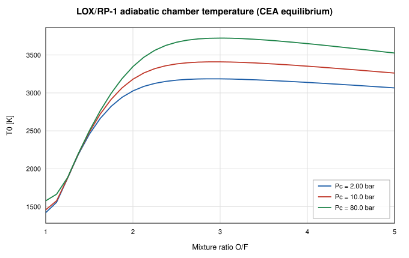
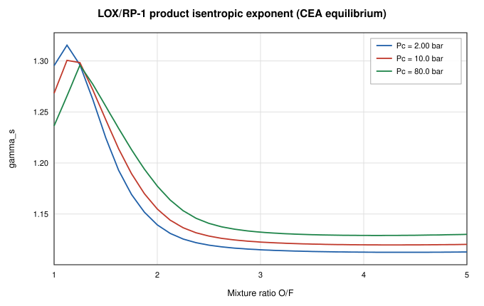
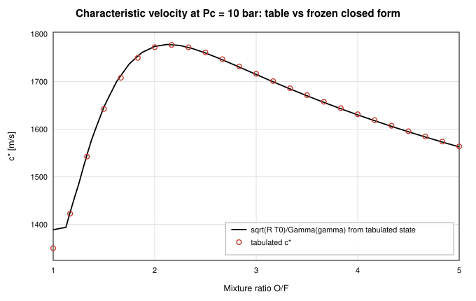
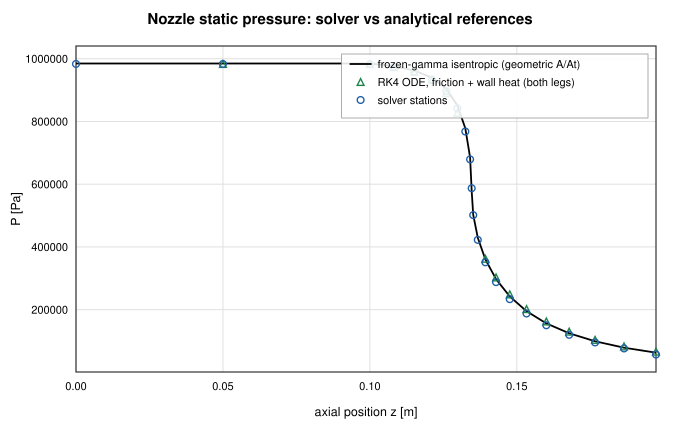
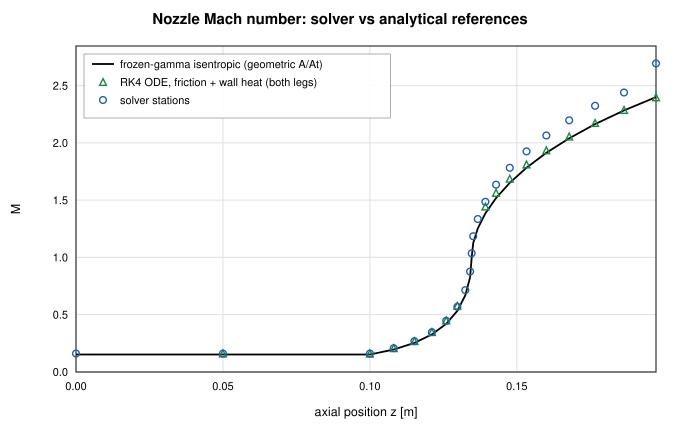
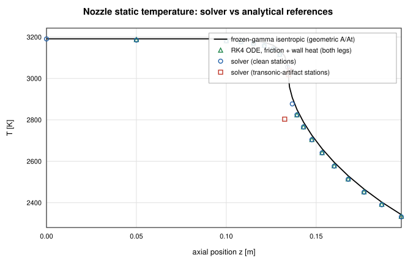
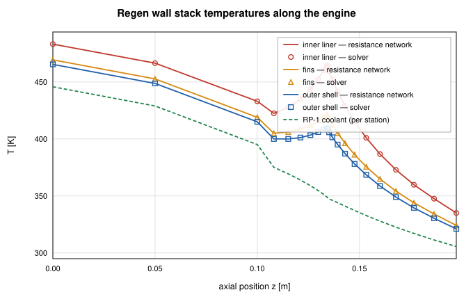
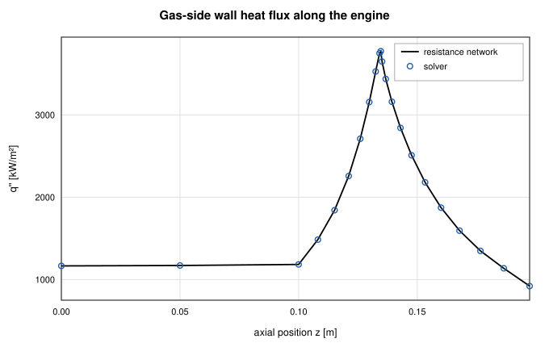
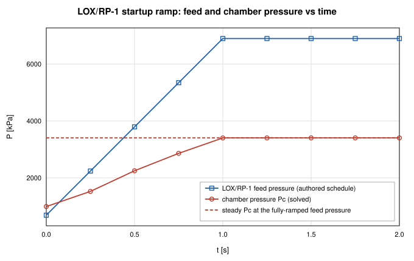

# Reacting-Junction Combustion and Rocket Thruster Validation

**Verification of the CEA-coupled reacting junction and the regeneratively
cooled LOX/RP-1 thruster case against analytical solutions**

Generated by `scripts/combustion-validation-report.ts` — all numbers and
figures come from live solves of the current solver. Regenerate with
`npx tsx scripts/combustion-validation-report.ts`. The corresponding CI
gates are `src/core/__tests__/reactingJunction.test.ts` (junction physics,
validation rules, robustness from perturbed initial conditions, and the
transient startup ramp) and the examples suite (both the steady and
transient thruster examples solve and pass invariants). Model documentation:
[docs/combustion.md](../combustion.md).

## Abstract

This report verifies the reacting-junction combustion capability of
OpenFLUME — a chamber node whose energy equation is the thermochemical
closure h = η·h(T0(Pc, O/F)) with T0 from NASA CEA equilibrium tables,
solved inside the monolithic Newton system — and validates the complete
LOX/RP-1 thruster example (feed circuits, injectors, chamber, choked
converging–diverging nozzle, and a 42-station three-layer
regenerative cooling jacket) against closed-form analytical solutions. Five
groups of checks are made: (1) thermodynamic self-consistency of the
committed CEA tables (cp = γR/(γ−1) and the frozen c\* closed form) across
the entire tabulated (Pc, O/F) domain; (2) integral engine quantities against
the choked-flow, orifice, and chamber-closure closed forms; (3) nozzle
pressure/temperature/Mach profiles against a frozen-γ isentropic reference
and an RK4 integration of the generalized quasi-1-D compressible ODE with
friction and wall-heat extraction; (4) the per-station three-layer wall
stack against an exact series–parallel thermal-resistance network; and (5)
the transient (startup-ramp) reacting junction against the equivalent
steady solution at the fully-ramped feed pressure. The solver (default
limited-upwind momentum faces,
`settings.momentumFluxScheme: "upwind"`) tracks the analytical references
to 3.16 % on the
subsonic leg and 4.87 % on the supersonic leg (§3). Each leg
is anchored at a solved station, so those figures are *local* truncation.
The dominant error is separate and integral: the sonic cell chokes at a
slightly large effective throat state, biasing the mass flow by
3.01 % and offsetting the entire Mach profile by about
as much (§2). Wall temperatures agree to 2.3e-13 K. The
transient startup ramp tracks its quasi-static reference to
7.8e-5 % on chamber pressure and
adiabatic temperature after the 1 s ramp and 1 s hold (§5).

## The Model Under Test

The thruster example (`src/ui/thrusterCombustor.ts`) couples three
circuits at a reacting junction:

- **LOX feed** — tank → injector orifice → chamber;
- **RP-1 feed** — tank → counterflow regenerative jacket (one coolant
  node per gas station, 42 passes) → injector orifice → chamber;
- **hot gas** — chamber → 42-station choked converging–diverging
  nozzle → exhaust, with `momentumFlux` and `kineticEnergy` enabled.

The `exhaust` node is a supersonic outlet. Boundary nodes impose a static
pressure, which over-specifies such an outlet — the imposed value
back-propagates into the last interior station through that segment's
momentum row — so the example authors it at the **matched-expansion**
pressure, the value the quasi-1-D ODE produces when continued across the
final segment from the converged interior. The nozzle is gridded with two
stations per contour segment of the original coarse build; the convergent
and divergent are refined together, because the sonic cell sets the choked
mass flow while the divergent sets the downstream profile.

The chamber is a junction (`config.junctions`): its energy row is the CEA
closure with efficiency η = 0.9409 (= 0.97² on enthalpy rise), and the
product gas's R/γ/μ/cp refresh from the same lookup between outer Picard
iterations. Every gas station carries a wall section — gas film
(Bartz-order h scaled (Dt/D)^1.8) → inner liner → fin-root conduction →
fins → fin-tip conduction → outer closeout shell — with coolant films on
the channel base, the fin sides (fin efficiency 0.8 folded into the wetted
area), and the channel top. All copper conduction uses the temperature-
dependent OFHC-copper conductivity evaluated at the endpoint mean
temperature.

The solved operating point: Pc = 993.57 kPa,
O/F = 2.5913, ṁ_ox = 0.55308 kg/s,
ṁ_fuel = 0.21344 kg/s,
T0 = 3392.7 K, γ = 1.1267,
R = 363.63 J/kg·K.

## 1. CEA Table Thermodynamic Consistency

The committed tables (`core/combustion/generated/ceaTables.ts`, built
offline by `scripts/build-cea-tables.py` from NASA CEA chamber
equilibrium runs) store T0, molecular weight, γ_s, and c\* on a (Pc, O/F)
grid. Sweeping a 25×97 grid spanning the full tabulated domain
(Pc ∈ [2.00, 300] bar,
O/F ∈ [1, 5]) checks two closed forms:

$$c_p = \frac{\gamma}{\gamma - 1} R, \qquad
c^*_{frozen} = \frac{\sqrt{R\,T_0}}{\Gamma(\gamma)}, \quad
\Gamma(\gamma) = \sqrt{\gamma}\left(\frac{2}{\gamma+1}\right)^{\frac{\gamma+1}{2(\gamma-1)}}.$$

The first is an exact identity of the constant-cp ideal-gas closure the
solver derives from the table, and it holds to 0.0e+0 % at every
point. The second is the frozen one-dimensional c\* evaluated from the
tabulated (T0, γ_s, R), compared against the tabulated c\* — which is CEA's
**equilibrium** value, so the difference between them is the physical
equilibrium-vs-frozen expansion gap, not an interpolation error:

| Comparison | Result |
| ---------- | ------ |
| cp = γR/(γ−1) (identity) | max deviation 0.0e+0 % |
| tabulated equilibrium c\* vs frozen closed form | ≤ 3.02 % (at the Pc = 2.00 bar, O/F = 1.00 corner of the table) |
| same gap at the thruster operating point | 0.07 % |

The characteristics behave as LOX/RP-1 equilibrium chemistry should
(Figures 1–3): T0 peaks at O/F = 3.00
(3410 K at 10 bar) while c\* peaks fuel-rich of the
temperature peak at O/F = 2.13
(1777 m/s) — the classical offset caused by the lower
molecular weight of fuel-rich products. T0 rises with chamber pressure as
dissociation is suppressed, and γ_s dips near the temperature peak where
dissociation buffers the mixture.

*Figure 1. Adiabatic chamber temperature vs mixture ratio at three chamber pressures (CEA equilibrium tables).*

*Figure 2. Product isentropic exponent γ_s vs mixture ratio.*

*Figure 3. Characteristic velocity at 10 bar: tabulated c\* (markers) against the frozen closed form √(R·T0)/Γ(γ) evaluated from the tabulated state (line).*

## 2. Thruster Integral Quantities

**Chamber closure.** The junction's contract is
T_chamber = η·T0(Pc, O/F) exactly (constant-cp ideal gas). The solved
chamber temperature is 3192.19 K
against η·T0 = 3192.19 K — a deviation of
1.3e-14 %.

**Injector orifices.** Both injectors must obey
ṁ = C_d·A·√(2ρ·ΔP_eff) with ΔP_eff the solved pressure drop corrected for
the hydrostatic head ρgΔz along the branch (the jacket runs z-up with
standard gravity):

| Injector | ṁ analytic [kg/s] | ṁ solver [kg/s] | deviation |
| -------- | ----------------- | --------------- | --------- |
| LOX | 0.552071 | 0.553082 | 0.18 % |
| RP-1 | 0.213437 | 0.213437 | 2.6e-14 % |

These verify the coupling, not merely the component formula: the chamber
pressure both orifices discharge against is a solved unknown of the same
Newton system that carries the CEA closure.

**Choked mass flow and c\*.** From the solved chamber stagnation state
(P0 = 1007.2 kPa, T0 = 3197.1 K), the ideal 1-D
choked flow through the geometric throat is
ṁ = P0·At·Γ(γ)/√(R·T0) = 0.74413 kg/s. The solver passes
0.76652 kg/s — 3.01 %
more than ideal. Equivalently the emergent
c\* = Pc·At/ṁ = 1628.9 m/s sits 4.23 %
below the CEA reference
η_c\*·c\* = 1700.8 m/s. This 3.01 %
excess is the transonic discretization bias documented in
[docs/combustion.md](../combustion.md): the default limited-upwind momentum
faces (`settings.momentumFluxScheme: "upwind"`) are first-order at the
sonic cell, so the discrete system chokes at a slightly larger effective
throat state.

This is the **dominant** error in the whole gas path, and it is set at the
sonic cell alone — not accumulated along the nozzle. It shows up as a nearly
uniform Mach offset everywhere, including the barrel stations at M ≈ 0.16
where no cell is anywhere near sonic; §3's leg deviations sit on top of it.
Refining the sonic cell is what moves it: the coarse build of this example
(half as many stations) chokes 5.71 % high, and on a frictionless
replica of the same contour, splitting only the two segments either side of
the throat four ways cuts the bias from 5.80 % to 1.43 %
without touching any other cell. Conversely, a scheme change that leaves the
sonic cell on upwind cannot address it.

The upwind faces are what remove the nonphysical wrong-branch roots by
construction. Under the legacy `central` scheme this grid still converges,
but onto a root the second-law audit certifies as **inadmissible** — a
discrete expansion shock in the convergent, where a station jumps to the
supersonic branch away from the area minimum — and an exact isentropic seed
lands on the same pathology rather than on the physical root. That trade,
not accuracy, is why upwind is the default. It is a property of the quasi-1-D
nozzle discretization (present with fixed gas properties too), not of the
reacting junction.

**Formula-coupled twin.** The same feed, nozzle, and jacket plumbing, with
the chamber replaced by an ordinary node fed by an imposed total mass flow
and each propellant discharging into its own boundary "manifold" node
through its unchanged orifice formula, closes the
Pc ↔ (ṁ_ox, ṁ_fuel, ṁ_gas) loop with an outer iteration around repeated
solves instead of the junction's monolithic Newton coupling — the
architecture that predates junctions (see
[docs/combustion.md](../combustion.md)). Given the SAME
CEA-matched gas (γ = 1.1267, R = 363.63 J/kg·K) and
target chamber temperature (η·T0) as the junction's own converged state, it
solves to Pc = 1003.19 kPa,
ṁ_ox = 0.544325 kg/s, ṁ_fuel = 0.210081 kg/s. The
junction formulation lands within 0.960 % on Pc,
1.609 % on ṁ_ox, and
1.598 % on ṁ_fuel —
with the gas properties matched, this residual is the effect of the
coupling architecture and discretization alone (monolithic Newton feedback
vs. an externally iterated, decoupled combustion temperature), not a
mismatched gamma.

## 3. Nozzle Profiles

Two analytical references bracket the nozzle physics:

1. **Frozen-γ isentropic flow** through the geometric area schedule:
   M(A/At) from the Mach–area relation (subsonic branch upstream of the
   throat, supersonic downstream), then
   P/P0 = (1 + (γ−1)/2·M²)^(−γ/(γ−1)) and T = T0/(1 + (γ−1)/2·M²) from the
   solved chamber stagnation state. This neglects friction and wall heat.
2. **RK4 integration of the generalized quasi-1-D ODE** (the same
   machinery as the compressible-flow validation report),

$$\frac{dM}{dx} = \frac{M\left(1 + \frac{\gamma-1}{2}M^2\right)}{1 - M^2}\left[\frac{\gamma M^2}{2}\frac{f}{D} + \frac{1 + \gamma M^2}{2T_0}\frac{dT_0}{dx} - \frac{1}{A}\frac{dA}{dx}\right],$$

   with f = 0.02 (the authored Darcy factor), linear D(x) inside
   each tapered segment, and dT0/dx from the solver's own per-station
   gas-film heat extraction spread over each station's tributary length
   (2000 RK4 sub-steps per segment). The ODE is singular at M = 1, so it is
   integrated on the two legs that avoid the transonic cell, selected by
   Mach rather than by station name — the subsonic leg
   (chamber → conv13, the last station below M = 0.8,
   initialized from the solved chamber state) and the supersonic leg
   (div3 → div23, from the first station above
   M = 1.2, initialized from that station's solved state).
   Anchoring each leg at a solved station and evaluating the reference at the
   solved ṁ measures the *local* spatial discretization of momentum and
   energy, with the choking-point bias of §2 removed by construction.

| Leg | Stations | max ΔP/P | max ΔT/T | max ΔM/M |
| --- | -------- | -------- | -------- | -------- |
| Subsonic (barrel + convergent) | 15 | 3.16 % | 0.22 % | 2.96 % |
| Supersonic (divergent) | 20 | 4.87 % | 2.06 % | 4.18 % |

Both legs track the ODE closely. What remains on each is the
limited-upwind faces' first-order truncation acting as a small spurious
entropy source per cell, accumulating away from the station each leg is
anchored at; the divergent carries more of it than the convergent because
its cells coarsen downstream. These are *local* drifts: because each leg is
anchored at a solved station, they exclude the choking bias of §2, which is
the larger error and is not visible here. The drift is grid-convergent — it
is the documented cost of the scheme that removes the wrong-branch
transonic roots (see [docs/combustion.md](../combustion.md)).

Note that both legs now run closer to the sonic cell than the fixed station
names used before this revision did (M = 0.8 and
M = 1.2, against roughly 0.53 and 1.19), and each spans more of
the nozzle, so the two rows are not directly comparable with the figures in
earlier revisions of this report. The stiff `1/(1 − M²)` factor means a
leg that reaches nearer M = 1 will report a larger deviation for the same
underlying solution quality.

Against the no-friction isentropic reference, the stations
(all of them — no station is smeared off the isentrope branches on this grid) agree within 4.19 % on pressure (worst at
div1). That comparison is not anchored at a solved station, so
unlike the table above it carries the §2 choking bias as well as the
friction and heat-extraction corrections the isentrope omits. The profile
through the throat is monotone — the sonic transition falls inside one
near-throat segment and is smeared first-order across it
([docs/combustion.md](../combustion.md)), but no station is thrown off the
isentrope branches, and every integral quantity remains solid.

*Figure 4. Static pressure along the nozzle: frozen-γ isentrope (line), RK4 ODE with friction and wall heat (triangles), solver stations (circles).*

*Figure 5. Mach number along the nozzle (derived from solved ṁ, P, T). The sonic transition falls inside a near-throat segment and is smeared first-order across it; the profile stays monotone through the throat.*

*Figure 6. Static temperature along the nozzle.*

## 4. Regenerative Wall Stack

Each station's wall section is, in steady state, an exact series–parallel
resistance network: gas film G_g = h_g·A_g in series with a three-node
solid network — inner liner (channel-base film G_b to the coolant and
fin-root conduction G_fr to the fins), fins (fin-side film G_f and fin-tip
conduction G_ft), outer shell (channel-top film G_s) — all referenced to
the solved gas and coolant temperatures. The reference solves this 3×3
linear system per station, iterating the OFHC-copper conductivity at the
endpoint-mean temperatures exactly as the solver's thermal subsystem does.

Across all 42 stations the solver matches the network to
**2.3e-13 K** worst-case on the three layer
temperatures and **2.7e-14 %** on the gas-side heat rate —
machine-level agreement, confirming the solid Newton subsystem solves the
conduction/convection network exactly (Figures 7–8, table below).

**Global energy closure.** The coolant picks up
64.32 kW through the 126
coolant-side films, against ṁ_fuel·cp·ΔT =
64.28 kW of enthalpy rise from tank to
injector — closure to 0.05 %. (The chamber station's
7.32 kW gas film
is computed from the adiabatic-flame chamber state but does not cool the
chamber gas — the junction node's energy row is the CEA closure — the
one-way chamber heat-flux approximation noted in the example and in
docs/combustion.md.)

**Fin efficiency.** The modeled constant (0.8, folded into the fin wetted
area) sits next to the analytic straight-fin value at throat conditions,
η = tanh(mH)/(mH) = 0.821 with
m = √(2h/(k·t)) = 275.1 1/m — the 1-D fin theory the constant
approximates.

| Station | T_liner an. | T_liner num. | T_fin an. | T_fin num. | T_shell an. | T_shell num. | Q̇_gas an. [kW] | Q̇_gas num. [kW] |
| ------- | ----------- | ------------ | --------- | ---------- | ----------- | ------------ | --------------- | ---------------- |
| chamber | 488.0 | 488.0 | 474.2 | 474.2 | 470.2 | 470.2 | 7.32 | 7.32 |
| barrel1 | 471.1 | 471.1 | 457.2 | 457.2 | 453.3 | 453.3 | 14.70 | 14.70 |
| barrel2 | 437.1 | 437.1 | 423.0 | 423.0 | 419.1 | 419.1 | 8.04 | 8.04 |
| conv1 | 422.7 | 422.7 | 407.0 | 407.0 | 402.5 | 402.5 | 1.27 | 1.27 |
| conv2 | 424.7 | 424.7 | 407.1 | 407.1 | 402.2 | 402.2 | 1.25 | 1.25 |
| conv3 | 426.8 | 426.8 | 407.4 | 407.4 | 401.9 | 401.9 | 1.21 | 1.21 |
| conv4 | 429.9 | 429.9 | 408.3 | 408.3 | 402.2 | 402.2 | 1.17 | 1.17 |
| conv5 | 433.0 | 433.0 | 409.2 | 409.2 | 402.5 | 402.5 | 1.12 | 1.12 |
| conv6 | 437.2 | 437.2 | 410.8 | 410.8 | 403.4 | 403.4 | 1.07 | 1.07 |
| conv7 | 441.1 | 441.1 | 412.3 | 412.3 | 404.2 | 404.2 | 1.00 | 1.00 |
| conv8 | 446.1 | 446.1 | 414.5 | 414.5 | 405.7 | 405.7 | 0.92 | 0.92 |
| conv9 | 450.2 | 450.2 | 416.3 | 416.3 | 406.8 | 406.8 | 0.83 | 0.83 |
| conv10 | 455.3 | 455.3 | 418.7 | 418.7 | 408.5 | 408.5 | 0.73 | 0.73 |
| conv11 | 458.9 | 458.9 | 420.3 | 420.3 | 409.6 | 409.6 | 0.63 | 0.63 |
| conv12 | 463.1 | 463.1 | 422.3 | 422.3 | 411.0 | 411.0 | 0.51 | 0.51 |
| conv13 | 465.2 | 465.2 | 423.2 | 423.2 | 411.5 | 411.5 | 0.39 | 0.39 |
| conv14 | 467.5 | 467.5 | 424.3 | 424.3 | 412.3 | 412.3 | 0.26 | 0.26 |
| conv15 | 467.4 | 467.4 | 424.0 | 424.0 | 411.9 | 411.9 | 0.13 | 0.13 |
| throat | 467.3 | 467.3 | 423.8 | 423.8 | 411.7 | 411.7 | 0.13 | 0.13 |
| div1 | 465.3 | 465.3 | 422.4 | 422.4 | 410.5 | 410.5 | 0.12 | 0.12 |
| div2 | 463.1 | 463.1 | 420.9 | 420.9 | 409.2 | 409.2 | 0.24 | 0.24 |
| div3 | 459.5 | 459.5 | 418.5 | 418.5 | 407.1 | 407.1 | 0.35 | 0.35 |
| div4 | 455.5 | 455.5 | 415.7 | 415.7 | 404.7 | 404.7 | 0.46 | 0.46 |
| div5 | 450.5 | 450.5 | 412.1 | 412.1 | 401.5 | 401.5 | 0.57 | 0.57 |
| div6 | 445.0 | 445.0 | 408.3 | 408.3 | 398.0 | 398.0 | 0.66 | 0.66 |
| div7 | 438.8 | 438.8 | 403.8 | 403.8 | 394.1 | 394.1 | 0.75 | 0.75 |
| div8 | 432.4 | 432.4 | 399.1 | 399.1 | 389.9 | 389.9 | 0.83 | 0.83 |
| div9 | 425.4 | 425.4 | 394.1 | 394.1 | 385.3 | 385.3 | 0.91 | 0.91 |
| div10 | 418.4 | 418.4 | 388.9 | 388.9 | 380.6 | 380.6 | 0.97 | 0.97 |
| div11 | 411.1 | 411.1 | 383.5 | 383.5 | 375.8 | 375.8 | 1.03 | 1.03 |
| div12 | 403.8 | 403.8 | 378.0 | 378.0 | 370.8 | 370.8 | 1.08 | 1.08 |
| div13 | 396.5 | 396.5 | 372.5 | 372.5 | 365.8 | 365.8 | 1.13 | 1.13 |
| div14 | 389.2 | 389.2 | 367.0 | 367.0 | 360.7 | 360.7 | 1.17 | 1.17 |
| div15 | 382.1 | 382.1 | 361.5 | 361.5 | 355.7 | 355.7 | 1.20 | 1.20 |
| div16 | 375.1 | 375.1 | 356.1 | 356.1 | 350.7 | 350.7 | 1.22 | 1.22 |
| div17 | 368.3 | 368.3 | 350.7 | 350.7 | 345.8 | 345.8 | 1.25 | 1.25 |
| div18 | 361.7 | 361.7 | 345.5 | 345.5 | 340.9 | 340.9 | 1.26 | 1.26 |
| div19 | 355.3 | 355.3 | 340.4 | 340.4 | 336.2 | 336.2 | 1.28 | 1.28 |
| div20 | 349.1 | 349.1 | 335.4 | 335.4 | 331.5 | 331.5 | 1.28 | 1.28 |
| div21 | 343.1 | 343.1 | 330.5 | 330.5 | 327.0 | 327.0 | 1.29 | 1.29 |
| div22 | 337.3 | 337.3 | 325.7 | 325.7 | 322.5 | 322.5 | 1.29 | 1.29 |
| div23 | 331.9 | 331.9 | 321.2 | 321.2 | 318.2 | 318.2 | 1.30 | 1.30 |

*Figure 7. Wall stack temperatures along the engine: analytic resistance network (lines) vs solver solid nodes (markers); dashed line is the per-station coolant temperature.*

*Figure 8. Gas-side wall heat flux along the engine: resistance network (line) vs solver (markers). The peak sits at the throat, as the (Dt/D)^1.8 film scaling dictates.*

## 5. Transient Reacting Junction (Startup Ramp)

The transient example (`src/ui/thrusterCombustorTransient.ts`) reuses the
same feed/nozzle/jacket network as §§1–4, with every node given a volume for
mass-storage and the LOX/RP-1 feed pressures ramped
100 → 1000 psi over the first second, then held for a second
more. The junction's energy row stays the quasi-steady CEA closure of §§1–4
at every implicit step (`useCoupledHMode`, core/solver/kernel.ts) — only the
chamber's ordinary mass row (`d(ρV)/dt`) is genuinely transient — so the
chamber should track the feed **quasi-statically**: at each instant, close to
the steady solution the same feed pressure would produce. That is exactly
what the coupled Newton system's own quasi-steady energy treatment predicts,
and is what this section checks, against a steady solve of the identical
network held at the fully-ramped (1000 psi) feed pressure —
not the §§1–4 thruster example, which is authored at its own, unrelated feed
pressure.

The exhaust boundary is fixed at 30 kPa (a plausible high-altitude ambient)
rather than sea-level, because a sea-level exhaust produces an unphysical
recompression kink at the last interior nozzle station at the low (100 psi)
end of the ramp; 30 kPa was found empirically to remove that artifact at
both ends of the ramp without perturbing the chamber physics
([docs/combustion.md](../combustion.md), "Transient reacting junctions").
The Newton tolerance is loosened from the §§1–4 default (1e-8) to 1e-7 for
this example: near the top of the hold the inner Newton loop's unscaled
residual grinds against a numerical noise floor at the tighter tolerance,
inflating a single step's cost by more than 30× for no gain in accuracy (see
the same section of docs/combustion.md).

| Quantity | End of ramp+hold (transient) | Steady at 1000 psi feed | deviation |
| -------- | ----------------------------- | ------------------------------------- | --------- |
| Chamber pressure Pc [kPa] | 3404.5 | 3404.5 | 7.8e-5 % |
| Adiabatic T0 (CEA) [K] | 3567.8 | 3567.8 | 3.1e-6 % |
| O/F | 2.5992 | 2.5992 | 2.3e-8 % |

Across the 9 accepted steps (fixed `dt` = 0.25 s
to `endTime` = 2 s), the chamber pressure rises
monotonically through the ramp, then sits flat through the hold to a
relative spread of 0.03 % (a numerical noise floor at the
loosened tolerance, not a physical drift) — the LOX/RP-1 feed pressures
reproduce the authored schedule exactly (100.0 →
1000 psi), and the fixed exhaust boundary holds
to a 0.0e+0 % spread across the whole run, confirming it never
back-couples into the solve.

*Figure 9. Feed and chamber pressure vs time through the 2-second startup ramp: the chamber (red) tracks the feed (blue) quasi-statically, converging onto the steady solution at the fully-ramped feed pressure (dashed) by the end of the hold.*

## Conclusions

The reacting-junction formulation and the thruster case reproduce their
analytical references:

- the committed CEA tables satisfy the cp = γR/(γ−1) identity exactly
  across their entire domain, and their equilibrium c\* sits within
  3.02 % of the frozen closed form (the physical
  equilibrium-vs-frozen gap);
- the chamber closure holds to 1.3e-14 %, and both injectors
  match the orifice closed form (with hydrostatic head) to
  0.18 % while discharging against a
  solved chamber pressure;
- nozzle profiles track the RK4 friction-and-heat ODE to
  3.16 % on pressure on the subsonic leg and
  4.87 % on the supersonic leg, each anchored at a solved
  station so the figures are local truncation, grid-convergent, and the cost
  of a scheme with no wrong-branch transonic roots;
- the three-layer regenerative wall stack matches the exact resistance
  network to 2.3e-13 K and closes the coolant energy
  balance to 0.05 %;
- the transient startup ramp tracks its quasi-static reference (a steady
  solve at the fully-ramped feed pressure) to
  7.8e-5 % on
  chamber pressure, adiabatic temperature, and O/F, exactly as the junction's
  quasi-steady energy treatment predicts.

The one systematic integral deviation — a 3.01 %
excess of choked mass flow (equivalently a 4.23 % c\*
deficit) — is the documented first-order choking bias of the default
limited-upwind momentum faces, independent of the combustion coupling. It is
also the dominant error in the gas path: it is set at the sonic cell and
then offsets the entire Mach profile, so it is the number to watch, and
sonic-cell resolution is the lever that moves it. Known model limitations
(quasi-steady junction energy even in transient mode, frozen downstream
composition, standard-state reactant injection, idealGas product fluid) are
catalogued in [docs/combustion.md](../combustion.md).

## References

1. Gordon, S., and McBride, B. J., *Computer Program for Calculation of
   Complex Chemical Equilibrium Compositions and Applications*,
   NASA RP-1311, 1994 (CEA).
2. Sutton, G. P., and Biblarz, O., *Rocket Propulsion Elements*, 9th ed.,
   John Wiley & Sons, 2016 (c\*, choked flow, injector hydraulics, regen
   cooling).
3. Shapiro, A. H., *The Dynamics and Thermodynamics of Compressible Fluid
   Flow*, Vol. 1, Ronald Press, 1953 (generalized quasi-1-D ODE).
4. Bartz, D. R., "A Simple Equation for Rapid Estimation of Rocket Nozzle
   Convective Heat Transfer Coefficients," *Jet Propulsion*, 27(1), 1957.
5. Incropera, F. P., et al., *Fundamentals of Heat and Mass Transfer*,
   6th ed., Wiley, 2007 (resistance networks, fin efficiency).

## Nomenclature

| Symbol | Meaning |
| ------ | ------- |
| A, At | local / throat flow area |
| C_d | orifice discharge coefficient |
| c\* | characteristic velocity Pc·At/ṁ |
| c_p | specific heat at constant pressure |
| D, Dt | local / throat diameter |
| f | Darcy friction factor |
| G | thermal conductance [W/K] |
| h | film coefficient; specific enthalpy |
| M | Mach number |
| ṁ | mass flow rate |
| O/F | oxidizer/fuel mass-flow ratio |
| P, P0, Pc | static / stagnation / chamber pressure |
| q'' | wall heat flux |
| R | specific gas constant |
| T, T0 | static / stagnation (adiabatic chamber) temperature |
| Γ(γ) | Vandenkerckhove function |
| γ | isentropic exponent (CEA γ_s) |
| η | combustion efficiency on enthalpy rise (= η_c\*²) |
| η_fin | straight-fin efficiency tanh(mH)/(mH) |
