# Modeling of Compressible Flow with Friction and Heat Transfer using OpenFLUME

**A validation report recreating the NASA GFSSP verification study**
*(Bandyopadhyay & Majumdar, "Modeling of Compressible Flow with Friction and Heat Transfer using the Generalized Fluid System Simulation Program (GFSSP)", TFAWS 2007, MSFC-464, [NTRS 20070036728](https://ntrs.nasa.gov/citations/20070036728))*

Generated by `scripts/compressible-validation-report.ts` — all numbers and
figures come from live solves of the current solver. The corresponding CI gate
is `src/core/__tests__/compressibleDuctFlow.test.ts`.

## Abstract

This report verifies and validates the quasi one-dimensional compressible-flow
capability of the OpenFLUME solver — a pressure-based node-and-branch
network code — by recreating, case for case and figure for figure, the NASA
GFSSP compressible-flow verification study. The solver's predictions with
stagnation-enthalpy transport (`settings.kineticEnergy`) and the convective
acceleration term (`settings.momentumFlux`) are compared against classical
analytical solutions of compressible pipe flow: Fanno flow (friction choking in
an adiabatic constant-area pipe), Rayleigh flow (thermal choking in a
frictionless heated pipe), the combined effect of friction and heat transfer,
and subsonic flow in a converging-diverging nozzle with friction and with
combined friction and heat transfer. The analytical reference in every case is
a fourth-order Runge-Kutta integration of the generalized 1-D compressible-flow
ordinary differential equation, cross-checked against the standard Fanno and
Rayleigh closed forms. Non-uniform node distributions clustered near the
choked exit improve the accuracy of the numerical prediction, exactly as
reported for GFSSP. The numerical predictions agree with the analytical
solutions in all cases within the ~5 % band the original study reports.

## Introduction

Network flow-analysis codes usually neglect the fluid's inertia and kinetic
energy, which makes them unable to simulate compressible duct flow phenomena
such as friction choking or nozzle flow. The OpenFLUME solver is a finite
volume based node-and-branch code in the same family as NASA's Generalized
Fluid System Simulation Program (GFSSP). It recently gained two opt-in terms
that close the quasi-1-D compressible equations: a convective-acceleration
(momentum-flux) term in the branch momentum equation and stagnation-enthalpy
transport in the energy equation. The purpose of this report is to verify
those terms against the same benchmark problems NASA used to verify GFSSP's
compressible capability, using the same geometry, boundary conditions, fluid,
and reporting format so results can be compared side by side with the original
paper.

## Problem Description

Two geometries are considered: (a) a straight pipe of constant diameter and
(b) a converging-diverging nozzle of linearly varying diameter. The working
fluid is nitrogen, treated as an ideal gas (γ = 1.4, R = 296.8 J/kg·K). The
effect of friction and heat transfer on pressure, temperature, and Mach number
is studied in five cases:

| Case | Description |
| ---- | ----------- |
| 1 | Fanno flow — friction in an adiabatic constant-area pipe, choked exit |
| 2 | Rayleigh flow — heat transfer in a frictionless constant-area pipe, choked exit |
| 3 | Combined friction and heat transfer in a constant-area pipe |
| 4 | Effect of friction and area change in an adiabatic converging-diverging nozzle |
| 5 | Combined friction and heat transfer in the converging-diverging nozzle |

### Constant-Area Duct

Cases 1–3 use the same constant-area pipe: D = 6 in, L = 3207 in, inlet at
50 psia and 80 °F. The length is the Fanno critical length for the case-1
conditions, so the flow chokes exactly at the exit (Figure 1).

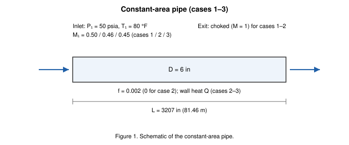

*Figure 1. Schematic of the constant-area pipe used for cases 1–3.*

### Converging-Diverging Nozzle

Cases 4–5 use a nozzle whose diameter varies linearly from 8 in at the inlet
to 6 in at the throat (x = 12 in) and back out to 7.2 in at the exit
(L = 30 in), with a constant Darcy friction factor of 0.05 and, in case 5, a
constant wall heat flux (Figure 2). The original paper states its nozzle
dimensions are arbitrary; these dimensions follow the same description and
keep the flow subsonic throughout at an inlet Mach number of 0.25.

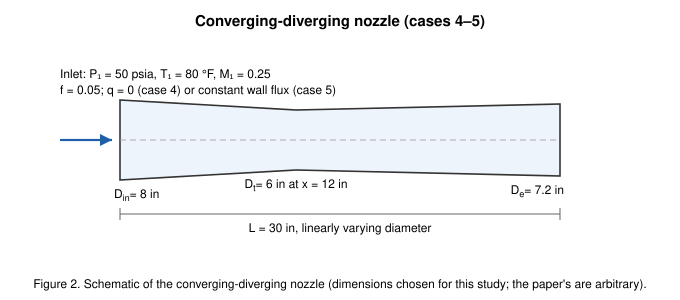

*Figure 2. Schematic of the converging-diverging nozzle used for cases 4–5.*

## Benchmark Solutions

The generalized quasi-1-D compressible flow of an ideal gas with area change,
wall friction, and heat addition reduces to a first-order ordinary
differential equation for the Mach number,

$$\frac{dM}{dx} = \frac{M\left(1 + \frac{\gamma-1}{2}M^2\right)}{1 - M^2}\left[\frac{\gamma M^2}{2}\frac{f}{D} + \frac{1 + \gamma M^2}{2T_0}\frac{dT_0}{dx} - \frac{1}{A}\frac{dA}{dx}\right],$$

with the stagnation-temperature gradient supplied by the energy balance for a
constant wall heat flux q,

$$\frac{dT_0}{dx} = \frac{q\,\pi D}{\dot m\,c_p},$$

and the static temperature and pressure recovered from

$$\frac{T(x)}{T(0)} = \frac{T_0(x)}{T_0(0)}\,\frac{1 + \frac{\gamma-1}{2}M(0)^2}{1 + \frac{\gamma-1}{2}M(x)^2}, \qquad \frac{p(x)}{p(0)} = \frac{A(0)}{A(x)}\frac{M(0)}{M(x)}\sqrt{\frac{T(x)}{T(0)}}.$$

This ODE is integrated with the classical fourth-order Runge-Kutta method
(4000 sub-steps per station interval), and the result is cross-checked against
the standard closed-form Fanno and Rayleigh relations: the computed critical
length matches the Fanno formula for fL✻/D, and the choking heat rate matches
the Rayleigh T₀/T₀✻ relation (both to machine precision, see the assertions in
the CI test).

## Numerical Modeling

OpenFLUME employs a finite volume formulation of the mass, momentum, and
energy conservation equations on a network of nodes and branches. Mass and
energy conservation are enforced at internal nodes; each branch supplies one
momentum relation between its endpoint pressures and its mass flow rate. For
this study two opt-in settings close the compressible physics:

- **`momentumFlux`** adds the convective-acceleration term
  (ṁ/A)²(1/ρ_dn − 1/ρ_up) to the branch momentum equation, with each endpoint
  of a tapered branch contributing its own flow area;
- **`kineticEnergy`** switches the energy equation to transport stagnation
  enthalpy h₀ = h + v²/2, and evaluates the momentum equation's friction and
  acceleration terms at the resulting static states. Friction uses the
  harmonic mean of the endpoint static densities, the correct integral
  weighting for a flow that accelerates along a segment.

Pipe friction is the Darcy relation with a prescribed constant friction
factor (`pipe.frictionFactor`), matching the benchmark's use of a fixed f.
In steady mode the solver detects this configuration and couples the node
enthalpies into the Newton system together with the pressures and mass
flows (the coupled [P, ṁ, h] system); this fully coupled treatment is what
allows it to hold the near-sonic
states at a choked exit. As with GFSSP, the mass flow rate is not prescribed:
pressure boundary conditions are imposed at both ends and the flow rate is
computed. Near-choked cases are seeded with an initial mass-flow guess
(`branches[].initialMdot`) and nodal pressure/temperature profiles, exactly
as GFSSP requires initial guesses. The Mach number is a derived quantity,
computed from the solved mass flow, pressure, and temperature.

## Discretization

The pipe (or nozzle) is divided into a finite number of pipe segments with a
node at each end, including the two boundary nodes. Both uniform and
non-uniform distributions were run. For the constant-area duct, 21 nodes with
cosine clustering toward the inlet and the choked exit (Figure 3) give a
grid-independent solution; the same conclusion is reported in the original
study. For the nozzle, 65 nodes clustered near the inlet and the
throat are used, with a 33-node mostly-uniform grid for
the grid study. Wall heat in the heated cases is applied as per-node heat
inputs equal to the wall flux integrated over each node's control volume.

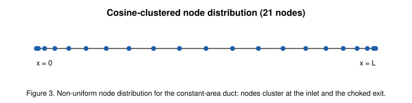

*Figure 3. Cosine-clustered 21-node distribution for the constant-area duct.*

## Results and Discussion

The table below summarizes the agreement between the numerical solution and
the RK4 analytical reference at the interior stations of each case. Following
the original study — which reports its own near-choking discrepancies — the
last station before a choked exit (analytic M > 0.95 for cases 1 and 3,
M > 0.92 for case 2) is excluded from the profile statistics; the discrete
node-lumped equations choke slightly early there.

| Case | ṁ error | max ΔP/P | max ΔT/T | max ΔM/M | stations compared |
| ---- | ------- | -------- | -------- | -------- | ----------------- |
| 1 — Fanno (21 uniform) | 0.05 % | 0.2 % | 0.1 % | 0.3 % | 19 |
| 1 — Fanno (21 clustered) | 0.01 % | 0.0 % | 0.0 % | 0.0 % | 19 |
| 1 — Fanno (41 clustered) | 0.00 % | 0.0 % | 0.0 % | 0.0 % | 38 (+1 near-choke excluded) |
| 2 — Rayleigh (21 clustered) | 0.00 % | 2.5 % | 1.6 % | 2.5 % | 18 (+1 near-choke excluded) |
| 3 — Combined (21 clustered) | 0.18 % | 1.6 % | 0.5 % | 1.4 % | 18 |
| 4 — Nozzle, friction (65 clustered) | 0.03 % | 0.0 % | 0.0 % | 0.0 % | 63 |
| 5 — Nozzle, friction + heat (65 clustered) | 0.01 % | 0.0 % | 0.1 % | 0.1 % | 63 |

### Case 1: Fanno Flow

With an inlet Mach number of 0.5, a friction factor of 0.002, and a pipe
diameter of 6 in, the Fanno critical length is
3207 in — reproducing the benchmark's 3207 in —
and the flow chokes at the exit. Figure 4 plots the p/p✻ ratio for the three
node distributions against the analytical solution: the 21-node clustered
grid is sufficient for a grid-independent solution (refining to 41 nodes
changes nothing at plot scale), and the uniform grid, while converged, is
about an order of magnitude less accurate near the choked exit
(0.2 % vs 0.01 % peak
pressure deviation) — the same benefit of non-uniform gridding the original
study reports. Figure 5 shows the corresponding static-temperature
distributions and Figure 6 the Mach number, which is a derived quantity
computed from the solved mass flow rate, pressure, and temperature. The small
offset visible even at the inlet arises because the mass flow rate is not
prescribed — pressure boundary conditions are imposed and the flow rate is
computed (0.01 % from the analytical choked
value on the 21-node clustered grid).

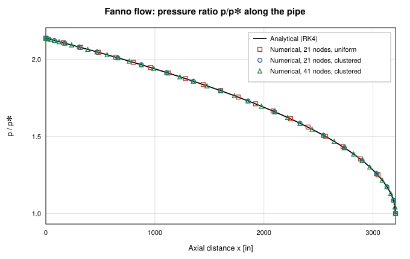

*Figure 4. Pressure distribution for Fanno flow with various grid distributions.*

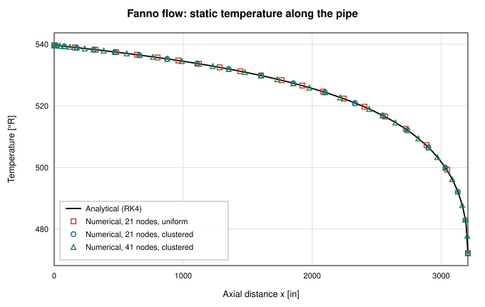

*Figure 5. Temperature distribution for Fanno flow with various grid distributions.*

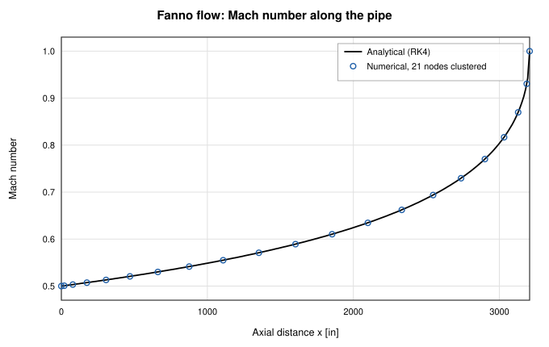

*Figure 6. Case 1 — Fanno flow: Mach number along the pipe length.*

### Case 2: Rayleigh Flow

The same pipe geometry is used with zero friction and a uniform wall heat
flux. With an inlet Mach number of 0.46, the analytically computed choking
heat rate is 2073 Btu/s — within
0.7 % of the benchmark's
2088 Btu/s figure (the residual difference is the paper's imperial unit
constants). Figures 7, 8, and 9 show the temperature, pressure, and Mach
number distributions. The static temperature first rises with heat addition
and then falls as the flow accelerates toward the thermal-choking point — the
characteristic Rayleigh maximum at M = 1/√γ — and the numerical solution
tracks all three profiles within the benchmark's 5 % band. The station
nearest the exit sits at an analytic M ≈ 0.95, where the node-lumped heat
allocation chokes the discrete solution one node early; the original study
reports the same near-choking discrepancy.

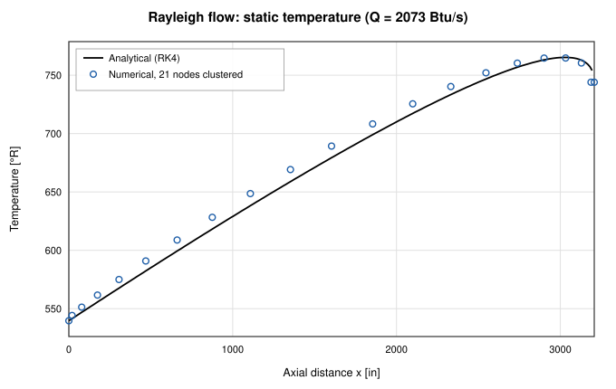

*Figure 7. Temperature distribution for Rayleigh flow.*

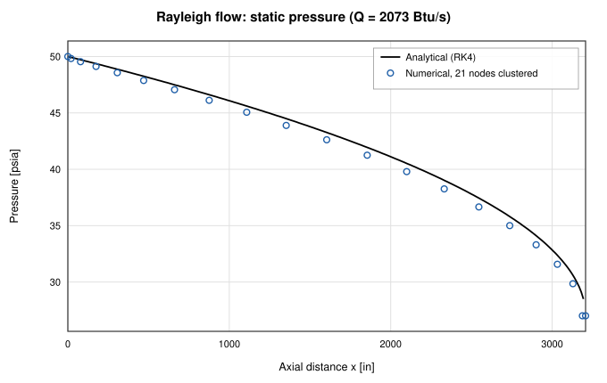

*Figure 8. Pressure distribution for Rayleigh flow.*

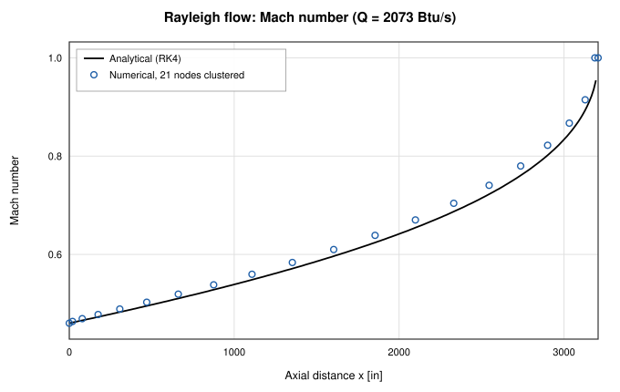

*Figure 9. Mach number distribution for Rayleigh flow.*

### Case 3: Combined Friction and Heat Transfer

No standard table exists for combined friction and heating; the reference is
the RK4 integration of the generalized ODE. With an inlet Mach number of
0.45, f = 0.002, and Q = 555 Btu/s distributed uniformly along the pipe,
Figures 10, 11, and 12 show the combined effect on temperature, pressure, and
Mach number, plotted as dimensional quantities with the benchmark's inlet
conditions of 50 psia and 80 °F. Agreement is within
1.6 % on the thermodynamic
profiles and 1.4 % on Mach number.

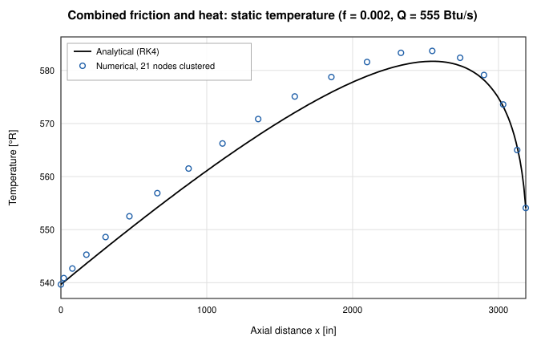

*Figure 10. Combined friction and heat transfer: effect on temperature.*

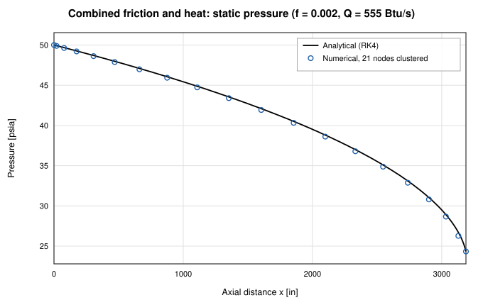

*Figure 11. Combined friction and heat transfer: effect on pressure.*

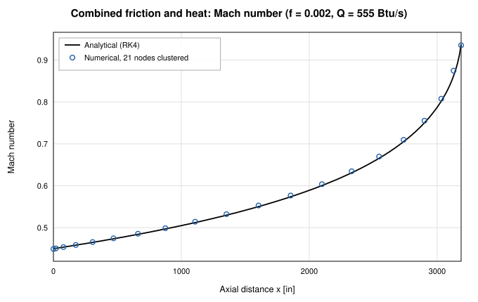

*Figure 12. Combined friction and heat transfer: effect on Mach number.*

### Cases 4 and 5: Nozzle Flow with Friction Only, and Friction with Heat

The nozzle of Figure 2 is run with a wall friction factor of 0.05,
adiabatic for case 4 and with a constant wall heat flux for case 5. Inlet
pressure and temperature are specified, and the exit pressure is taken from
the analytical solution so that the inlet Mach number is 0.25 — the same
procedure as the benchmark. Figure 13 shows the grid study on the pressure
distribution: the 65-node distribution, mostly uniform but
clustered near the inlet and the throat, produces a grid-independent solution;
what residual discrepancy exists concentrates at the throat, where the
nozzle's slope discontinuity is represented by straight tapered segments —
the same locus of error the original study reports, though here it stays
below 0.1 %.
Figures 14, 15, and 16 compare the Mach number,
pressure, and temperature distributions for friction only and for combined
friction and heat transfer. Heating raises the Mach number everywhere
downstream, deepens the pressure drop through the throat, and lifts the
temperature profile; all four numerical series track their analytical
counterparts within 0.1 % on
Mach number.

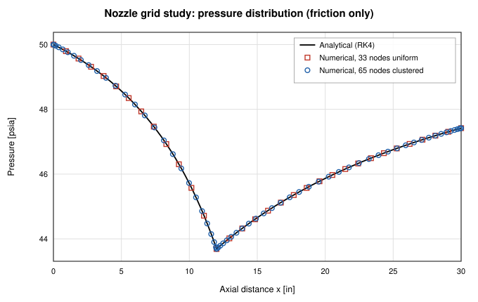

*Figure 13. Grid study on the pressure distribution in the converging-diverging nozzle (friction only).*

*Figure 14. Mach number for nozzle flow: friction only and friction + heat, analytical vs numerical.*

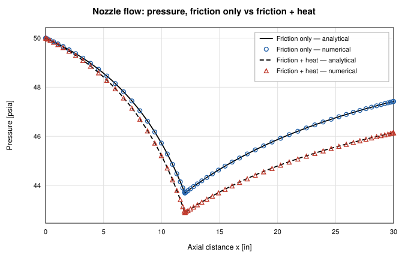

*Figure 15. Pressure distribution for nozzle flow: friction only and friction + heat, analytical vs numerical.*

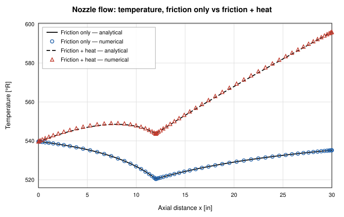

*Figure 16. Temperature distribution for nozzle flow: friction only and friction + heat, analytical vs numerical.*

## Conclusions

The quasi-1-D compressible-flow capability of OpenFLUME — stagnation
enthalpy transport plus the convective acceleration term — reproduces all
five benchmark cases of the NASA GFSSP compressible-flow verification study.
Pressure, temperature, and Mach number distributions agree with the RK4
analytical solutions within the ~5 % band the original study reports, and the
computed mass flow rates agree with the analytical choked values within 1 %.
Non-uniform grids clustered near choke points improve accuracy, and the
largest local discrepancies occur where the original study also reports them:
at the last node before a choked exit and at the nozzle throat's slope
discontinuity. Supersonic duct states and shock capture remain out of scope.

## References

1. Bandyopadhyay, A., and Majumdar, A., "Modeling of Compressible Flow with
   Friction and Heat Transfer using the Generalized Fluid System Simulation
   Program (GFSSP)," Thermal & Fluids Analysis Workshop (TFAWS), 2007,
   MSFC-464. [NTRS 20070036728](https://ntrs.nasa.gov/citations/20070036728)
2. Saad, M. A., *Compressible Fluid Flow*, 2nd ed., Prentice Hall, 1993.
3. Press, W. H., et al., *Numerical Recipes*, 2nd ed., Cambridge University
   Press, 1992 (fourth-order Runge-Kutta method).
4. Majumdar, A. K., LeClair, A. C., Moore, R., and Schallhorn, P. A.,
   *Generalized Fluid System Simulation Program, Version 6.0*,
   NASA/TM-2013-217492, 2013.

## Nomenclature

| Symbol | Meaning |
| ------ | ------- |
| A | flow area |
| c_p | specific heat at constant pressure |
| D | local diameter |
| f | Darcy friction factor |
| L | pipe or nozzle length |
| M | Mach number |
| ṁ | mass flow rate |
| p | static pressure |
| Q | total heat transfer rate |
| q | wall heat flux |
| R | gas constant |
| T | static temperature |
| T₀ | stagnation temperature |
| V | velocity |
| γ | specific heat ratio |
| ρ | density |
| ✻ | choked (M = 1) property |
| 1 / 0 | inlet / stagnation property |
