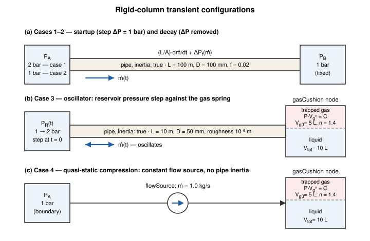
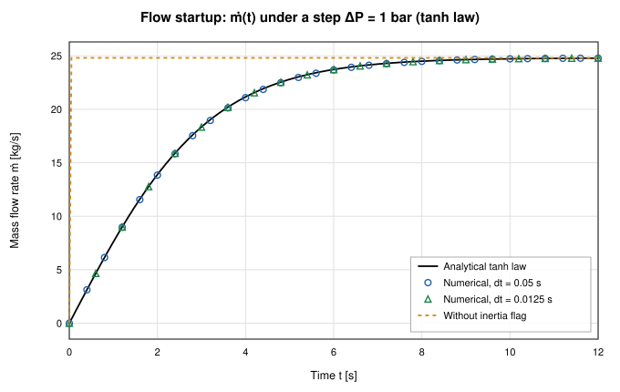
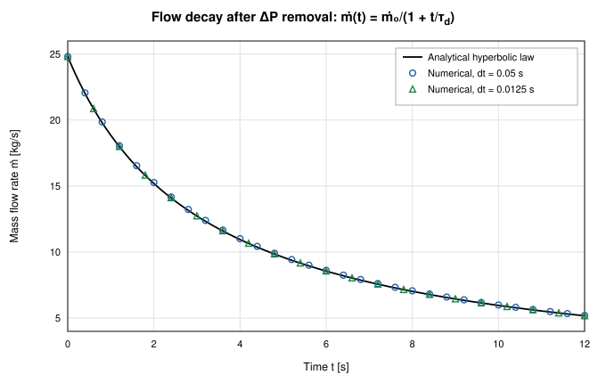
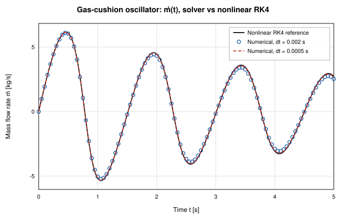
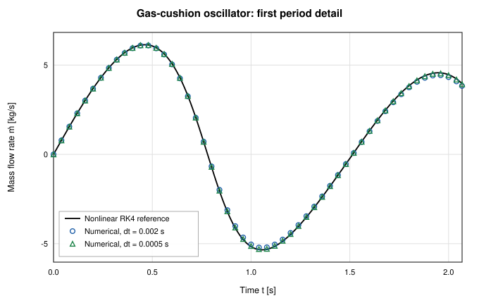
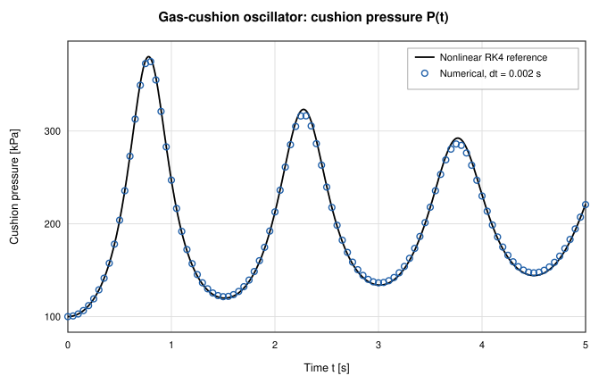
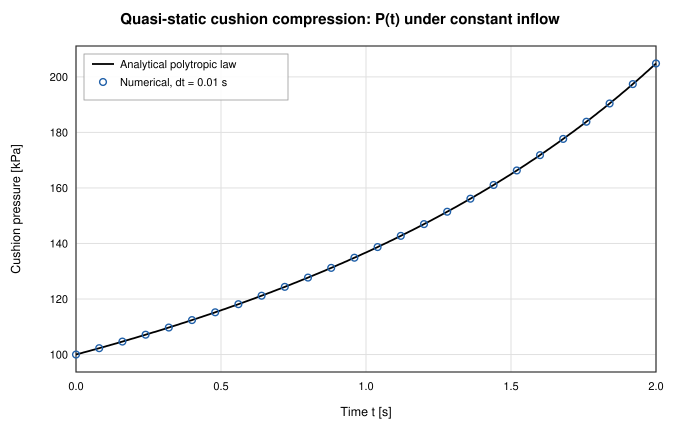

# Rigid-Column Fluid Transient Validation of OpenFLUME

**Validation of the lumped fluid-inertia term (L/A)·dṁ/dt and the trapped-gas-cushion node model against closed-form rigid-column theory and Runge-Kutta references**

Generated by `scripts/fluid-transient-validation-report.ts` — all numbers and
figures come from live solves of the current solver. The corresponding CI gate
is `src/core/__tests__/fluidTransient.test.ts`.

## Abstract

This report validates the rigid-column fluid-transient capability of the
OpenFLUME solver — a pressure-based node-and-branch network code in the
GFSSP family — against the classical closed-form solutions of
incompressible-column surge theory. Two opt-in models are exercised: the
lumped fluid-inertia term (L/A)·dṁ/dt in the branch momentum equation
(`pipe.inertia`) and the polytropic trapped-gas-cushion node model
(`node.gasCushion`). Four benchmark cases are run: flow startup in a single
pipe under a step pressure difference (exact tanh law for quadratic friction),
flow decay after removal of the driving pressure (exact hyperbolic law), a
liquid column oscillating on a trapped-gas spring (fourth-order Runge-Kutta
reference of the nonlinear ODE plus the linearized natural frequency), and
quasi-static compression of a trapped-gas volume (exact polytropic law). The
startup and decay traces match the closed forms within
0.05 % RMS at the refined time step, the
oscillator period matches the linearized prediction within
0.2 % and the RK4 reference within
0.1 %, and the compression trace holds P·V_g^n constant
to 5.9e-14 %. The backward-Euler integrator's first-order
numerical damping of the oscillation amplitude is quantified and shown to
shrink in proportion to the time step. Method-of-characteristics acoustic
waterhammer is explicitly out of scope: the rigid-column model is valid for
timescales long compared to the acoustic transit time of the line.

## Introduction

Steady network solvers relate branch pressure drop to mass flow
instantaneously. During rapid transients — valve slam, pump start, surge into
a closed volume — the momentum of the liquid column itself delays the flow
response: the column must be accelerated by the net pressure force acting on
it. The classical lumped treatment (rigid-column or incompressible-column
theory; Wylie & Streeter, Chaudhry) treats the liquid in each line as a rigid
slug of mass ρLA, giving the momentum balance

$$\frac{L}{A}\frac{d\dot m}{dt} = \Delta P - \Delta P_f(\dot m),$$

which the solver adds to the branch momentum equation when `inertia: true`
is set on a pipe. Paired with a trapped-gas cushion — a polytropic gas spring
P·V_g^n = const at a tank node — the same term reproduces surge oscillations
of the Lee & Martin entrapped-air type.

This report validates both models against closed-form rigid-column solutions
and against fourth-order Runge-Kutta integrations of the governing ODEs,
using the same configurations as the CI gate
`src/core/__tests__/fluidTransient.test.ts`.

**Scope boundary.** Rigid-column theory neglects liquid compressibility and
pipe-wall elasticity, so it carries no pressure waves: it is valid when the
transient timescale is long compared to the acoustic transit time 2L/a of the
line (for the case-1 pipe, 2L/a ≈ 0.13 s against a flow time constant of
3.16 s). Sudden events faster than the acoustic transit —
classical Joukowsky waterhammer — require the method of characteristics and
are explicitly outside the solver's scope; the (L/A) term captures bulk surge
only.

## Problem Description

All cases use water as an incompressible liquid (ρ = 998 kg/m³,
μ = 10⁻³ Pa·s — the solver's `water` preset). Four cases are studied
(Figure 1):

| Case | Description |
| ---- | ----------- |
| 1 | Flow startup — step ΔP = 1 bar across an inertial pipe with fixed-f quadratic friction; exact tanh law |
| 2 | Flow decay — driving ΔP removed from the case-1 steady state; exact hyperbolic law |
| 3 | Gas-cushion oscillator — inertial water column against a trapped-gas spring, reservoir stepped 1 → 2 bar; RK4 + linearized frequency |
| 4 | Quasi-static cushion compression — constant 1 kg/s inflow against the trapped gas; exact polytropic law |

Cases 1–2 use a pipe of L = 100 m, D = 100 mm
(A = 7.854·10⁻³ m²) with a fixed Darcy friction factor
f = 0.02, between two pressure boundaries. Case 3 mirrors the CI oscillator:
L = 10 m, D = 50 mm, roughness 10⁻⁶ m
(Colebrook friction), discharging into a 10 L tank node holding a
5 L trapped-gas cushion with polytropic index n = 1.4.
Case 4 feeds the same cushion node from a constant flow source with no pipe
inertia, isolating the cushion model.

*Figure 1. The three network topologies: (a) inertial pipe between two pressure boundaries (cases 1–2); (b) reservoir pressure step driving the liquid column against the trapped-gas cushion (case 3); (c) constant flow source compressing the cushion quasi-statically (case 4).*

## Benchmark Solutions

### Startup: the tanh law

With a fixed Darcy friction factor the pipe's friction loss is exactly
quadratic, ΔP_f = K·ṁ² with

$$K = \frac{f\,L}{2\,\rho\,D\,A^2},$$

so the rigid-column momentum equation under a constant applied ΔP,

$$\frac{L}{A}\frac{d\dot m}{dt} = \Delta P - K\dot m^2,$$

has the exact solution

$$\dot m(t) = \dot m_\infty \tanh(t/\tau), \qquad \dot m_\infty = \sqrt{\Delta P/K}, \qquad \tau = \frac{L}{A}\,\frac{\dot m_\infty}{\Delta P}.$$

For the case-1 parameters, ṁ∞ = 24.81 kg/s
(v∞ = 3.17 m/s) and τ = 3.159 s. As a cross-check, an
RK4 integration of the momentum ODE using the solver's own
`componentPressureDrop` friction law reproduces the tanh value at t = 4τ to
machine-level accuracy.

### Decay: the hyperbolic law

Dropping the driving ΔP to zero from a steady flow ṁ₀ leaves

$$\frac{L}{A}\frac{d\dot m}{dt} = -K\dot m^2 \;\Rightarrow\; \dot m(t) = \frac{\dot m_0}{1 + t/\tau_d}, \qquad \tau_d = \frac{L}{A\,K\,\dot m_0}.$$

Starting from the case-1 steady state (ṁ₀ = ṁ∞), τ_d = 3.159 s —
numerically equal to the startup τ, since τ_d = (L/A)·ṁ∞/ΔP as well.
Quadratic friction gives algebraic (1/t), not exponential, decay: the damping
weakens as the flow slows.

### Oscillator: gas spring and linearized frequency

The liquid column (mass m_eff = ρLA = 19.60 kg) rides on the
trapped-gas spring. The polytropic cushion P·V_g^n = C gives a stiffness, at
the stepped equilibrium (P = 2 bar,
V_g,eq = V_g0·(P_eq/P_step)^{1/n} = 3.048 L),

$$k_\mathrm{eff} = \left|\frac{dP_\mathrm{gas}}{dx}\right|A = \frac{n\,P_\mathrm{step}\,A^2}{V_{g,\mathrm{eq}}} = 354.2\ \mathrm{N/m},$$

so the linearized natural frequency and period are

$$\omega = \sqrt{k_\mathrm{eff}/m_\mathrm{eff}} = 4.252\ \mathrm{rad/s}, \qquad T_\mathrm{lin} = 2\pi\sqrt{\frac{m_\mathrm{eff}}{k_\mathrm{eff}}} = 1.478\ \mathrm{s}.$$

Because the pressure step doubles the cushion pressure, the oscillation is
strongly nonlinear (the gas spring stiffens on compression), so the primary
reference is an RK4 integration of the full nonlinear system

$$\frac{L}{A}\frac{d\dot m}{dt} = P_\mathrm{step} - \Delta P_f(\dot m) - \frac{P_\mathrm{eq}V_{g0}^n}{(V_\mathrm{tot}-V_w)^n}, \qquad \frac{dV_w}{dt} = \frac{\dot m}{\rho},$$

with ΔP_f evaluated by the solver's own friction law so that friction
modeling is identical between reference and solver.

### Compression: the polytropic law

With a constant mass inflow and no inertia the cushion compresses
quasi-statically: V_g(t) = V_g0 − (ṁ/ρ)t exactly (incompressible liquid),
and the gas pressure follows

$$P(t) = P_0\left(\frac{V_{g0}}{V_g(t)}\right)^{n}.$$

Over 2 s the gas volume falls from 5 L to
3.00 L and the pressure rises to
204.8 kPa.

## Numerical Modeling

OpenFLUME enforces mass conservation at internal nodes and one momentum
relation per branch. Two opt-in models close the rigid-column physics:

- **`pipe.inertia`** adds the lumped fluid-inertia term to the branch
  momentum equation, ΔP = ΔP_friction + (L/A)·dṁ/dt, discretized backward
  Euler: (L/A)·(ṁ − ṁ_prev)/Δt joins the Newton system of each transient
  step. In steady mode the term vanishes identically (the CI gate asserts
  bit-identical steady results with the flag on and off).
- **`node.gasCushion`** models a trapped, non-dissolving gas pocket in a
  liquid-filled tank node: the gas obeys P·V_g^n = const with the node
  pressure, the liquid volume V_tot − V_g supplies the node's mass-storage
  term, and validation restricts the model to incompressible /
  expandable-liquid transients.

Time integration is backward Euler with a coupled Newton solve per step
(`solveTransient`, fixed stepping). Backward Euler is unconditionally
stable but first-order accurate and numerically dissipative: for a linear
oscillator each step multiplies the amplitude by 1/√(1+(ωΔt)²), a per-period
decay factor of approximately exp(−πωΔt). This artificial damping is
quantified in case 3 rather than hidden. Initial flow states are seeded with
`branches[].initialMdot` (0 for startup and the oscillator, the analytic
steady flow for decay).

## Time-Step Selection

Each case resolves its transient timescale with the following ratios:

| Case | timescale | dt [s] | timescale/dt |
| ---- | --------- | ------ | ------------ |
| 1 — startup | τ = 3.159 s | 0.05 / 0.0125 | 63 / 253 |
| 2 — decay | τ_d = 3.159 s | 0.05 / 0.0125 | 63 / 253 |
| 3 — oscillator | T_lin = 1.478 s | 0.002 / 0.0005 | 739 / 2956 |
| 4 — compression | fill time 2 s | 0.01 | 200 |

Cases 1–3 are each run at two time steps to expose the first-order
convergence of the backward-Euler integrator; the coarser step matches the
kind of step a user would plausibly choose (≳ 50 steps per timescale), the
finer step is 4× smaller.

## Results and Discussion

| Case (dt) | converged | final-state error | time-constant / period error | trace RMS |
| --------- | --------- | ----------------- | ---------------------------- | --------- |
| 1 — startup (0.05 s) | true | 0.01 % | 0.69 % (τ) | 0.16 % |
| 1 — startup (0.0125 s) | true | 0.00 % | 0.17 % (τ) | 0.04 % |
| 2 — decay (0.05 s) | true | 0.11 % | 1.09 % (τ_d) | 0.20 % |
| 2 — decay (0.0125 s) | true | 0.03 % | 0.27 % (τ_d) | 0.05 % |
| 3 — oscillator (0.002 s) | true | 0.4 % (first peak) | 0.1 % vs RK4, 0.2 % vs linearized | 1.7 % |
| 3 — oscillator (0.0005 s) | true | 0.1 % (first peak) | 0.0 % vs RK4, 0.3 % vs linearized | 0.4 % |
| 4 — compression (0.01 s) | true | 9.6e-6 % (final P) | — | 4.1e-6 % |

Trace RMS is normalized by ṁ∞ (case 1), ṁ₀ (case 2), the RK4 first-peak
amplitude (case 3), and the final analytic pressure (case 4).

### Case 1: Flow Startup

Figure 2 shows the mass-flow rise under the step ΔP. The numerical trace
follows the tanh law closely at both time steps: the RMS deviation is
0.16 % at dt = 0.05 s and 0.04 % at
dt = 0.0125 s — a ratio of 4.0, consistent
with the first-order accuracy of backward Euler (dt ratio 4). The measured
time constant (time to reach tanh(1) ≈ 76.16 % of ṁ∞) is
3.181 s at the coarse step against the analytic
τ = 3.159 s (0.69 %); backward Euler slightly
overestimates the rise time,
consistent with a dissipative first-order scheme. The final flow settles within 0.01 % of the analytic
steady value — the steady solution is independent of the integrator, so the
error at t ≫ τ collapses to the Newton tolerance. The dashed trace shows the
same network without the `inertia` flag: the flow jumps to
24.8 kg/s (the quasi-steady value)
within the first step, which is precisely the behavior the inertia term is
there to prevent.

*Figure 2. Flow startup under a step ΔP: analytic tanh law vs backward-Euler solves at two time steps, plus the quasi-steady jump without the inertia flag.*

### Case 2: Flow Decay

Figure 3 shows the decay after the driving pressure is removed from the
steady state. With quadratic friction the decay is hyperbolic — fast at
first, then increasingly slow — and the numerical trace tracks it within
0.20 % RMS at dt = 0.05 s and 0.05 % at
dt = 0.0125 s. The half-flow time (ṁ = ṁ₀/2, analytically t = τ_d)
is reproduced within 1.09 % at the coarse step and
0.27 % at the fine step. The largest relative deviations occur
in the first few steps, where dṁ/dt is steepest and the backward-Euler local
error is largest.

*Figure 3. Flow decay after removal of the driving ΔP: analytic hyperbolic law vs numerical solution.*

### Case 3: Gas-Cushion Oscillator

Figures 4–6 show the surge oscillation of the water column against the
trapped-gas cushion after the reservoir pressure step. The solver resolves
4 flow peaks in 5 s against 4 in the RK4
reference. The mean peak-to-peak period is 1.481 s at
dt = 0.002 s, within 0.1 % of the RK4 reference
(1.483 s) and 0.2 % of the
linearized T_lin = 1.478 s. The residual gap to T_lin is real
nonlinearity, not error — the RK4 reference itself sits
0.3 % from the linearized period,
because the large-amplitude motion samples the stiffening branch of the gas
spring.

**Amplitude and numerical damping.** The first flow peak is
6.11 kg/s against 6.14 kg/s from
RK4 (0.4 % low). Successive peaks in the RK4
reference decay by a factor 0.783 per period — this is
the physical friction of the smooth pipe (roughness 10⁻⁶ m). The solver's
peaks decay faster, by 0.767 per period. The excess is
backward-Euler numerical damping: for a linear oscillator the scheme
multiplies amplitude by exp(−πωΔt) per period, which at ω = 4.25 rad/s
and dt = 0.002 s predicts a factor 0.974 on top of the
physical decay — a combined 0.763,
close to the measured 0.767. Refining to
dt = 0.0005 s shrinks the predicted numerical factor to
0.993 and the measured decay improves to
0.779 per period against RK4's 0.783,
with the first-peak deficit dropping to 0.1 % and the
trace RMS to 0.4 % (Figures 4 and 5). The damping is thus a
quantified, first-order-in-dt property of the integrator, not a model error;
users resolving oscillation amplitudes should budget ≳ 3×10³
steps per period or use the adaptive stepper.

The cushion-pressure trace (Figure 6) tracks the RK4 gas pressure with an RMS
of 0.8 % of the pressure swing, with the same progressive
amplitude attenuation.

**Friction-dominated variant.** With the pipe roughness raised to 10⁻⁴ m
(the CI test's damping check), physical friction dominates: the RK4 peaks
decay by 0.742 per period and the solver measures
0.728 at the same dt = 0.002 s — the numerical
contribution is now a small correction on a large physical effect, and the
trace RMS against RK4 is 1.4 %.

*Figure 4. Gas-cushion oscillator: mass-flow trace, nonlinear RK4 reference vs solver at two time steps.*

*Figure 5. First-period detail: both time steps track the RK4 trace closely; the coarse step loses a small amount of amplitude at the trough and second peak.*

*Figure 6. Cushion pressure P(t): solver vs RK4 reference.*

### Case 4: Quasi-Static Cushion Compression

Figure 7 shows the monotonic pressurization of the trapped gas under a
constant 1 kg/s inflow. This case isolates the cushion model from the
inertia term (the branch is a flow source). The solved pressure holds the
polytropic invariant P·V_g^n = const to within 5.9e-14 % at
every step, the final pressure of
204.8 kPa
is within 9.6e-6 % of the analytic
204.8 kPa, and the final gas volume is within
6.9e-6 % of the analytic 2.996 L.
The trace RMS is 4.1e-6 %. Unlike cases 1–3 there is no
integration-error mechanism here — the polytropic relation is enforced
algebraically each step — so the residual deviation reflects the Newton
tolerance and the backward-Euler placement of the mass-storage term, not
accumulated drift.

*Figure 7. Quasi-static compression of the trapped-gas cushion: analytic polytropic law vs solver.*

## Conclusions

The solver's lumped fluid-inertia term and trapped-gas-cushion model
reproduce the four canonical rigid-column transients. Startup and decay
follow the exact tanh and hyperbolic laws within
0.2 % RMS at an ordinary time step and within
0.05 % at a 4× refined step, converging at the
first-order rate expected of backward Euler. The gas-cushion oscillator
matches the RK4 period within 0.1 %
and the linearized natural frequency within 0.2 %;
its amplitude decay separates cleanly into physical friction (present
identically in the RK4 reference) and backward-Euler numerical damping that
matches the exp(−πωΔt) prediction and shrinks proportionally with dt.
Quasi-static cushion compression holds the polytropic invariant to
5.9e-14 %. The multi-segment Lee & Martin entrapped-air
benchmark (GFSSP Figure 10) combines both models at engineering scale and is
exercised separately as a shipped example (user manual §7.10); it is not
repeated here. Acoustic waterhammer — wave propagation, Joukowsky pressure
spikes, method-of-characteristics solutions — remains explicitly out of
scope: the rigid-column model is valid only for transients slow compared to
the line's acoustic transit time.

## References

1. Wylie, E. B., and Streeter, V. L., *Fluid Transients in Systems*,
   Prentice Hall, 1993.
2. Chaudhry, M. H., *Applied Hydraulic Transients*, 3rd ed., Springer, 2014.
3. Lee, T. S., and Martin, C. S., "Transient analysis of entrapped air
   pockets in pipeline systems" (the entrapped-air oscillation benchmark
   reproduced as Figure 10 of the GFSSP manual; see also Majumdar et al.,
   AIAA 2015-3850).
4. Majumdar, A. K., LeClair, A. C., Moore, R., and Schallhorn, P. A.,
   *Generalized Fluid System Simulation Program, Version 6.0*,
   NASA/TM-2013-217492, 2013.
5. Press, W. H., et al., *Numerical Recipes*, 2nd ed., Cambridge University
   Press, 1992 (fourth-order Runge-Kutta method).

## Nomenclature

| Symbol | Meaning |
| ------ | ------- |
| A | pipe flow area |
| a | acoustic wave speed |
| D | pipe diameter |
| f | Darcy friction factor |
| K | quadratic resistance coefficient, ΔP_f = K·ṁ² |
| k_eff | linearized gas-spring stiffness |
| L | pipe length |
| ṁ | mass flow rate |
| ṁ∞ / ṁ₀ | steady (asymptotic) / initial mass flow rate |
| m_eff | liquid column mass ρLA |
| n | polytropic index of the trapped gas |
| P | pressure |
| T_lin | linearized natural period |
| t | time |
| V_g / V_w | gas / liquid (water) volume of the cushion node |
| V_tot | total cushion-node volume |
| Δt (dt) | integration time step |
| ρ | liquid density |
| τ / τ_d | startup / decay time constant |
| ω | linearized natural frequency |
