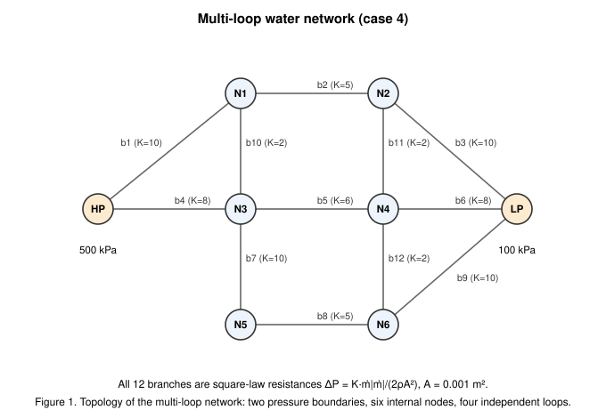
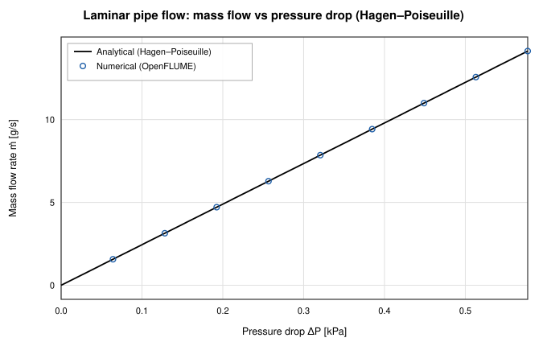
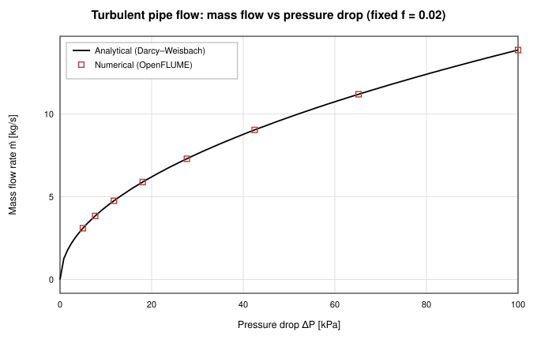
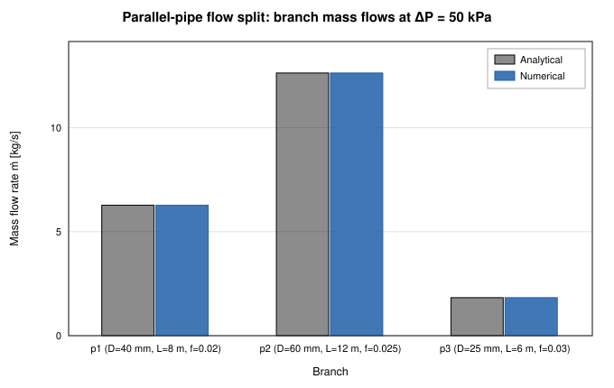
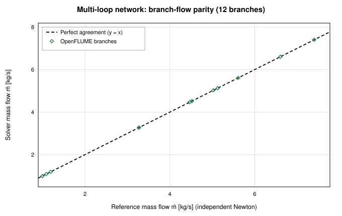
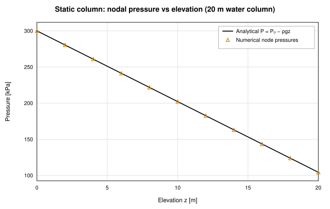
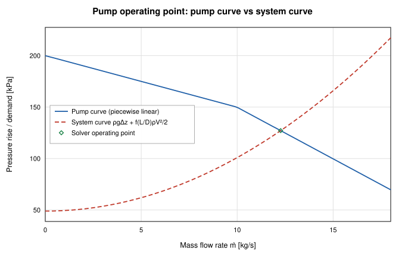

# Steady Incompressible Network Hydraulics Validation of OpenFLUME

**A validation report for the pressure–flow network solver against the classical closed-form results of steady incompressible pipe hydraulics: Hagen–Poiseuille laminar flow, Darcy–Weisbach turbulent flow, parallel-pipe flow splits, multi-loop network analysis (Hardy-Cross reference problem), hydrostatics, and pump/system operating points.**

Generated by `scripts/hydraulics-validation-report.ts` — all numbers and
figures come from live solves of the current solver. The corresponding CI
gates are `src/core/__tests__/solver.test.ts` and
`src/core/__tests__/benchmarks.test.ts`.

## Abstract

This report verifies the steady incompressible-flow capability of the
OpenFLUME solver — a pressure-based node-and-branch network code in the
GFSSP family — against six benchmark problems of classical pipe hydraulics,
each of which admits either an exact closed-form solution or an independent
reference solution converged in this script to a tolerance far below the
solver's own. The cases cover the laminar friction law (Hagen–Poiseuille),
the turbulent Darcy–Weisbach law with a prescribed friction factor, the flow
split among parallel pipes of unequal geometry, a six-node twelve-branch
multi-loop water network of the kind classically solved with the Hardy-Cross
method, hydrostatic pressure distributions with and without through-flow, and
the operating point of a pump run against a pipe system curve. Across all
49 compared quantities the numerical solution
reproduces the reference to within 9.98e-10 % — the agreement is limited only
by the Newton convergence tolerance (10⁻⁹), not by any modeling
approximation, because every case is constructed so that the solver's
friction closure and the analytic reference are the same expression.

## Introduction

Before a network flow solver can be trusted on problems without known
answers, it must reproduce the problems with known answers. For steady
incompressible flow the canonical set is small and sharp: the laminar
Hagen–Poiseuille law (an exact solution of the Navier–Stokes equations), the
Darcy–Weisbach equation with prescribed friction factor, mass-conservative
flow splits, Kirchhoff-consistent loop networks — the problem class Hardy
Cross's 1936 moment-distribution analogue was invented for — the hydrostatic
law, and the intersection of a pump curve with a system curve. This report
exercises the OpenFLUME steady solver on all six, mirroring the network
configurations of the CI test suite (`solver.test.ts`,
`benchmarks.test.ts`) so the report and the CI gates validate the same
physics. The companion report
(`compressible-report.md`) covers the compressible quasi-1-D
capability; this one establishes the incompressible foundation underneath
it.

## Problem Description

The working fluid throughout is water, treated as an incompressible liquid
(ρ = 998 kg/m³, μ = 0.001 Pa·s, the solver's `water` preset). Six cases
are studied:

| Case | Description |
| ---- | ----------- |
| 1 | Laminar flow in a small-bore pipe — ṁ vs ΔP against Hagen–Poiseuille, Re 200–1800 |
| 2 | Turbulent flow with fixed Darcy friction factor — ṁ vs ΔP over a ΔP decade |
| 3 | Flow split among three parallel pipes of unequal D, L, and f |
| 4 | Multi-loop water network: 6 internal nodes, 12 square-law resistances, 4 loops |
| 5 | Hydrostatics: a 20 m static water column, and a flowing inclined riser |
| 6 | Pump operating point: pump curve vs pipe system curve between equal reservoirs |

Cases 1, 2, 3, and 5 use pressure boundary pairs with pipe branches sized in
the script; case 4 uses the multi-loop geometry of benchmark B1 in
`benchmarks.test.ts`, shown in Figure 1; case 6 uses the pump curve of
benchmark B2 discharging through a fixed-friction pipe with a 5 m static
lift.

*Figure 1. Topology of the multi-loop water network (case 4): two pressure boundaries at 500 kPa and 100 kPa, six internal nodes, twelve square-law resistance branches forming four independent loops.*

## Benchmark Solutions

**Hagen–Poiseuille (case 1).** For fully developed laminar flow the Darcy
friction factor is exactly f = 64/Re, which turns the Darcy–Weisbach
equation into the linear Hagen–Poiseuille law:

$$\Delta P = \frac{128\,\mu L\,\dot m}{\pi \rho D^4}, \qquad \dot m = \frac{\pi \rho D^4 \Delta P}{128\,\mu L}.$$

**Darcy–Weisbach with fixed f (case 2).** With a prescribed constant
friction factor the momentum balance closes exactly:

$$\Delta P = f\,\frac{L}{D}\,\frac{\rho V^2}{2}, \qquad \dot m = A\sqrt{\frac{2\rho\,\Delta P}{f L/D}}.$$

**Parallel-pipe split (case 3).** Parallel branches between common nodes see
the same ΔP, so each branch flow follows the fixed-f closed form
independently and the total is their sum:

$$\dot m_i = A_i\sqrt{\frac{2\rho\,\Delta P\, D_i}{f_i L_i}}, \qquad \dot m_{tot} = \sum_i \dot m_i.$$

**Multi-loop network (case 4).** Each branch is a square-law resistance
ΔP = R·ṁ|ṁ| with R = K/(2ρA²). The network solution must satisfy
Kirchhoff's two laws — mass continuity at every node and zero signed ΔP
around every loop:

$$\sum_{j \in node} \dot m_j = 0, \qquad \sum_{j \in loop} \pm R_j\,\dot m_j |\dot m_j| = 0.$$

This is the problem class of Cross (1936), whose iterative loop-correction
scheme
$$\Delta Q = -\frac{\sum_j \pm R_j Q_j |Q_j|}{2 \sum_j R_j |Q_j|}$$
predates but is equivalent in fixed point to a Newton iteration on the
network equations. The reference here is an independent Newton solve of the
nodal continuity equations with the exact branch law, implemented in this
script with a finite-difference Jacobian and dense Gaussian elimination,
converged to a mass residual below 10⁻¹² kg/s (18 iterations).

**Hydrostatics (case 5).** For a static column of incompressible liquid the
pressure varies linearly with elevation,

$$P(z) = P_0 - \rho g z,$$

and for a flowing inclined pipe the boundary pressure difference splits into
hydrostatic and frictional parts:

$$P_{bot} - P_{top} = \rho g\,\Delta z + f\,\frac{L}{D}\,\frac{\rho V^2}{2}.$$

**Pump operating point (case 6).** Between reservoirs of equal pressure, the
steady flow settles where the pump pressure rise equals the system demand,

$$\Delta P_{pump}(\dot m) = \rho g\,\Delta z + f\,\frac{L}{D}\,\frac{\rho V^2}{2},$$

with the pump curve interpolated piecewise-linearly in volumetric flow
Q = ṁ/ρ, exactly as the solver's pump component defines it. The reference
operating point is found by bisection on this scalar equation to a bracket
width of 10⁻¹² kg/s.

## Numerical Modeling

OpenFLUME employs a finite volume formulation of the mass, momentum, and
energy conservation equations on a network of nodes and branches: mass (and
energy) conservation is enforced at every internal node, and each branch
supplies one momentum relation between its endpoint pressures and its mass
flow rate, solved as a coupled Newton system with pressure boundary
conditions at boundary nodes. The flow rate is never prescribed — it is
computed from the imposed pressures, exactly as in GFSSP.

The component physics exercised here:

- **`pipe`** applies the Darcy–Weisbach relation. With no
  `frictionFactor` override the friction factor is f = 64/Re for
  Re < 2300 (exact Hagen–Poiseuille), the Swamee–Jain explicit Colebrook
  approximation for Re > 4000, and a C¹ smoothstep blend between (case 1
  stays entirely below Re 1800, inside the exact laminar branch). With
  `frictionFactor` set, that constant f is used at every Reynolds number
  (cases 2, 3, 5b, 6), making the analytic references exact closures of the
  solver's own momentum equation. The pipe's `elevationChange` adds the
  hydrostatic term ρg·Δz with g = 9.80665 m/s².
- **`resistance`** applies the square law ΔP = K·ṁ|ṁ|/(2ρA²) (case 4).
- **`pump`** applies a pressure rise interpolated piecewise-linearly from
  its (Q, ΔP) curve (case 6).

All solves use `tolerance` 10⁻⁹, `maxIterations` 500, and relaxation 0.9
(0.8 for the multi-loop network, matching benchmark B1). The compressible
opt-in terms (`momentumFlux`, `kineticEnergy`) are left off: both are
identically zero for constant-density flow. Internal nodes carry initial
pressure guesses only; these do not constrain the converged solution.

## Results and Discussion

Every case converged. The table summarizes the maximum relative deviation of
each compared quantity from its reference; the errors sit at the Newton
convergence floor (10⁻⁹ relative residual), orders of magnitude below any
physical-modeling tolerance.

| Case | Compared quantity | Points | Max error |
| ---- | ----------------- | ------ | --------- |
| 1 — Laminar pipe | ṁ vs Hagen–Poiseuille | 9 | 9.98e-10 % |
| 2 — Turbulent pipe | ṁ vs Darcy–Weisbach | 8 | 5.36e-12 % |
| 3 — Parallel split | branch ṁ vs closed form | 3 | 5.62e-13 % |
| 3 — Parallel split | total ṁ | 1 | 3.43e-13 % |
| 4 — Multi-loop | branch ṁ vs independent Newton | 12 | 1.25e-12 % |
| 4 — Multi-loop | node P vs independent Newton | 6 | 4.57e-13 % |
| 5a — Static column | node P vs P₀ − ρgz | 9 | 0.00e+0 % of ρgH |
| 5b — Flowing riser | ṁ vs friction + ρgΔz closure | 1 | 1.82e-13 % |
| 6 — Pump | operating-point ṁ | 1 | 1.88e-13 % |
| 6 — Pump | operating-point rise | 1 | 1.72e-13 % |

### Case 1: Laminar Pipe Flow (Hagen–Poiseuille)

A D = 10 mm, L = 10 m water pipe is driven by
boundary-pressure pairs chosen to sweep the Reynolds number from
200 to 1800 — entirely inside the laminar regime, where the
solver's friction factor is exactly 64/Re and the Hagen–Poiseuille law is an
exact closure. Figure 2 shows the solved mass flow against the analytic
line: ṁ is linear in ΔP, and the maximum deviation over the
9-point sweep is 9.98e-10 %. The solver-reported
Reynolds numbers confirm every point sits below the laminar cutoff
(Re = 2300), so no transition blending contaminates the comparison.

| ΔP [kPa] | ṁ analytic [kg/s] | ṁ numerical [kg/s] | Re | ṁ error |
| -------- | ----------------- | ------------------ | -- | ------- |
| 0.064 | 1.57080e-3 | 1.57080e-3 | 200 | 9.98e-10 % |
| 0.128 | 3.14159e-3 | 3.14159e-3 | 400 | 4.57e-10 % |
| 0.192 | 4.71239e-3 | 4.71239e-3 | 600 | 4.57e-10 % |
| 0.257 | 6.28319e-3 | 6.28319e-3 | 800 | 6.23e-11 % |
| 0.321 | 7.85398e-3 | 7.85398e-3 | 1000 | 6.50e-11 % |
| 0.385 | 9.42478e-3 | 9.42478e-3 | 1200 | 5.24e-11 % |
| 0.449 | 1.09956e-2 | 1.09956e-2 | 1400 | 4.60e-11 % |
| 0.513 | 1.25664e-2 | 1.25664e-2 | 1600 | 3.90e-11 % |
| 0.577 | 1.41372e-2 | 1.41372e-2 | 1800 | 2.72e-11 % |

*Figure 2. Laminar pipe flow: solved mass flow rate vs pressure drop against the exact Hagen–Poiseuille line.*

### Case 2: Turbulent Pipe Flow (Darcy–Weisbach)

A D = 50 mm, L = 10 m pipe with a prescribed
constant friction factor f = 0.02 is swept over a ΔP decade
(5–100 kPa). Because f is fixed, the
Darcy–Weisbach inversion ṁ = A√(2ρΔP/(fL/D)) is exact, and the solved flow
follows the square-root curve of Figure 3 to within 5.36e-12 %.
Reynolds numbers span 7.9e+4 to
3.5e+5, comfortably turbulent.

| ΔP [kPa] | ṁ analytic [kg/s] | ṁ numerical [kg/s] | Re | ṁ error |
| -------- | ----------------- | ------------------ | -- | ------- |
| 5.000 | 3.10145e+0 | 3.10145e+0 | 78978 | 2.42e-12 % |
| 7.671 | 3.84146e+0 | 3.84146e+0 | 97822 | 5.36e-12 % |
| 11.768 | 4.75802e+0 | 4.75802e+0 | 121162 | 1.14e-12 % |
| 18.053 | 5.89328e+0 | 5.89328e+0 | 150071 | 2.86e-13 % |
| 27.696 | 7.29941e+0 | 7.29941e+0 | 185878 | 6.94e-13 % |
| 42.489 | 9.04105e+0 | 9.04105e+0 | 230228 | 1.77e-13 % |
| 65.184 | 1.11982e+1 | 1.11982e+1 | 285161 | 3.49e-13 % |
| 100.000 | 1.38701e+1 | 1.38701e+1 | 353200 | 7.68e-14 % |

*Figure 3. Turbulent pipe flow with fixed friction factor: solved mass flow rate vs pressure drop against the exact Darcy–Weisbach inversion.*

### Case 3: Parallel-Pipe Flow Split

Three pipes of unequal diameter, length, and friction factor connect the
same two pressure boundaries (ΔP = 50 kPa). Each branch must
carry ṁᵢ = Aᵢ√(2ρΔP·Dᵢ/(fᵢLᵢ)) independently; the solver reproduces every
branch flow to within 5.62e-13 % and the total to within
3.43e-13 % (Figure 4). This exercises simultaneous momentum
closure on parallel paths — the degenerate two-node limit of a loop network.

| Branch | D [mm] | L [m] | f | ṁ analytic [kg/s] | ṁ numerical [kg/s] | error |
| ------ | ------ | ----- | - | ----------------- | ------------------ | ----- |
| p1 | 40 | 8 | 0.02 | 6.276899 | 6.276899 | 1.41e-14 % |
| p2 | 60 | 12 | 0.025 | 12.632016 | 12.632016 | 5.62e-13 % |
| p3 | 25 | 6 | 0.03 | 1.827549 | 1.827549 | 0.00e+0 % |
| **total** | — | — | — | 20.736463 | 20.736463 | 3.43e-13 % |

*Figure 4. Parallel-pipe flow split: analytic vs numerical branch flows for three unequal pipes at common ΔP.*

### Case 4: Multi-Loop Water Network (Hardy-Cross Reference)

The six-node, twelve-branch, four-loop network of Figure 1 (the geometry of
CI benchmark B1) is driven from 500 kPa to 100 kPa through square-law
resistances. The reference solution is this script's own Newton iteration on
the nodal continuity equations with the exact branch law, converged to a mass
residual below 10⁻¹² kg/s in 18 iterations. All twelve solver
branch flows agree with the reference to within 1.25e-12 %, and
all six internal node pressures to within 4.57e-13 % (Figure 5).
As an internal-consistency check, the signed pressure-drop sums around the
four independent loops of the solved network close to within
2.2e-16 of the 400 kPa system ΔP — Kirchhoff's
second law is satisfied to solver precision.

| Branch | K | ṁ reference [kg/s] | ṁ solver [kg/s] | error |
| ------ | - | ------------------ | --------------- | ----- |
| b1 (HP→N1) | 10 | 6.607218 | 6.607218 | 2.69e-13 % |
| b2 (N1→N2) | 5 | 5.610671 | 5.610671 | 1.20e-12 % |
| b3 (N2→LP) | 10 | 4.521599 | 4.521599 | 2.55e-13 % |
| b4 (HP→N3) | 8 | 7.403880 | 7.403880 | 2.40e-13 % |
| b5 (N3→N4) | 6 | 5.128094 | 5.128094 | 1.20e-12 % |
| b6 (N4→LP) | 8 | 5.025888 | 5.025888 | 2.30e-13 % |
| b7 (N3→N5) | 10 | 3.272332 | 3.272332 | 1.25e-12 % |
| b8 (N5→N6) | 5 | 3.272332 | 3.272332 | 1.00e-12 % |
| b9 (N6→LP) | 10 | 4.463610 | 4.463610 | 2.79e-13 % |
| b10 (N1→N3) | 2 | 0.996547 | 0.996547 | 1.78e-13 % |
| b11 (N2→N4) | 2 | 1.089072 | 1.089072 | 2.85e-13 % |
| b12 (N4→N6) | 2 | 1.191278 | 1.191278 | 5.41e-13 % |

| Node | P reference [kPa] | P solver [kPa] | error |
| ---- | ----------------- | -------------- | ----- |
| N1 | 281.286 | 281.286 | 4.55e-13 % |
| N2 | 202.429 | 202.429 | 2.73e-13 % |
| N3 | 280.291 | 280.291 | 4.57e-13 % |
| N4 | 201.241 | 201.241 | 2.75e-13 % |
| N5 | 226.643 | 226.643 | 1.28e-14 % |
| N6 | 199.819 | 199.819 | 2.91e-13 % |

*Figure 5. Multi-loop network: parity of solver branch flows against the independent Newton reference — all 12 branches on the y = x line.*

### Case 5: Hydrostatics

**Static column.** A 20 m vertical water column is discretized into
10 pipe segments with `elevationChange` set, and the two boundary
pressures are placed in exact hydrostatic balance
(P₀ = 300 kPa at the bottom, 104.26 kPa at the top).
The solver recovers the linear pressure profile P = P₀ − ρgz at every
interior node to within 0.00e+0 Pa
(0.00e+0 % of the ρgH = 195.7 kPa column
span), with a residual through-flow of 3.44e-13 kg/s —
numerically zero (Figure 6).

**Flowing inclined riser.** A 20 m fixed-f pipe rising
Δz = 5 m carries flow driven by a boundary ΔP composed of
ρgΔz = 48.94 kPa of hydrostatic head plus
30 kPa of friction. The solver must
superpose both momentum terms correctly to recover the closed-form flow: it
returns ṁ = 5.371874 kg/s against the analytic
5.371874 kg/s, an error of 1.82e-13 %.

*Figure 6. Static water column: solved nodal pressures vs the analytic hydrostatic line P = P₀ − ρgz.*

### Case 6: Pump Operating Point

The benchmark-B2 pump curve (200 kPa at 0 m³/s, 150 kPa at 0.01 m³/s, 50 kPa at 0.02 m³/s;
piecewise linear in volumetric flow) discharges through a
D = 50 mm, L = 10 m fixed-f pipe with a 5 m static
lift, between reservoirs of equal pressure. The analytic operating point —
the intersection of the pump curve with the system curve
ρgΔz + f(L/D)ρV²/2, found by bisection — is
ṁ = 12.263893 kg/s at a rise of 127.115 kPa.
The solver lands on ṁ = 12.263893 kg/s at
127.115 kPa — errors of 1.88e-13 % and
1.72e-13 % respectively (Figure 7). The operating point falls on
the steeper second segment of the pump curve, so the agreement also confirms
the solver's piecewise-linear curve interpolation and its Newton handling of
the slope discontinuity at the knot.

*Figure 7. Pump operating point: pump curve, system curve, and the solver's converged operating point at their intersection.*

## Conclusions

The steady incompressible capability of OpenFLUME reproduces all six
classical hydraulics benchmarks — laminar and turbulent single-pipe flow,
parallel splits, multi-loop networks, hydrostatics, and pump/system
operating points — to within 9.98e-10 %, the Newton convergence floor.
Because every case was constructed as an exact closure of the solver's own
friction laws (64/Re laminar, fixed-f Darcy–Weisbach, square-law resistance,
piecewise-linear pump curve, ρgΔz elevation), the residual deviations
measure the solver's algebraic convergence rather than any modeling gap; the
Kirchhoff loop-closure sums of the multi-loop case confirm the same at the
network level. Reynolds-correlation accuracy (Swamee–Jain vs Colebrook) is
covered separately by the CI friction-factor tests and is deliberately
excluded here by fixing f. Together with the compressible report, this
establishes the solver's verification baseline across both incompressible
and compressible steady regimes.

## References

1. White, F. M., *Fluid Mechanics*, 7th ed., McGraw-Hill, 2011.
2. Cross, H., "Analysis of Flow in Networks of Conduits or Conductors,"
   *University of Illinois Engineering Experiment Station Bulletin* No. 286,
   1936.
3. Streeter, V. L., and Wylie, E. B., *Fluid Mechanics*, 8th ed.,
   McGraw-Hill, 1985.
4. Swamee, P. K., and Jain, A. K., "Explicit Equations for Pipe-Flow
   Problems," *Journal of the Hydraulics Division*, ASCE, Vol. 102, No. 5,
   1976, pp. 657–664.
5. Majumdar, A. K., LeClair, A. C., Moore, R., and Schallhorn, P. A.,
   *Generalized Fluid System Simulation Program, Version 6.0*,
   NASA/TM-2013-217492, 2013.

## Nomenclature

| Symbol | Meaning |
| ------ | ------- |
| A | flow area |
| D | pipe diameter |
| f | Darcy friction factor |
| g | gravitational acceleration (9.80665 m/s²) |
| K | resistance loss coefficient |
| L | pipe length |
| ṁ | mass flow rate |
| P | static pressure |
| Q | volumetric flow rate |
| R | square-law resistance, ΔP = R·ṁ\|ṁ\| |
| Re | Reynolds number ρVD/μ |
| V | mean velocity |
| z / Δz | elevation / elevation change |
| ΔP | pressure difference |
| μ | dynamic viscosity |
| ρ | density |
| 0 | reference (bottom-of-column) property |
