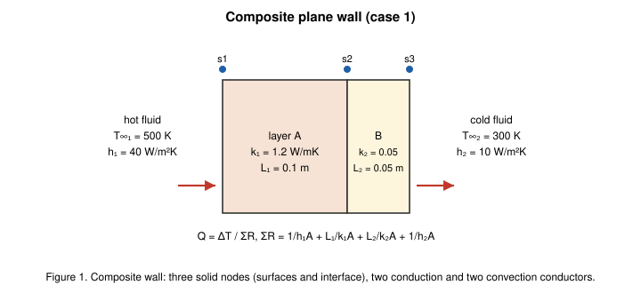
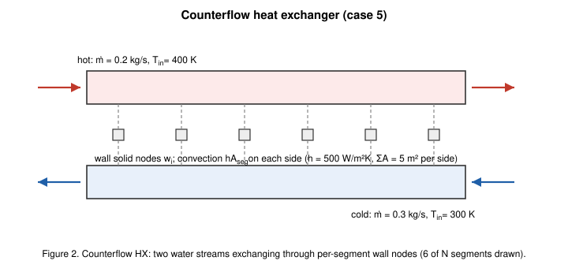
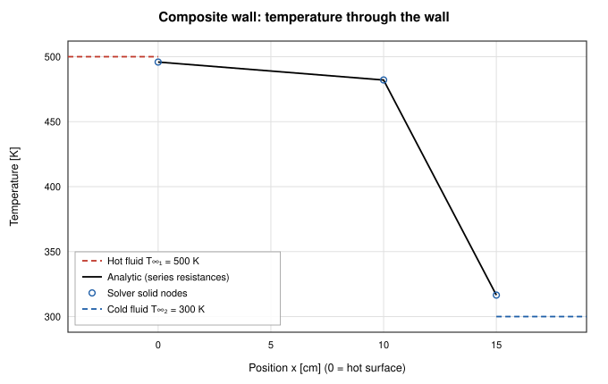
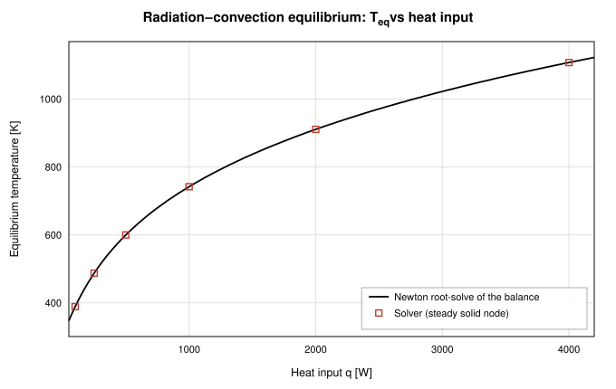
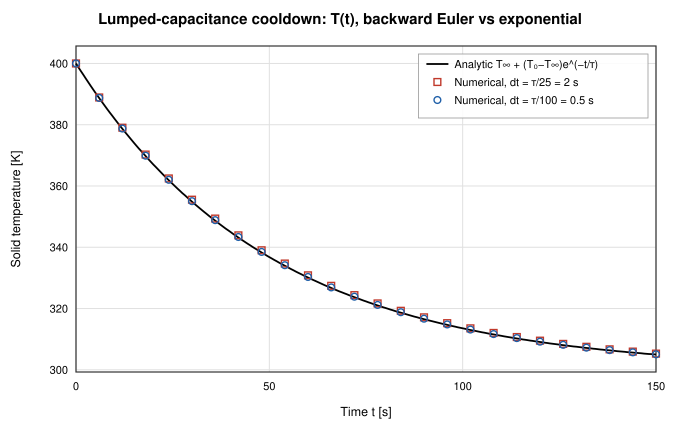
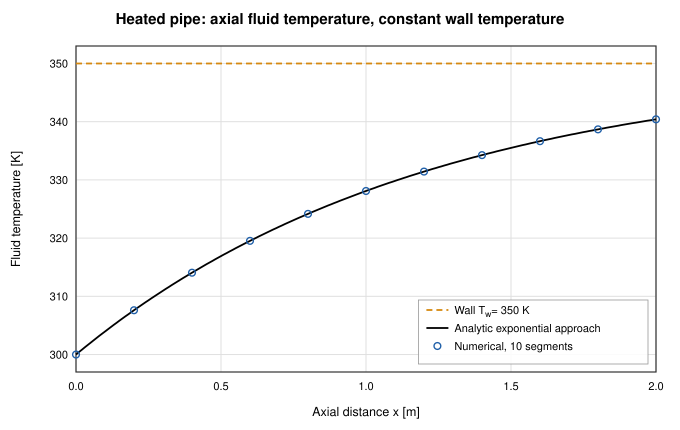
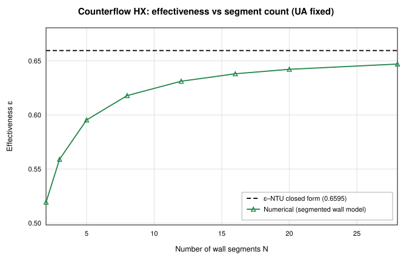

# Thermal Network and Conjugate Heat Transfer Validation of OpenFLUME

**Analytic verification of the solid-node thermal system — conduction, convection, and radiation conductors — and of its conjugate coupling to the fluid network**

Generated by `scripts/thermal-validation-report.ts` — all numbers and figures
come from live solves of the current solver. The corresponding CI gates are
`src/core/__tests__/thermal.test.ts` and
`src/core/__tests__/solidThermalTransient.test.ts`.

## Abstract

This report verifies the conjugate thermal capability of the OpenFLUME
solver — a pressure-based node-and-branch network code in the same family as
NASA's GFSSP — against classical closed-form heat-transfer solutions. Five
benchmark cases exercise every conductor kind and both coupling directions
between the solid and fluid systems: a steady composite plane wall (series
thermal-resistance network), the nonlinear radiation–convection equilibrium of
a heated solid node, the lumped-capacitance transient cooldown, a heated pipe
approaching a constant wall temperature, and — the flagship case — a
counterflow heat exchanger of two water streams wall-coupled through solid
nodes, compared against the ε–NTU closed form. The steady resistance-network
cases reproduce the analytic solutions to near machine precision
(composite-wall heat flow within 6.9e-14 %, radiation equilibrium
temperatures within 1.2e-14 %); the transient cooldown follows the
exponential within 0.18 % of the temperature span at dt = τ/100
and exhibits the expected first-order time-step convergence of backward Euler
(error ratio 4.01 for a 4× step refinement); the heated
pipe reproduces the exponential wall-temperature approach to
1.8e-14 %; and the 20-segment heat exchanger predicts
effectiveness within 2.62 % and both outlet temperatures within
1.730 K of the ε–NTU
solution, with the residual discrepancy shown to be finite-segmentation error
that vanishes monotonically as the wall discretization is refined.

## Introduction

Fluid-network codes that carry only fluid unknowns cannot represent hardware
thermal mass, structural conduction paths, or radiation sinks — all of which
dominate problems like cryogenic line chilldown, heat-exchanger sizing, and
thermal protection. OpenFLUME therefore carries a second, thermal network
alongside the fluid one: solid nodes with optional thermal capacitance
(mass × cp) and prescribed heat inputs, ambient nodes at fixed temperature,
and conductors of three kinds — conduction (kA/L), convection (hA, attaching
a solid to a fluid node), and radiation (σεAF between solid/ambient nodes).
Heated-pipe branches provide a complementary lightweight fluid heating path
against a prescribed wall temperature. The purpose of this report is to
verify that machinery the same way the compressible-flow capability was
verified (see `docs/validation/compressible-report.md`): live solves
of small networks against independent analytic references, with every number
in this document interpolated from those solves.

## Problem Description

Five cases cover the three conductor kinds, both steady and transient solid
physics, and both directions of conjugate coupling (fluid heating a wall,
walls heating a fluid):

| Case | Description | Reference |
| ---- | ----------- | --------- |
| 1 | Steady composite plane wall: convection–conduction–conduction–convection in series | Resistance sum, Q = ΔT/ΣR |
| 2 | Radiation–convection equilibrium of a solid node with fixed heat input, swept over q | Newton root-solve of the T⁴ balance |
| 3 | Lumped-capacitance transient cooldown by convection, two time steps | T(t) = T∞ + (T₀−T∞)e^(−t/τ) |
| 4 | Heated pipe: 10 constant-wall-temperature segments in series | Exponential axial approach |
| 5 | Counterflow heat exchanger: two water streams wall-coupled per segment | ε–NTU closed form |

### Composite Wall

Case 1 is the classic two-layer furnace wall (Figure 1): hot fluid at
500 K with film coefficient h₁ = 40 W/m²K, a 10 cm
layer of k₁ = 1.2 W/mK, a 5 cm layer of k₂ = 0.05 W/mK,
and cold fluid at 300 K with h₂ = 10 W/m²K, over A = 1 m².
Three solid nodes sit at the two surfaces and the layer interface; the two
fluids are boundary nodes of the fluid network.

*Figure 1. Composite wall: three solid nodes (surfaces and interface), two conduction and two convection conductors between two fluid boundary nodes.*

### Counterflow Heat Exchanger

Case 5 mirrors the architecture of GFSSP Example 5 (the water–water
counterflow heat exchanger, user manual §7.9): each axial segment carries an
internal fluid node on the hot stream, an internal fluid node on the cold
stream, and a wall solid node between them, with convection conductors on
both faces (Figure 2). The hot stream (0.2 kg/s, 400 K in)
flows left to right; the cold stream (0.3 kg/s, 300 K in)
flows right to left. Both film coefficients are 500 W/m²K over a total
transfer area of 5 m² per side, so the overall conductance
UA = hA/2 = 1250 W/K is independent of the segment count and
the segment sweep isolates pure discretization error. The capacity rates are
deliberately unequal (C_r = 0.6667) to exercise the general
ε–NTU form rather than the degenerate balanced case.

*Figure 2. Counterflow heat exchanger: per-segment wall solid nodes with convection conductors to both streams, mirroring GFSSP Example 5.*

## Benchmark Solutions

**Series resistance network (case 1).** In steady state the heat flow through
every element of the chain is equal, so the wall behaves as resistances in
series:

$$\Sigma R = \frac{1}{h_1 A} + \frac{L_1}{k_1 A} + \frac{L_2}{k_2 A} + \frac{1}{h_2 A}, \qquad \dot Q = \frac{T_{\infty 1} - T_{\infty 2}}{\Sigma R},$$

and the surface and interface temperatures follow from partial sums,
$T_{s,i} = T_{\infty 1} - \dot Q \sum_{j \le i} R_j$. With the case-1
numbers, ΣR = 1.208333 K/W and Q̇ = 165.5172 W.

**Radiation–convection equilibrium (case 2).** A solid node with heat input q
losing to a common sink temperature T∞ by convection and radiation settles
where

$$q = hA\,(T - T_\infty) + \sigma \varepsilon A F\,(T^4 - T_\infty^4).$$

The quartic has one physical root above T∞; the reference is a Newton
iteration on this balance, converged to 10⁻¹² K in-script.

**Lumped capacitance (case 3).** A solid of thermal capacitance mc cooling
through a convection conductance hA obeys

$$m c \frac{dT}{dt} = -hA\,(T - T_\infty) \;\Rightarrow\; T(t) = T_\infty + (T_0 - T_\infty)\,e^{-t/\tau}, \qquad \tau = \frac{mc}{hA}.$$

For the physical problem this classical solution requires a small Biot number
(Bi = hL_c/k ≲ 0.1) so the solid is spatially isothermal; for the network
model the comparison is exact by construction, because a solid node *is* a
lumped capacitance with no internal resistance — which makes this a pure test
of the time integrator.

**Heated pipe with constant wall temperature (case 4).** A fluid stream ṁcp
exchanging with a fixed wall temperature through a uniformly distributed
conductance UA obeys dT/dx = (UA/L)(T_w − T)/(ṁc_p), giving the exponential
approach

$$T(x) = T_w - (T_w - T_{in})\,\exp\left(-\frac{UA}{\dot m c_p}\frac{x}{L}\right).$$

The solver's heated-pipe branch applies exactly the per-segment
effectiveness form ε = 1 − exp(−UA_seg/ṁc_p), whose composition over equal
segments reproduces this exponential at every node; the comparison therefore
isolates the branch heat-delivery path and the coupled energy balance rather
than a discretization error.

**Counterflow ε–NTU (case 5).** With NTU = UA/C_min and C_r = C_min/C_max,
the counterflow effectiveness is

$$\varepsilon = \frac{1 - \exp\left(-\mathrm{NTU}\,(1 - C_r)\right)}{1 - C_r \exp\left(-\mathrm{NTU}\,(1 - C_r)\right)},$$

and the outlet temperatures follow from q = εC_min(T_{h,in} − T_{c,in}).
The axial profiles come from the temperature-difference ODE
dΔT/dx = −(UA/L)(1/C_h − 1/C_c)ΔT, whose exponential solution is anchored by
the ε–NTU outlet states (cross-checked in-script to 10⁻⁹ K). With the case-5
numbers, NTU = 1.4945, C_r = 0.6667, and
ε = 0.6595.

## Numerical Modeling

The thermal network adds one temperature unknown per solid node. Each solid
node enforces an energy balance over its attached conductors and prescribed
heat input,

$$m c_p \frac{dT_i}{dt} = \sum_j \dot Q_{ji} + \dot Q_{input,i},$$

with the storage term dropped in steady mode (and the backward-Euler form
m c_p (T_i^{n+1} − T_i^n)/Δt in transient mode — first-order in time). The
conductor heat rates take the three classical forms: conduction
Q̇ = (kA/L)(T_i − T_j), convection Q̇ = hA(T_s − T_f) against a fluid-node
temperature, and radiation Q̇ = σεAF(T_i⁴ − T_j⁴) between solid/ambient
nodes. The solid temperatures are solved as a segregated thermal subsystem by
a Newton iteration with an exact analytic Jacobian — including the 4σεAFT³
radiation derivative, which is what lets the strongly nonlinear case-2
balance converge from a cold start (the Jacobian is verified entry-by-entry
against central finite differences in
`src/core/__tests__/solidThermalTransient.test.ts`).

Conjugate coupling runs in both directions. Convection conductors deposit
their heat rate into the attached fluid node's energy balance, so a heated
wall raises the downstream fluid temperature through the ordinary advective
energy equation; conversely the fluid temperature enters the conductor's
driving ΔT. Heated-pipe branches short-cut this when the wall temperature is
known rather than solved: they deliver Q̇ = ṁc_pε(T_w − T_in) with
ε = 1 − exp(−UA/ṁc_p) directly to the downstream node. In cases 1–3 the
fluid network is reduced to boundary nodes (fixed T∞ reservoirs) with a
zero-flow source branch, mirroring the CI-test configurations; in cases 4–5
the streams carry real through-flow (case 4 pressure-driven through an
orifice, case 5 imposed by flow sources on both streams, exactly as in the
CI heat-exchanger test).

In the segmented heat-exchanger model each stream's internal node holds its
cell-outlet state (an implicit upwind discretization of the counterflow
ODEs), so hot node i is plotted at x = i/N and cold node i — flowing right to
left — at x = (i−1)/N. The scheme is first-order in the segment width, which
is the discretization error the segment sweep of Figure 8 quantifies.

## Results and Discussion

| Case | Compared quantity | Max deviation | Notes |
| ---- | ----------------- | ------------- | ----- |
| 1 — composite wall | heat flow Q̇ | 6.9e-14 % | series chain spread 6.0e-13 % |
| 1 — composite wall | surface/interface T (3 nodes) | 0.00e+0 K (0.0e+0 %) | near machine precision |
| 2 — radiation–convection | equilibrium T over 6-point q sweep | 1.2e-14 % | balance residual ≤ 2.3e-14 % of q |
| 3 — lumped transient (dt = τ/25) | T(t) vs exponential | 0.72 % of span | backward Euler, first order |
| 3 — lumped transient (dt = τ/100) | T(t) vs exponential | 0.18 % of span | error ratio 4.01 vs 4 expected |
| 4 — heated pipe (10 segments) | axial T profile, 10 nodes | 1.8e-14 % | outlet within 5.68e-14 K |
| 5 — counterflow HX (N = 20) | effectiveness ε | 2.62 % | outlets within 1.730 K; segmentation error, first order in 1/N |

### Case 1: Composite Plane Wall

The solver reproduces the series-resistance solution essentially exactly:
Q̇ = 165.5172 W against the analytic 165.5172 W
(6.9e-14 %), with the same heat flow through all four elements of the
chain to 6.0e-13 % — the discrete statement that the steady
resistances are truly in series. The hot-surface, interface, and cold-surface
temperatures are 495.86 K, 482.07 K, and
316.55 K against analytic values of 495.86 K,
482.07 K, and 316.55 K — a worst deviation of
0.00e+0 K (Figure 3). The insulation layer carries
82.8 % of the total resistance and correspondingly
almost the entire temperature drop, a useful visual check that each conductor
carries its intended share.

*Figure 3. Temperature through the composite wall: analytic piecewise-linear profile and solver solid-node temperatures; dashed levels are the two fluid reservoir temperatures.*

### Case 2: Radiation–Convection Equilibrium

A solid node with fixed heat input q sheds it through a convection conductor
(h = 15 W/m²K, A = 0.05 m²) to a 300 K fluid and a
radiation conductor (ε = 0.8, A = 0.05 m², F = 1) to a
300 K ambient. Sweeping q from 100 to
4000 W moves the equilibrium from
388.8 K to 1107.5 K, across
which the radiated share of the load grows from
33.4 % to 84.9 % — the sweep genuinely
crosses from convection-dominated to radiation-dominated territory. The
solver matches the Newton reference within 1.2e-14 % at every point
(Figure 4, Table below), and substituting the solver temperatures back into
the analytic balance leaves a residual below 2.3e-14 % of q,
confirming the exact treatment of the T⁴ conductor in the thermal Newton
system.

| q [W] | T_eq analytic [K] | T_eq solver [K] | deviation |
| ----- | ----------------- | --------------- | --------- |
| 100 | 388.755 | 388.755 | 0.0e+0 % |
| 250 | 487.300 | 487.300 | 1.2e-14 % |
| 500 | 599.786 | 599.786 | 0.0e+0 % |
| 1000 | 741.854 | 741.854 | 0.0e+0 % |
| 2000 | 910.723 | 910.723 | 1.2e-14 % |
| 4000 | 1107.535 | 1107.535 | 0.0e+0 % |

*Figure 4. Equilibrium temperature vs heat input: Newton root-solve of the convection + radiation balance (line) and steady solver results (markers).*

### Case 3: Lumped-Capacitance Transient Cooldown

A solid node (m = 1 kg, c_p = 500 J/kg·K) initially at
400 K cools through a convection conductor (hA = 10 W/K) to
a 300 K reservoir; τ = mc_p/hA = 50 s. Two fixed time steps were
run to 3τ. At dt = τ/25 = 2 s the trace deviates from the
exponential by at most 0.72 % of the 100 K span
(|ΔT| = 0.724 K at τ,
0.300 K at 3τ); refining to
dt = τ/100 = 0.5 s reduces the 3τ error to
0.0747 K — a ratio of 4.01
for a 4× step refinement, consistent with the first-order accuracy of
backward Euler (Figure 5). The integrator is unconditionally stable and
monotone here, so the choice of dt is purely an accuracy trade, not a
stability one.

*Figure 5. Lumped-capacitance cooldown: analytic exponential and backward-Euler traces at dt = τ/25 and dt = τ/100 (markers subsampled for legibility).*

### Case 4: Heated Pipe with Constant Wall Temperature

Water enters 10 series heated-pipe segments (D = 0.02 m,
L = 2 m total, UA = 250 W/K per segment) at 300 K with
the wall held at 350 K; the flow is pressure-driven and the solved
rate is ṁ = 0.36218 kg/s, giving a total
NTU = 1.651 and an expected outlet approach of
ε = 80.8 % of the wall–inlet difference. The
axial profile follows the analytic exponential at all 10 nodes to within
1.8e-14 %, with the outlet at 340.403 K against
the analytic 340.403 K (Figure 6). Agreement at this level
is expected rather than remarkable — the branch model applies the same
per-segment effectiveness relation the analytic solution composes — but it
verifies the heat-delivery path into the downstream node energy balance and
the coupled solve of flow rate and temperature, with the reference evaluated
at the solved ṁ exactly as in the CI test.

*Figure 6. Heated pipe: analytic exponential approach to the wall temperature and solved node temperatures along the pipe string.*

### Case 5: Counterflow Heat Exchanger (flagship)

The 20-segment exchanger predicts ε = 0.6422
against the ε–NTU value of 0.6595 — a deviation of
2.62 % — with outlet temperatures of
335.78 K (hot) and 342.82 K (cold) against
analytic values of 334.05 K and 343.97 K
(deviations of 1.730 K and
1.153 K). The hot- and cold-side duties agree to
1.7e-5 %, confirming that the wall nodes store nothing in
steady state and simply relay the heat. The axial profiles (Figure 7) track
the analytic exponentials within 1.730 K everywhere on
both streams.

The residual effectiveness error is finite segmentation, not physics: each
segment lumps its exchange at the cell-outlet states (implicit upwind), which
under-predicts the local ΔT and hence the duty. Because total UA is held
fixed as the segment count varies, the sweep of Figure 8 isolates that error:
the numerical effectiveness rises monotonically toward the closed form, from
21.26 % low at N = 2 to
1.89 % at
N = 28, with the error falling roughly in
proportion to 1/N as expected of a first-order scheme. This is the same
segmentation trade GFSSP documents for its Example 5 model, which uses twelve
passes.

| N segments | ε numerical | ε deviation | T_h,out [K] | T_c,out [K] | hot/cold duty imbalance |
| ---------- | ----------- | ----------- | ----------- | ----------- | ----------------------- |
| 2 | 0.5193 | 21.26 % | 348.07 | 334.62 | 7.6e-6 % |
| 3 | 0.5590 | 15.24 % | 344.10 | 337.27 | 9.7e-6 % |
| 5 | 0.5953 | 9.73 % | 340.47 | 339.69 | 9.5e-6 % |
| 8 | 0.6179 | 6.31 % | 338.21 | 341.19 | 9.1e-6 % |
| 12 | 0.6312 | 4.30 % | 336.88 | 342.08 | 1.2e-5 % |
| 16 | 0.6380 | 3.26 % | 336.20 | 342.54 | 1.5e-5 % |
| 20 | 0.6422 | 2.62 % | 335.78 | 342.82 | 1.7e-5 % |
| 28 | 0.6471 | 1.89 % | 335.29 | 343.14 | 2.2e-5 % |

*Figure 7. Counterflow HX axial temperature profiles at N = 20: analytic (lines) vs numerical node temperatures (markers), hot stream flowing left to right, cold stream right to left.*

*Figure 8. Effectiveness vs segment count at fixed total UA: monotone first-order approach of the segmented wall model to the ε–NTU closed form.*

## Conclusions

The thermal-network machinery of OpenFLUME — solid and ambient nodes,
conduction, convection, and radiation conductors, heated-pipe branches, and
the segregated exact-Jacobian thermal Newton subsystem — reproduces the five
classical benchmarks. Steady resistance-network problems solve to near
machine precision (6.9e-14 % on composite-wall heat flow,
1.2e-14 % on radiation–convection equilibria across a q sweep that
moves the radiated share from 33.4 % to
84.9 % of the load). The backward-Euler transient integrator
follows the lumped-capacitance exponential within 0.72 % of span
at dt = τ/25 and converges at first order, its documented accuracy. Conjugate
coupling is verified in both directions: heated-pipe branches reproduce the
exponential wall-temperature approach to 1.8e-14 %, and the
wall-coupled counterflow heat exchanger matches ε–NTU effectiveness within
2.62 % at twenty segments, with the remaining discrepancy
demonstrated to be first-order segmentation error that shrinks monotonically
under refinement. Known limitations follow directly from the formulation:
transient accuracy is first order in Δt, and segmented heat-exchanger duty
converges from below at first order in 1/N, so segment count should be
chosen against the NTU per segment rather than by habit.

## References

1. Incropera, F. P., DeWitt, D. P., Bergman, T. L., and Lavine, A. S.,
   *Fundamentals of Heat and Mass Transfer*, 6th ed., John Wiley & Sons,
   2007 (composite walls, lumped capacitance, radiation exchange, ε–NTU).
2. Kays, W. M., and London, A. L., *Compact Heat Exchangers*, 3rd ed.,
   McGraw-Hill, 1984 (effectiveness–NTU relations for counterflow).
3. Majumdar, A. K., LeClair, A. C., Moore, R., and Schallhorn, P. A.,
   *Generalized Fluid System Simulation Program, Version 6.0*,
   NASA/TM-2013-217492, 2013 (Example 5: water–water counterflow heat
   exchanger; conjugate solid–fluid formulation).

## Nomenclature

| Symbol | Meaning |
| ------ | ------- |
| A | heat-transfer area |
| Bi | Biot number hL_c/k |
| C | capacity rate ṁc_p |
| C_r | capacity ratio C_min/C_max |
| c_p | specific heat |
| F | radiation view factor |
| h | convective film coefficient |
| k | thermal conductivity |
| L | thickness / length |
| m | solid node mass |
| ṁ | mass flow rate |
| NTU | number of transfer units UA/C_min |
| Q̇, q | heat rate / heat input |
| R | thermal resistance |
| T | temperature |
| T∞ | reservoir (fluid or ambient) temperature |
| UA | overall conductance |
| ε | heat-exchanger effectiveness; radiation emissivity |
| σ | Stefan–Boltzmann constant |
| τ | lumped-capacitance time constant mc_p/hA |

